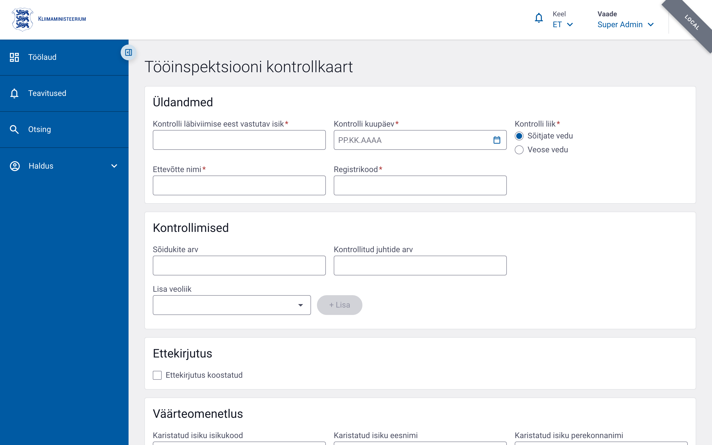

# Tööinspektsiooni kontrollkaart

Tööinspektsiooni kontrollkaarti kasutatakse tööinspektsiooni kontrolli andmete fikseerimiseks. Selle abil salvestatakse kontrolli üldandmed, kontrollitud veoliigid ja salvestite tüübid, rikkumised, ettekirjutuse tegemine ning väärteomenetluse info.

## Vormi eesmärk

- Registreerida tööinspektsiooni kontrolli põhiandmed (inspektor, kuupäev, ettevõte, kontrolli liik).
- Dokumenteerida kontrollitud veoliigid ja juhtide/sõidukite arv erinevate salvestite tüüpide lõikes.
- Märkida, kas on koostatud ettekirjutus.
- Salvestada karistatud isiku ja väärteomenetluse andmed.
- Lisada kontrolli käigus tuvastatud rikkumised klassifikaatorist.

## Menüü tee

Töölaud → **Tööinspektsiooni kontrollkaart** → Täida vorm

või

Menüü → Kontrollaktid → **Tööinspektsiooni kontrollkaart**

## Vormi osad ja väljad

Vorm koosneb mitmest kaardist. Kui välja juures on täht `*`, on see kohustuslik.

### 1. Üldandmed

| Väli | Kohustuslik | Selgitus |
|---|---|---|
| Kontrolli läbiviimise eest vastutav isik (`inspectorName`) | Jah | Max 200 tähemärki |
| Kontrolli kuupäev (`inspectionDate`) | Jah | Kuupäev, ei tohi olla tulevikus |
| Kontrolli liik (`inspectionType`) | Jah | Valik: sõitjate vedu või veose vedu |
| Ettevõtte nimi (`companyName`) | Jah | Max 300 tähemärki |
| Registrikood (`companyRegCode`) | Jah | Max 20 tähemärki |

### 2. Kontrollimised

| Väli | Kohustuslik | Selgitus |
|---|---|---|
| Sõidukite arv (`vehicleCount`) | Ei | Ainult numbrid, max 5 tähemärki |
| Kontrollitud juhtide arv (`totalDriversCount`) | Ei | Ainult numbrid, max 5 tähemärki |

Kontrollimiste maatriksis saab lisada ridu erinevate veoliikide kohta. Iga rea kohta täidetakse järgmised arvulised väljad:

- Veoliik (`transportClass`)
- Analoogsalvestiga juhid (`analogRecorderDrivers`)
- Digitaalsalvestiga juhid (`digitalRecorderDrivers`)
- Nutisalvestiga juhid (`smartRecorderDrivers`)
- Analoogsalvestiga tööpäevad (`analogRecorderWorkDays`)
- Digitaalsalvestiga tööpäevad (`digitalRecorderWorkDays`)
- Nutisalvestiga tööpäevad (`smartRecorderWorkDays`)

### 3. Ettekirjutus

| Väli | Kohustuslik | Selgitus |
|---|---|---|
| Ettekirjutus koostatud (`prescriptionComposed`) | Ei | Märkeruut |

### 4. Väärteomenetlus

| Väli | Kohustuslik | Selgitus |
|---|---|---|
| Karistatud isiku isikukood (`punishedPersonIdCode`) | Ei | Max 20 tähemärki |
| Karistatud isiku eesnimi (`punishedPersonFirstName`) | Ei | Max 100 tähemärki |
| Karistatud isiku perekonnanimi (`punishedPersonLastName`) | Ei | Max 100 tähemärki |
| Väärteomenetluse viitenumber (`proceedingReferenceNumber`) | Ei | Max 50 tähemärki |

### 5. Rikkumised

Rikkumisi saab lisada nupuga **Lisa rikkumine**. Avanevas valikus saab valida rikkumise õigusliku aluse, liigi ja koodi. Iga rikkumise juurde määratakse kogus. Rikkumised pole vormi salvestamiseks kohustuslikud, kuid neid peetakse vajalikuks riskihindamise jaoks.

## Vormi salvestamine ja kinnitamine

1. Täitke kõik kohustuslikud väljad.
2. Klõpsake **Salvesta** — vorm salvestatakse mustandina.
3. Kontrollige andmed.
4. Klõpsake **Kinnita** — vorm muutub lõplikuks.

Rikkumistega akti puhul toimub kinnitamine e-toimiku kaudu, mitte otse vormi vaates.

## Nipid

- Kontrolli kuupäev ei tohi jääda tulevikku.
- Sõidukite arv ja kontrollitud juhtide arv aktsepteerivad ainult numbreid.
- Ühte veoliiki saab kontrollimiste maatriksisse lisada ainult ühe korra.
- Märkige ettekirjutus koostatuks, kui see on tehtud.
- Kasutage rikkumiste lisamiseks rikkumiste valijat, et vältida vaba teksti sisestamist.
