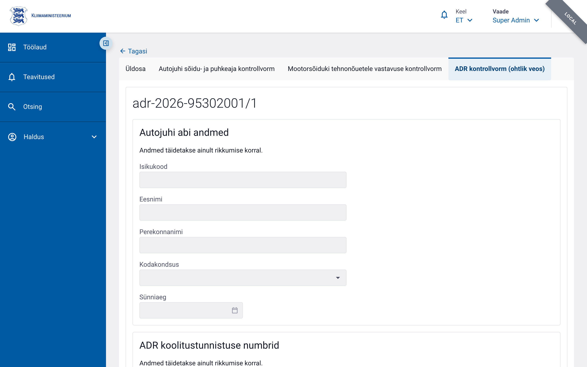

# ADR kontrollvorm (ohtlik veos)

ADR kontrollvormi kasutatakse ohtliku veose kontrolli tulemuste dokumenteerimiseks. Vorm võimalik salvestada veos, rikkumised, rakendatud meetmed ja viited ADR sätetele.

## Vormi eesmärk

- Registreerida ohtliku kauba veo kontrolli andmed
- Dokumenteerida autojuhi abi, koolitustunnistused ja laadimiskohad
- Kirjeldada veetavaid ohtlikke kaupu
- Fikseerida rikkumised ja kontrolli tulemused
- Edastada vajadusel andmed X-tee kaudu

## Menüü tee

Liitvormis: **Liitvorm** → **Lisa ADR kontrollvorm**

või

Menüü → Kontrollaktid → **ADR kontrollvorm**

## Vormi osad ja kohustuslikud väljad

Vorm on jagatud kaartideks. Kui välja juures on täht `*`, on see kohustuslik.

### 1. Autojuhi abi andmed

Andmed täidetakse ainult rikkumise korral. Isikukoodi järgi saab otsida andmeid X-tee liidese kaudu.

| Väli | Kohustuslik | Selgitus |
|---|---|---|
| Isikukood (`driverAssistant.personalCodeEe`) | Ei | Eesti isikukood |
| Eesnimi (`driverAssistant.firstName`) | Ei | |
| Perekonnanimi (`driverAssistant.lastName`) | Ei | |
| Kodakondsus (`driverAssistant.citizenshipCode`) | Ei | Valik riikide loendist |
| Sünniaeg (`driverAssistant.birthDate`) | Ei | Kuupäev |

### 2. ADR koolitustunnistuse numbrid

| Väli | Kohustuslik | Selgitus |
|---|---|---|
| Autojuhi ADR koolitustunnistuse number (`driverAdrCertificateNumber`) | Ei | Max 100 tähemärki |
| Meeskonnaliikme ADR koolitustunnistuse number (`crewAdrCertificateNumber`) | Ei | Max 100 tähemärki |
| Autojuhi abi ADR koolitustunnistuse number (`assistantAdrCertificateNumber`) | Ei | Max 100 tähemärki |

### 3. Viimase peale- või mahalaadimise aadress ja kuupäev

| Väli | Kohustuslik | Selgitus |
|---|---|---|
| Riik (`lastLoadAddress.countryCode`) | Ei | |
| Maakond (`lastLoadAddress.county`) | Ei | EHAK valik, kui riik on Eesti |
| Linn (`lastLoadAddress.city`) | Ei | EHAK valik, kui riik on Eesti |
| Tänav (`lastLoadAddress.street`) | Ei | |
| Postiindeks (`lastLoadAddress.postalCode`) | Ei | Max 10 tähemärki |
| Kuupäev (`lastLoadDate`) | Ei | |

### 4. Järgmise peale- või mahalaadimise aadress

Sisaldab samu välju nagu eelmine osa (`nextLoadAddress`), kuupäev puudub.

### 5. Veetavate ohtlike kaupade andmed

Tabelisse saab lisada ühe või mitu rida. Igale kaubale täidetakse:

| Väli | Selgitus |
|---|---|
| ÜN-number (`unNumber`) | Ohtliku kauba ÜRO number |
| Pakendirühm (`packagingGroup`) | Pakkumisrühm |
| Kogus (`quantity`) | |
| Ühik (`unitCode`) | |

Ridade lisamiseks klõpsake **+ Lisa ohtlik kaup**. Rida saab kustutada prügikasti ikooni abil.

### 6. Erandi kohaldamine

| Väli | Kohustuslik | Selgitus |
|---|---|---|
| Kas kohaldatakse erandit (`exemptionApplied`) | Ei | Jah / Ei |
| ADRi punkt (`exemptionAdrProvision`) | Jah, kui erandit kohaldatakse | ADR säte, max 200 tähemärki |

### 7. Mahuti tüüp

| Väli | Kohustuslik | Selgitus |
|---|---|---|
| Mahuti tüüp (`containerType`) | Ei | Mahtlast, Paak, Pakend, MEMU |

### 8. Rikkumised

Rikkumiste loend kuvatakse klassifikaatori `DANGEROUS_GOODS_INFRINGEMENTS_NEW` väärtuste järgi. Iga rea kohta määratakse tulemus:

- **Kontrollitud (C)**
- **Ei ole võimalik kontrollida (NC)**
- **Ei kohaldata (NA)**

Kui tulemus on valitud, saab täiendavalt sisestada:

- Riskikategooria (`riskCategory`)
- ADRi punkt (`adrProvision`)
- Märkus (`notes`)

Väli **Muud rikkumised** (`otherViolations`) võimaldab vabalt teksti sisestada.

### 9. Kontrolli tulemus

| Väli | Kohustuslik | Selgitus |
|---|---|---|
| Kontrolli tulemus (`resultType`) | Ei | Korras, alustati väärteomenetlust, hoiatus, sõidukeeld (ADR art 5), autovedu on katkestatud |
| Menetluse liik (`proceedingType`) | Ei | Kiirmenetlus / Üldmenetlus |
| Menetluse viitenumber (`proceedingReferenceNumber`) | Jah, kui menetlus valitud | |
| Rakendatud meetmed (`correctiveMeasures`) | Ei | Kohapeal, enne sõidu lõppu, ettevõtte territooriumil |
| Plomm avatud kontrolli käigus (`sealOpened`) | Ei | Jah / Ei |
| Plommi avamise kuupäev (`sealOpenedDate`) | Ei | Kui plomm avati |
| Plommi paigaldamise kuupäev (`sealInstalledDate`) | Ei | Kui plomm avati |

### 10. Märkused

| Väli | Kohustuslik | Selgitus |
|---|---|---|
| Märkused (`notes`) | Ei | Vaba tekst, max 4000 tähemärki |

### 11. X-tee andmed

Kuvatakse pärast kinnitamist. Muudetav ainult õigusega `control_form.edit_locked`.

| Väli | Kohustuslik | Selgitus |
|---|---|---|
| Jõustunud otsus (`enforcementDecision`) | Ei | |
| Menetluse lõpetamise alus (`proceedingClosureBasis`) | Ei | |

## Vormi salvestamine ja kinnitamine

1. Täitke kõik kohustuslikud väljad.
2. Klõpsake **Salvesta** — vorm salvestatakse mustandina.
3. Klõpsake **Kinnita** — vorm muutub lõplikult salvestatuks ja nähtavaks X-tee andmete sisestamiseks.

Pärast kinnitamist ei saa vormi tavaliselt enam muuta. Paranduste tegemiseks on vaja administraatori õigust `control_form.edit_locked`.

## Nipid

- Autojuhi abi andmed ja koolitustunnistused täidetakse ainult rikkumise korral.
- Kui valite erandi kohaldamise, peate täitma ADRi punkti.
- Kui menetluse liik on valitud, on menetluse viitenumber kohustuslik.
- Ohtlike kaupade ridu saab lisada, muuta ja kustutada kontrolli käigus.
- Rikkumiste loend võib olla tühi, kui klassifikaator pole veel seadistatud.
