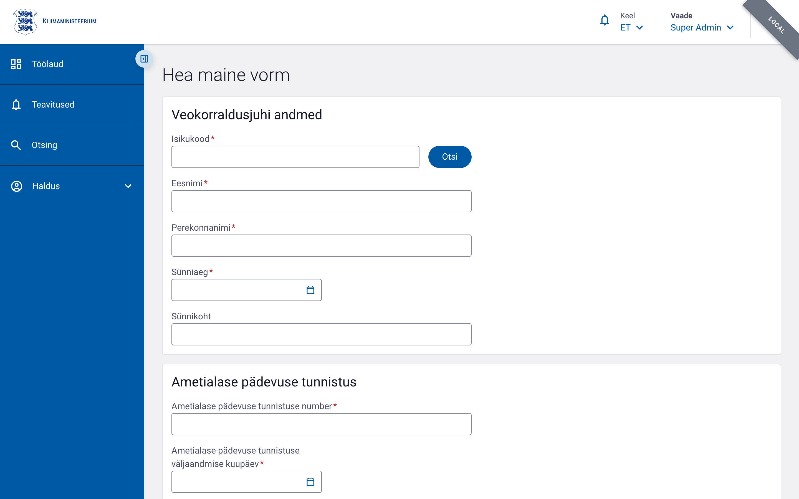

# Hea maine vorm

Hea maine vormi (ametlik nimetus: *Hea maine nõudele mittevastavaks tunnistatud veokorraldusjuht*) kasutatakse veokorraldusjuhi hea maine hindamise tulemuse registreerimiseks, sealhulgas ametialase pädevuse tunnistuse andmete ja sobivuse hinnangu salvestamiseks.

## Vormi eesmärk

- Registreerida veokorraldusjuhi hea maine hindamine
- Salvestada ametialase pädevuse tunnistuse andmed
- Määrata veokorraldusjuhi sobivus (`Sobib` või `Sobimatu`)
- Tuvastada sobimatuse kehtivusaeg, kui see on asjakohane

## Menüü tee

Töölaud → **+ Lisa** → **Hea maine nõudele mittevastavaks tunnistatud veokorraldusjuht**

Või otse URL-ilt: `/control-forms/good-repute/new`

## Vormi osad ja väljad

Vorm koosneb kolmest kaardist. Tähe `*` tähistab kohustuslikku välja.

### 1. Veokorraldusjuhi andmed

Isiku andmeid saab osaliselt automaatselt täita, sisestades isikukoodi ja klõpsates nuppu **Otsi**.

| Väli | Kohustuslik | Selgitus |
|---|---|---|
| Isikukood (`personalCode`) | Jah | Max 20 tähemärki |
| Eesnimi (`firstName`) | Jah | Max 100 tähemärki |
| Perekonnanimi (`lastName`) | Jah | Max 100 tähemärki |
| Sünniaeg (`dateOfBirth`) | Jah | Kuupäev |
| Sünnikoht (`placeOfBirth`) | Ei | Max 200 tähemärki |

### 2. Ametialase pädevuse tunnistus

| Väli | Kohustuslik | Selgitus |
|---|---|---|
| Tunnistuse number (`certificateNumber`) | Jah | Max 100 tähemärki |
| Väljaandmise kuupäev (`certificateIssueDate`) | Jah | Kuupäev |
| Väljaandnud riik (`certificateCountryCode`) | Jah | Valik riikide loendist |

### 3. Sobivuse hinnang

| Väli | Kohustuslik | Selgitus |
|---|---|---|
| Sobivus (`fitnessStatus`) | Jah | Valik: `Sobib` või `Sobimatu` |
| Sobimatuks tunnistamise kuupäev (`unfitFromDate`) | Jah, kui sobivus on `Sobimatu` | Kuupäev |
| Sobimatuse lõppkuupäev (`unfitUntilDate`) | Jah, kui sobivus on `Sobimatu` | Kuupäev |

## Nipid

- Sisestage isikukood ja kasutage nuppu **Otsi**, et täita eesnimi, perekonnanimi ja sünniaeg automaatselt.
- Kuupäevad ei tohi olla tulevikus.
- Kui sobivuseks valitakse `Sobimatu`, ilmuvad lisaks kuupäevaväljad. Lõppkuupäev peab olema hilisem kui alguskuupäev.
- Kohustuslikud väljad tuleb enne salvestamist täita.
- Vormi salvestamiseks klõpsake nuppu **Salvesta** ja katkestamiseks **Tühista**.
