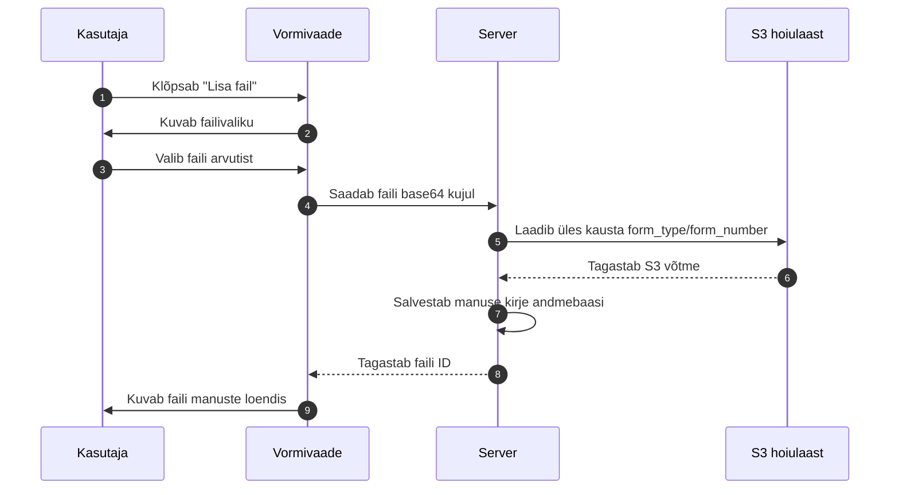

# Failide lisamine vormidele

Kontrollaktidele saab lisada manuseid, näiteks fotosid, tõendeid või dokumentide koopiaid. Manused salvestatakse S3-kõlbulikku objektihoidlasse ja nende kirjed andmebaasi.

## Millistes vormides saab faile lisada

Failide lisamine on saadaval peamistes vormides, kus on vaja tõendada visuaalselt või dokumendiga kontrolli tulemusi. Näiteks:

- liitvorm
- tehniline kontroll
- ADR
- tööinspektsioon
- hea maine
- välisriigis toimunud rikkumise akt

## Manuse lisamise sammud

## Lubatud failiformaadid

S3 laadimisel ja kasutajaliideses aktsepteeritakse järgmisi faile:

| Laiend | MIME-tüüp | Märkus |
|---|---|---|
| `.pdf` | `application/pdf` | Aruanded, tõendid |
| `.jpg`, `.jpeg` | `image/jpeg` | Fotod |
| `.png` | `image/png` | Fotod, joonised |
| `.tiff` | `image/tiff` | Kõrge eraldusvõimega pildid |

Lisaks lubab serveri seadistus (`S3_ALLOWED_MIME_TYPES`) lubada ka `.asics`, `.doc` ja `.docx` faile, kuid frontend hetkel piirab valikut eelkõige PDF ja pildifailidega.

## Faili piirangud

- **Maksimaalne failisuurus kasutajaliideses**: 10 MB
- **Maksimaalne failisuurus S3 proxy konfiguratsioonis**: 20 MB (vaikeväärtus)
- **Maksimaalne failinime pikkus**: 200 tähemärki (vaikeväärtus)
- Iga fail on seotud konkreetse vormi tüübi ja vormi numbri ning originaalse failinimega

## Faili tüüp

Iga fail peab olema märgitud tüübiga, mis selgitab, mida fail kujutab. Näiteks:

- dokumendifoto
- tõend
- lisamaterjal
- kontrolli foto

## Failide kustutamine

Manuseid saab peita enne vormi kinnitamist. Pärast kinnitamist ei saa manuseid enam lisada ega kustutada. Kustutamine on **pehme kustutamine**: faili kirje andmebaasis märgistatakse staatusega `deleted`, kuid fail jääb S3 hoiularuumi.

## Failide allalaadimine

Vormi vaates saab igat aktiivset manust alla laadida. Klõpsake faili nime. Süsteem küsib S3 proxy-lt ajutise allalaadimise lingi (presigned URL) ja avab selle uues vahekaardis.

## Failide ajalooline vaade

Kui sama nimega fail uuesti üles laetakse, luuakse andmebaasi uus kirje, kuid S3 võti jääb samaks. Seega näeb ajalugu eelkõige andmebaasi `forms.form_attachment` tabeli kirjetest, kus on säilinud iga üleslaadimise aeg, laadija ja staatus. Kui S3 bucketis on lubatud **S3 versioning**, on ka varasemad faili versioonid tehniliselt olemas, kuid nende vaatamiseks/laadimiseks tuleb kasutada S3 konsooli või CLI-d.
