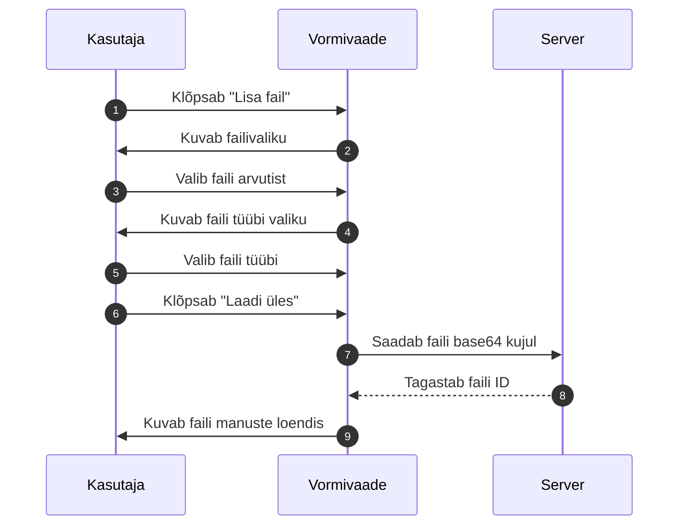

# Failide lisamine vormidele

Kontrollaktidele saab lisada manuseid, näiteks fotosid, tõendeid või dokumentide koopiaid.

## Millistes vormides saab faile lisada

Failide lisamine on saadaval peamistes vormides, kus on vaja tõendada visuaalselt või dokumendiga kontrolli tulemusi. Näiteks:

- liitvorm
- tehniline kontroll
- ADR
- tööinspektsioon

## Manuse lisamise sammud

## Faili tüüp

Iga fail peab olema märgitud tüübiga, mis selgitab, mida fail kujutab. Näiteks:

- dokumendifoto
- tõend
- lisamaterjal
- kontrolli foto

## Faili piirangud

- Maksimaalne failisuurus: 25 MB (võib sõltuda seadistusest)
- Lubatud formaadid: PDF, JPG, PNG
- Iga fail on seotud konkreetse vormiga ja vormi numbri ning faili tüübiga

## Failide kustutamine

Manuseid saab kustutada enne vormi kinnitamist. Pärast kinnitamist ei saa manuseid enam lisada ega kustutada.

## Failide allalaadimine

Kinnitatud vormi vaates saab kõiki manuseid alla laadida. Klõpsake faili nime või allalaadimise ikooni.
