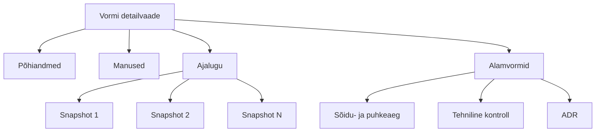

# Vormide vaatamine ja ajalugu

Salvestatud vormidele pääseb ligi nimekirja, töölaua või otsingu kaudu.

## Vormi detailvaade

Vormi detailvaade koosneb järgmistest osadest:

- **Põhiandmed** — vormi kõik täidetud väljad kaartide kaupa
- **Manused** — üleslaaditud failid
- **Ajalugu** — varasemad salvestatud versioonid (snapshots)
- **Alamvormid** — liitvormi puhul seotud alamvormid

## URL-i struktuur

| Vaade | URL |
|---|---|
| Põhivaade | `/control-forms/<tüüp>/<id>` |
| Ajalooline versioon | `/control-forms/<tüüp>/<id>/<snapshotId>` |

Näide:
- `/control-forms/foreign-violation/12345`
- `/control-forms/foreign-violation/12345/snapshot-67890`

## Snapshot (ajalooline versioon)

Snapshot on vormi salvestatud seisund ajateljel. Iga salvestamine loob uue snapshoti. Snapshotide abil saab:

- vaadata, kuidas vorm aja jooksul muutus
- võrrelda kahte versiooni
- tõendada, milline oli vormi seisund kindlal ajal

## Muudatuste võrdlus

Mõned vormid võimaldavad võrrelda kahte snapshoti. Süsteem kuvab:

- millised väljad on muutunud
- vana ja uue väärtuse
- muutmise kuupäeva
- muutja nime

## Vormi staatused

| Staatus | Selgitus |
|---|---|
| Mustand | Salvestatud, kuid mitte kinnitatud. Saab muuta. |
| Avaldatud | Kinnitatud. Ei saa enam muuta. |
| Aegunud | Vormi kehtivusaeg on möödas (kui rakendatakse aegumist). |
