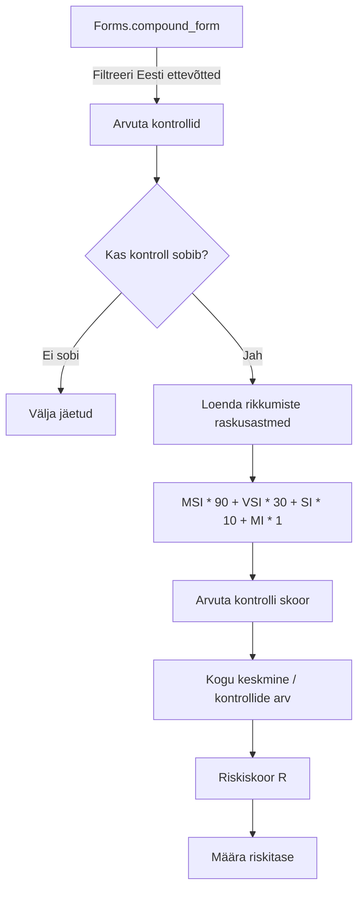
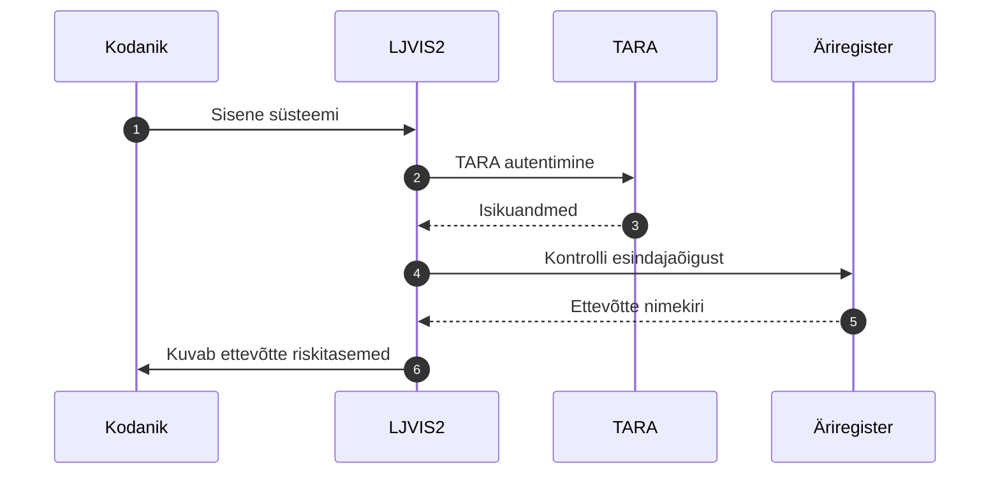

# Planeeritud riskihindamine

> **Märkus:** Riskihindamine on arendamisel (LJVIS2-150 / 151 / 152). See peatükk kirjeldab planeeritud käitumust.

## Mis on riskihindamine

LJVIS2 hakkab automaatselt hindama Eesti ettevõtete riskitaset kontrollaktide põhjal. Riskiskoor arvutatakse Euroopa Liidu määruse 2022/695 (veoettevõtja hea maine ja juhtide juurdepääs kutsele) alusel.

## Arvutusvalem

Riskiskoori valem on:

```
R = ((Σᵢ ((nMSI×90 + nVSI×30 + nSI×10 + nMI×1) / Nᵢ)) / r) × g
```



## Tähistused

| Tähis | Tähendus |
|---|---|
| `nMSI` | Huligaansõit (Most Serious Infringement) rikkumiste arv |
| `nVSI` | Väga tõsine rikkumine (Very Serious Infringement) arv |
| `nSI` | Tõsine rikkumine (Serious Infringement) arv |
| `nMI` | Vähemtõsine rikkumine (Minor Infringement) arv |
| `Nᵢ` | Kontrollitud sõidukite arv kontrollis i |
| `r` | Arvesse võetud kontrollide koguarv (sh nullpunktilised) |
| `g` | Aruka sõidumeeriku kaalutegur; esimeses versioonis 1,0 |
| `R` | Koondriskiskoor |

## Riskitasemed

| Riskitase | Väärtus | Kuvatav värv | Tähendus |
|---|---|---|---|
| Hall | `r = 0` | Hall | Kontrollimata — ettevõttel pole piisavalt kontrolle |
| Roheline | `0 ≤ R ≤ 100` | Roheline | Madal risk |
| Kollane | `101 ≤ R ≤ 200` | Kollane | Keskmine risk |
| Punane | `R ≥ 201` | Punane | Kõrge risk |

## Millised kontrollid arvesse lähevad

Arvesse lähevad:

- `compound_form` kirjed, mille staatus on `published`
- Ettevõtja on Eesti ettevõtja (registrikood 8 numbrit)
- Jõustumiskuupäev jääb kahe aasta pikkusesse ajavahemikku

### Nullpunktilised kontrollid

Need kontrollid lähevad arvesse (`r++`), kuid ei anna kaalupunkte:

- `sp_applicability = 'applied'` JA `proceeding_type` on expedited/general/summary JA puuduvad raskusastmega rikkumised
- `result_type = 'warning'` (HOIATUS) JA `sp_applicability = 'applied'` JA puuduvad EU raskusastmega rikkumised

### Välja jäetavad kontrollid

Kontrollid, mille `sp_applicability` on `not_checked` või `not_applied` ning tulemus on `ok`, ei lähe arvesse.

## Kodaniku vaade

Ettevõtte esindaja saab sisselogides vaadata oma ettevõtte riskitaset. Süsteem kontrollib TARA autentimise järel, kas isikul on äriregistri andmetel ettevõtja esindaja õigus.



## Administraatori vaade

Ametnikud saavad vaadata kõigi Eesti ettevõtete riskitasemete loendit. Loend võimaldab:

- sorteerida ettevõtete nime järgi
- filtreerida riskitaseme järgi (Hall, Roheline, Kollane, Punane)
- otsida registrikoodi või nime järgi
- avada detailvaate, kus kuvatakse skoori moodustavad kontrollid

## ERRU integratsioon

Riskiskoor edastatakse Euroopa Liidu ERRU (European Register of Road Transport Undertakings) süsteemile CTUD (Common Transport Union Database) liidese kaudu. LJVIS2 pakub selleks eraldi `/current` endpointi, mida CTUD päringu töötleja kutsub.
