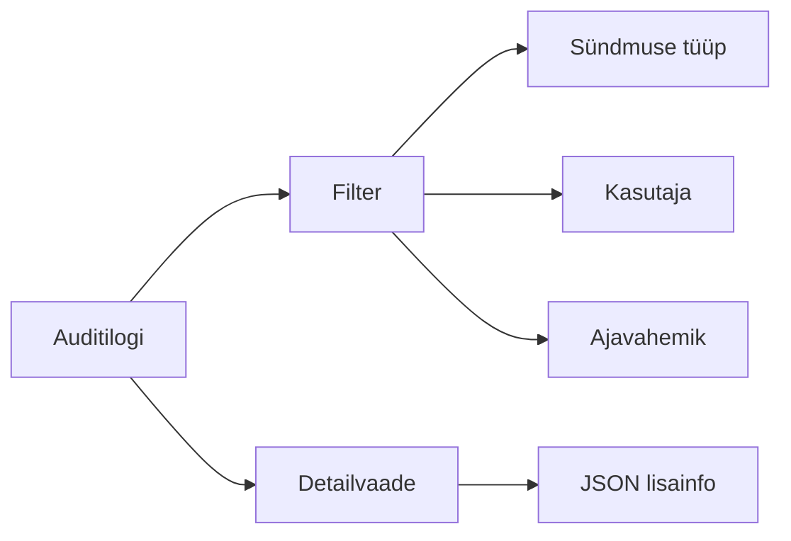

# Auditilogi vaatamine

Auditilogi kuvab süsteemis toimunud olulisi tegevusi. See on abivahend, mille abil saab jälgida, kes millal mida tegi.

## Ligipääs

Auditilogi avamiseks vali menüüst **Haldus → Auditilogi**.

Õigus: `audit.read`

## Mida logitakse

Auditilogi salvestab järgmised sündmused:

- kasutaja vaatamine ja muutmine
- kasutajagrupi muutmine
- klassifikaatori väärtuse muutmine
- vormide loomine, vaatamine ja muutmine
- autentimissündmused

## Logi kirje koostis

Iga kirje sisaldab:

| Väli | Selgitus |
|---|---|
| Sündmuse tüüp | Näiteks `user.create`, `form.view` |
| Kategooria | Kasutaja, vorm, klassifikaator jne |
| Tegija nimi | Kes tegevuse sooritas |
| Tegija isikukoodi räsi | Pseudonüümistatud isikukood |
| Kirjeldus | Inimloetav selgitus |
| Lisainfo | JSON-formaadis detailid |
| Ajatempel | Millal tegevus toimus |

## Logi otsimine

Auditilogi lehel saad:

- filtreerida sündmuse tüübi järgi
- otsida tegija nime järgi
- valida kuupäevavahemiku
- sorteerida ajatemplite järgi
- avada detailvaate, kus näidatakse täpsemaid andmeid ja JSON-i

## Räsiahela kontroll

Auditilogi on varustatud räsiahelaga, mis tagab, et ükski kirje ei oleks vaikimisi muudetud. Räsiahela kontrolli saab teha eraldi funktsiooniga, kui seda on õigus kasutada.

## Näited sündmustest

| Sündmus | Selgitus |
|---|---|
| `user.create` | Uus kasutaja loodud |
| `user.update` | Kasutaja andmed muudetud |
| `user_group.update` | Kasutajagrupi andmed muudetud |
| `classifier_value.update` | Klassifikaatori väärtus muudetud |
| `form.create` | Uus vorm loodud |
| `form.view` | Vormi vaadati |
