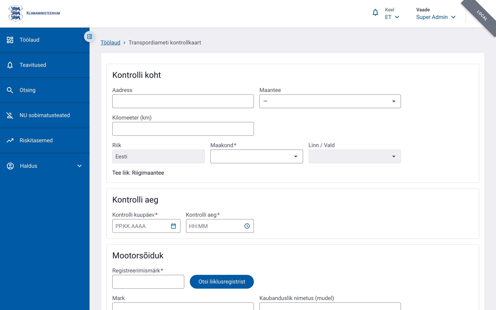
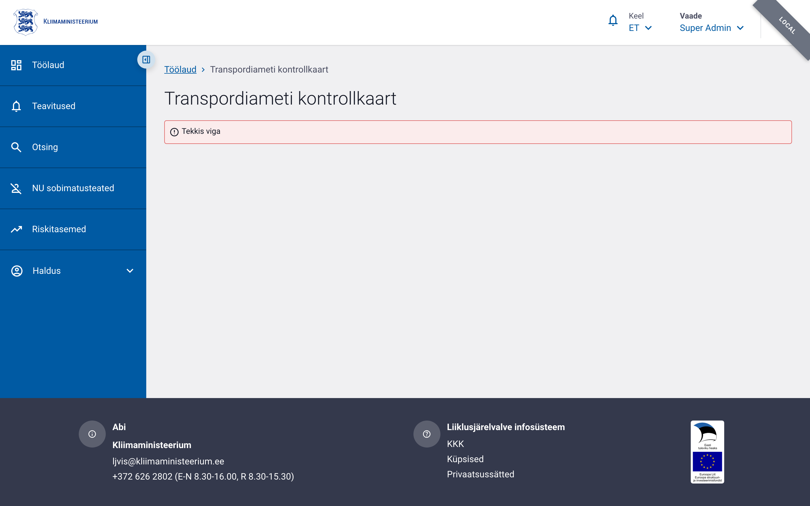
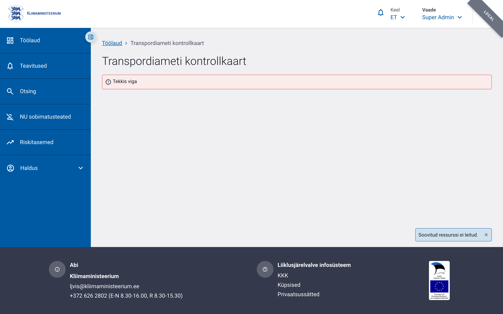

# Transpordiameti kontrollkaart

Transpordiameti (TRAM) kontrollkaart on liiklusinspektsiooni käigus täidetav
kontrollkaart autojuhi sõidu- ja puhkeaja ning muude dokumentide kontrollimiseks.
Alates ADR-002-st on TRAM kontrollkaart **üks eraldiseisev olem** (`forms.tram_control_card`):
üldosa ja sõidukijuhi kontrolli sisu on **ühel keritaval vormil**, mille saab salvestada,
kinnitada ja avalikustada ühe elutsükli jooksul. Varasem kahe olemi mudel (koondvorm +
eraldi autojuhi alamvorm) on asendatud. Vt ADR-002.

## Juurdepääs ja õigused

| Õigus | Kirjeldus |
|---|---|
| `tram_driver_form.write` | Vormi loomine ja muutmine |
| `tram_driver_form.read` | Vormi vaatamine |

Õigused määratakse kasutajate halduses Transpordiameti kasutajagruppidele. PPA-õigustega
kasutaja ei näe TRAM-vorme otsingus ega vormiloendis ja vastupidi.

## Vormi avamine

**Töölaud → „Transpordiameti kontrollkaart" → „Täida →"**

Olemasolevaid vorme saab avada otsingust või otse URL-ilt `/control-forms/tram-control-card/:id`.

## Vormi ülesehitus



Kogu info on **ühel keritaval vormil** — eraldi vahekaarti ega alamvormi ei ole.
Vorm koosneb kahest põhiosast:

| Osa | Sisu |
|---|---|
| **Üldosa** | Kontrollikoht, sõiduk, vedaja, ametiisik |
| **Sõidukijuhi andmed** | Juhi tuvastus, veoliik, veoklass, dokumendikontroll, kontrolli tulemus ja menetlus, failid, märkused |

### Üldosa


| Plokk | Väljad |
|---|---|
| **Kontrollikoht** | Kuupäev, kellaaeg, riik, maakond, linn/vald, tee / kilomeeter / aadress |
| **Sõiduk** | Registreerimismärk, mark, mudel, VIN, kategooria, läbisõit, haagised |
| **Vedaja** | Registrikood, nimi, riik, maakond, linn, aadress, sihtnumber, tegevusloa koopia number |
| **Ametiisik** | Eesnimi, perekonnanimi, asutus, struktuuriüksus, ametinimetus (eeltäidetud kasutaja profiilist) |

#### Sõiduki kategooria valik

Mootorsõiduki kategooria on täislaiuses väljal, nii et kõik kategooriad — sh `(e) M2` ja
`(f) M3` — mahuvad ühele reale. „Muu" tekstiväli ilmub vahetult „Muu" valiku järel.

#### Haagised

Haagised kuvatakse tähistega **Haagis 1**, **Haagis 2**, **Haagis 3**.

#### Vedaja otsing äriregistrist

Vedaja andmeid saab täita automaatselt äriregistri X-tee päringuga:
- **Peanupp** proovib esmalt registrikoodi järgi; kui registrikoodi pole täidetud, otsib nime järgi.
- **„Otsi nime järgi"** nupp vedaja nimevälja kõrval käivitab otse nimeotsingu.
- Mitme vaste korral avaneb **valikuaken** — vali sobiv ettevõte loendist, registrikood
  kantakse üle automaatselt.

### Sõidukijuhi andmed



„Sõidukijuhi andmed" sektsioon on üldosa all samal vormil ja täidetav kohe — ei pea
eelnevalt salvestama ega eraldi vahekaarti avama.

#### „Ei ole asjakohane" märkeruut


„Sõidukijuhi andmed" pealkirja all on märkeruut **„Ei ole asjakohane"**.
Märgituna ei ole autojuhi ees- ja perekonnanimi kohustuslikud — kasutatakse juhul,
kui kontroll toimub ilma juhti peatamata ja juhi andmeid ei ole võimalik tuvastada.

#### Juhi tuvastus

| Väli | Märkus |
|---|---|
| Eesnimi | |
| Perekonnanimi | |
| Eesti isikukood | |
| „Otsi rahvastikuregistrist" | Täidab nime, kodakondsuse ja sünniaja automaatselt |
| Välisriigi isikukood | |
| Kodakondsus | |
| Sünniaeg | Tuleviku kuupäev keelatud |

#### Veoliik

| Väli | Valikud |
|---|---|
| **Veoliik** | Kaubavedu · Sõitjatevedu · Tühi sõit |
| **Vedu** | Kaubanduslik vedu · Omavedu · Veost vabastatud |
| Liini number | Ainult sõitjateveol |
| Liini nimetus | Ainult sõitjateveol |

#### Veoklass

Veoklass sisaldab kaupade ja reisijate veoga seotud klassifikatsioone, sealhulgas
**kabotaaži** kontroll (lubatud / keelatud / ületatud).

#### Kontrolli tulemus ja menetlus

| Väli | Valikud / Märkus |
|---|---|
| **Kontrolli tulemus** | Korras · Hoiatus · Alustati väärteomenetlust |
| **Lisameede** | Lisameedet ei rakendatud · Ettekirjutus · Juhtimiselt kõrvaldamine · Arest · Autovedu on katkestatud |
| **Menetluse liik** | Lühimenetlus · Kiirmenetlus · Üldmenetlus |
| Menetluse number | Viidatav toimiku number (nt `1-20/2026/TRAM-6001`) |

#### Dokumendi või õiguse kontroll

Kontrollitud dokumentide ja õiguste loend koos tulemusega (OK / puudub / aegunud jne).
Muud dokumendid saab lisada vabatekstina.

#### E-toimiku andmed

Kui menetluse number on täidetud ja menetluses jõustub karistus, lisab öine
sünkroon automaatselt kaardile:
- **Jõustunud otsus** — kirjutuskaitstud tekstiväli
- **Menetluse lõpetamise alus** — kirjutuskaitstud tekstiväli

Need andmed on nähtavad ainult pärast automaatset avalikustamist (vt allpool).

#### Failid ja märkused

Kaardile saab lisada faile (nt kontrolliakti skanneering). Märkuste väli on
vabatekstiline.

#### E-toimiku kvalifikatsioonide päring



Kui kaardil on Eesti isikukoodiga sõidukijuht ja täidetud menetluse number, kuvatakse
vormi ülaosas kirjutuskaitstud **e-toimiku päringu kaart**, mis näitab juhiga seotud
karistuse kvalifikatsioone (sama komponent, mida kasutab PPA koondvorm). Andmeid ei
salvestata kaardile — kaart on informatiivne.

## Vorminumber

Igal kaardil on **üks** jooksev number:

```
tram-AAAA-NNNNN/versioon
```

Näiteks `tram-2026-00001/1`. Varasemat eraldi `sp-` alamvormi numbrit enam ei ole.

## Elutsükkel

**Salvestatud → Kinnitatud → Avaldatud**

- **Salvesta** — korduv salvestamine ei muuda versiooni.
- **Kinnita** — lukustab kaardi (versioon ei muutu).
- **Avalikusta** — lubatud ainult kinnitatud kaardilt; versiooninumber suureneb.

### Automaatne avalikustamine e-Toimikust

Kui kaardil on menetluse viitenumber ja Eesti isikukoodiga sõidukijuht, kontrollib öine
sünkroon e-Toimikust, kas menetluses on **jõustunud karistus**. Kui on, lisatakse kaardile
automaatselt uus avalikustatud versioon (`created_by = e-toimik`). Kui menetlus lõpetati
karistust määramata, avalikustab inspektor kaardi käsitsi.

## Vaatamisvaade

Avalikustatud vormi vaatamisvaates on sõidukijuhi sektsiooni sisu loetav kuid
mittemuudetav. Sektsioonid, mida TRAM kontrollkaardil ei kasutata (sõidu- ja
puhkeaja nõuete täitmine, sõiduki mass ja mõõtmed, ATP kokkuleppe nõuete kontroll),
ei kuvata ei redigeerimis- ega vaatamisvaates — need täidetakse salvestamisel
vaikeväärtustega.

## PDF-printimine

Vormi toimingute juures on nupp **„Prindi"**. Salvestatud vormil saab valida
**„Prindi täidetud vorm"** või **„Prindi tühi vorm"**. Uuel salvestamata vormil
saab alla laadida tühja blanketi. Varasema versiooni vaatamisel sisaldab
täidetud PDF valitud versiooni andmeid.
