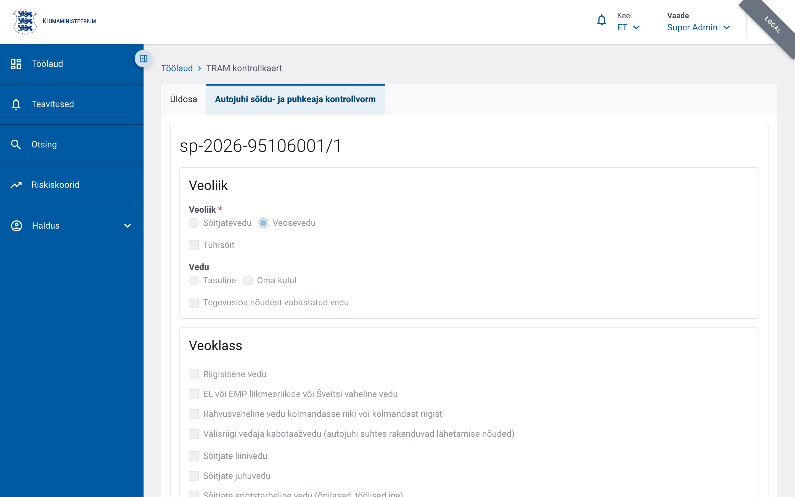

# Transpordiameti kontrollkaart

Transpordiameti (TRAM) kontrollkaart on liiklusinspektsiooni käigus täidetav
kontrollkaart autojuhi sõidu- ja puhkeaja ning muude dokumentide kontrollimiseks.
ERRU mõistes on tegemist sama andmetüübiga mis PPA koondvorm — andmed salvestuvad
samadesse tabelitesse (`forms.compound_form` + `forms.sp_driver_form`), kuid TRAM
kontrollkaardid eristatakse `compound_form.authority = 'TRAM'` väärtusega.
Vt arhitektuuriotsust ADR-001.

## Juurdepääs ja õigused

| Õigus | Kirjeldus |
|---|---|
| `tram_driver_form.write` | Vormi loomine ja muutmine |
| `tram_driver_form.read` | Vormi vaatamine |

Õigused määratakse kasutajate halduses Transpordiameti kasutajagruppidele. PPA-õigustega
kasutaja ei näe TRAM-vorme ega TRAM-vorme otsingus ja vastupidi.

## Vormi avamine

**Töölaud → „Transpordiameti kontrollkaart" → „Täida →"**

Olemasolevaid vorme saab avada otsingust või otse URL-ilt `/control-forms/tram-driver/:id`.

## Vormi ülesehitus


Vorm koosneb kahest osast: **üldosa** (kontrollikoht, sõiduk, vedaja, ametiisik) ja
**autojuhi alamvorm** (sõidu- ja puhkeaeg, dokumendid, rikkumised, kontrolli tulemus).
PPA koondvormi alamvorme (tehnoülevaatus, ADR, veo katkestamine, kaassõitja) TRAM-kaardil
ei ole.

### Üldosa


| Plokk | Väljad |
|---|---|
| **Kontrollikoht** | Kuupäev, kellaaeg, riik, maakond, linn/vald, tee / kilomeeter / aadress |
| **Sõiduk** | Registreerimismärk, mark, mudel, VIN, kategooria, läbisõit, haagised |
| **Vedaja** | Registrikood, nimi, riik, maakond, linn, aadress, sihtnumber, tegevusloa koopia number |
| **Ametiisik** | Eesnimi, perekonnanimi, asutus, struktuuriüksus, ametinimetus (eeltäidetud kasutaja profiilist) |

#### Sõiduki kategooria valik

Mootorsõiduki kategooria on täislaiuses väljal, nii et kõik kategooriad — sh `(e) M2` ja
`(f) M3` — mahuvad ühele reale. „Muu" tekstiväli ilmub vahetult „Muu" valiku järel.

#### Haagised

Haagised kuvatakse tähistega **Haagis 1**, **Haagis 2**, **Haagis 3**.

#### Vedaja otsing äriregistrist

Vedaja andmeid saab täita automaatselt äriregistri X-tee päringuga:
- **Peanupp** proovib esmalt registrikoodi järgi; kui registrikoodi pole täidetud, otsib nime järgi.
- **„Otsi nime järgi"** nupp vedaja nimevälja kõrval käivitab otse nimeotsingu.
- Mitme vaste korral avaneb **valikuaken** — vali sobiv ettevõte loendist, registrikood
  kantakse üle automaatselt.

### Sõidukijuhi andmed



Olemasoleval kaardil on autojuhi alamvormi vahekaart alati avatud — eraldi „Lisa autojuht"
nuppu ei ole.

> **Uue kaardi puhul** ilmub autojuhi vahekaart pärast üldosa esmakordset salvestamist,
> kuna alamvorm vajab salvestatud üldosa võtit (`compoundFormKey`).

#### „Ei ole asjakohane" märkeruut (ainult TRAM)


„Sõidukijuhi andmed" pealkirja all on märkeruut **„Ei ole asjakohane"**.
Märgituna ei ole autojuhi ees- ja perekonnanimi kohustuslikud — kasutatakse juhul,
kui kontroll toimub ilma juhti peatamata ja juhi andmeid ei ole võimalik tuvastada.

#### Sõidukijuhi andmeväljade järjekord

| Väli | Märkus |
|---|---|
| Eesnimi | |
| Perekonnanimi | |
| Eesti isikukood | Kitsamal väljal |
| „Otsi rahvastikuregistrist" | Täidab nime, kodakondsuse ja sünniaja automaatselt |
| Välisriigi isikukood | Kitsamal väljal |
| Kodakondsus | |
| Sünniaeg | |

#### E-toimiku kvalifikatsioonide päring


Kui autojuhi alamvormil on täidetud menetluse viitenumber, kuvatakse vormi ülaosas
kirjutuskaitstud **e-toimiku päringu kaart**, mis näitab juhiga seotud karistuse
kvalifikatsioone (sama komponent, mida kasutab PPA koondvorm). Andmeid ei salvestata
kaardile — kaart on informatiivne.

## Vorminumber

TRAM-kaartidel on eraldiseisev jooksev number, sõltumatu PPA `koond-` seeriast:

```
tram-AAAA-NNNNN/versioon
```

Näiteks `tram-2026-00001/1`.

## Elutsükkel

Vorm läbib samad olekud mis PPA vormid:

**Salvestatud → Kinnitatud → Avaldatud**

Kinnitatud vormi muutmisel suureneb versiooninumber.

## Vaatamisvaade

Avalikustatud vormi vaatamisvaates on peidetud kolm autoveoga mitte seotud sektsiooni
(„Sõidu- ja puhkeaja nõuete täitmine", „Sõiduki mass ja mõõtmed", „ATP kokkuleppe
nõuete kontroll") — need täideti salvestamisel vaikeväärtustega.
