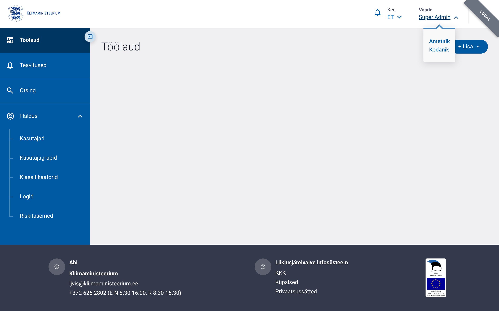

# Vaate vahetamine

LJVIS2-l on kaks vaadet: **ametniku vaade** ja **kodaniku vaade**. See, milline vaade
sisselogimisel avaneb, sõltub sellest, kummale nupule („Ametnikule" või „Kodanikule")
sisselogimislehel vajutasite.

## Vaadete erinevus

| Vaade | Kellele | Mida näeb |
|---|---|---|
| **Ametnik** | Transpordiametnik, kellele on loodud konto ja antud õigused | Vasakmenüü, kontrollkaardid, otsing, haldus (õiguste järgi) |
| **Kodanik** | Ettevõtja esindaja (äriregistri järgi) | „Minu ettevõtted" (esindatavate ettevõtete kontrollid ja riskitase) ja „Minu protokollid" (vormid, kus isik on osaline). Vasakmenüüd ei ole. |

## Vaate vahetamine käigu pealt

Kui Teil on **nii ametniku konto kui ka kodaniku õigused**, saate vaadet vahetada ilma
uuesti sisse logimata. Klõpsake päise paremas servas **Vaade** rippmenüüd ja valige
**Ametnik** või **Kodanik**:

- Kui Teil on ainult kodaniku õigused, kuvatakse rippmenüüs ainult „Kodanik" (vahetada
  ei ole midagi).
- Valik jääb meelde ka lehe värskendamisel.

## Kodaniku töölaud

Kodaniku vaates on avaleht koondvaade esindatavate ettevõtete ja isiklike protokollide
kohta:

