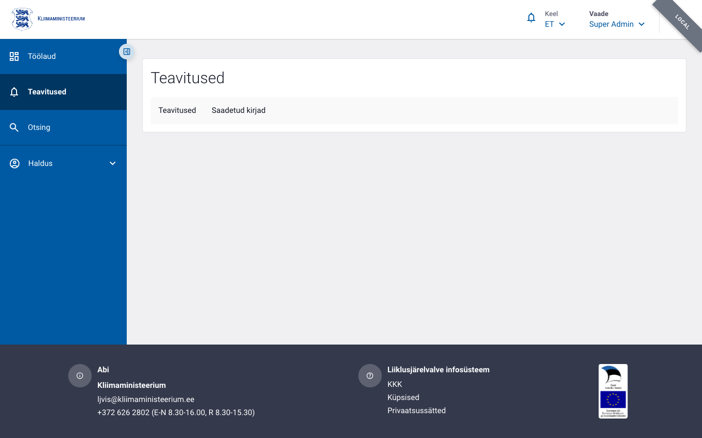
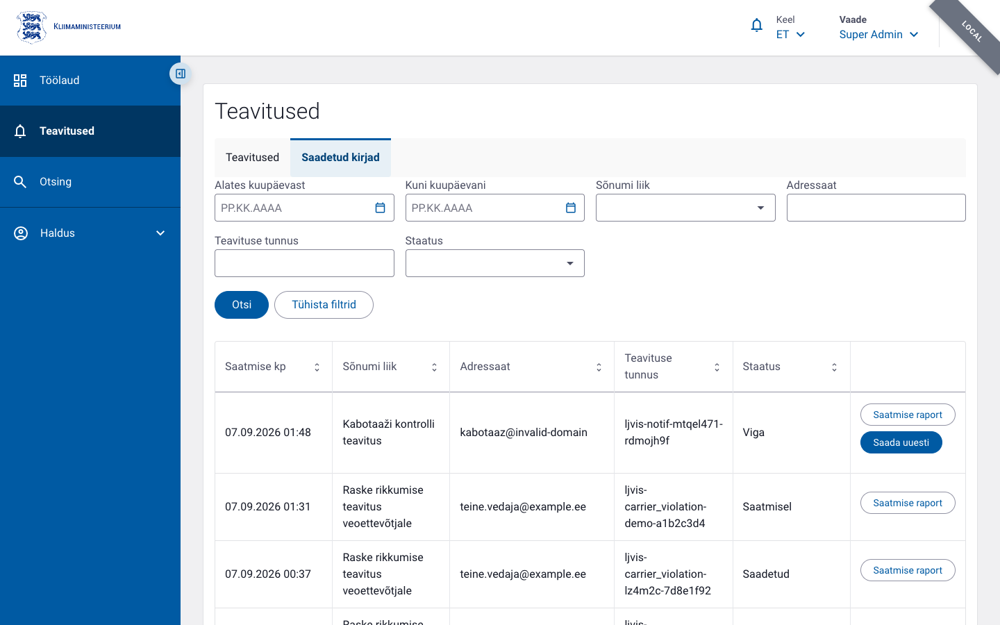

# Teavitused

Teavituste vaade avaneb vasakmenüüst klõpsates **Teavitused**.

Vaates on kaks vahekaarti:

| Vahekaart | Kellele nähtav | Sisu |
|-----------|---------------|------|
| **Teavitused** | Kõik sisseloginud kasutajad | Rakendusesisesed teavitused (nt vormi kinnitamine, riskihinnangu muutus) |
| **Saadetud kirjad** | Kasutajad, kellel on `notification.list` õigus | Välisele kanalile saadetud kirjade saatmislogi (Postkast 2.0 kaudu e-post) |

## Vahekaart „Teavitused"

Loetleb rakendusesisesed (kellaikoon päises) teavitused. Lugemata teavitused on
esile tõstetud. Nupp **Märgi kõik loetuks** eemaldab esile tõstmise korraga kõigilt.

Kui teavitusi ei ole, kuvatakse vastaav teade.

## Vahekaart „Saadetud kirjad"

Näitab kõiki LJVIS2 poolt saadetud e-kirju (Postkast 2.0 teenuse kaudu X-tee üle).

### Filtrid

| Filter | Selgitus |
|--------|----------|
| Alates kuupäevast | Saatmise kuupäeva alates (kaasa arvatud) |
| Kuni kuupäevani | Saatmise kuupäeva lõpp (kaasa arvatud) |
| Sõnumi liik | Teavituse liik klassifikaatorist |
| Adressaat | E-posti aadress (osaline otsing) |
| Teavituse tunnus | Unikaalne teavituse identifikaator (täpne otsing) |
| Staatus | Saatmise staatus: Saatmisel / Saadetud / Viga |

Klõps **Otsi** rakendab filtrid; **Tühista filtrid** lähtestab kõik.

Kui otsingule ei vasta ühtegi kirjet, kuvatakse tekst „Otsingule vastavaid teavitusi
ei leitud."

### Tabeli veerud

| Veerg | Sisu |
|-------|------|
| Saatmise kp | Saatmise kuupäev ja kellaaeg |
| Sõnumi liik | Teavituse liik (nt „Raske rikkumise teavitus veoettevõtjale") |
| Adressaat | Saaja e-posti aadress |
| Teavituse tunnus | LJVIS2 antud unikaalne identifikaator |
| Staatus | `Saatmisel` / `Saadetud` / `Viga` |

Kõiki veerge (v.a tegevuste veerg) saab **sorteerida**; vaikimisi on nimekiri
saatmise kuupäeva järgi kahanevas järjekorras.

### Staatused

| Kuvatav staatus | Tähendus |
|-----------------|----------|
| **Saatmisel** | Teavitus on järjekorras (`queued`) või Postkast 2.0 töötleb seda (`in_progress`). |
| **Saadetud** | Postkast 2.0 kinnitas eduka kättetoimetamise. |
| **Viga** | Saatmine ebaõnnestus — vigane aadress, vale kanal või muu viga. |

Viga-staatusega real kuvatakse hiirekursori hoidmisel staatuse peal **kohtspikker**
vea põhjusega.

### Saatmise raport

Nupp **Saatmise raport** avab ühe saatmiskatse adressaadi(te) saatmistulemuse detailvaate.

### Uuesti saatmine

Nupp **Saada uuesti** on nähtav ainult **Viga** staatusega ridadel ja ainult
`notification.resend` õigusega kasutajale. Nupule vajutades küsitakse kinnitus, seejärel
saadetakse teavitus **muutmata kujul samale adressaadile** uuesti.

Uuesti saatmine loob uue saatmiskirje — algne vigane kirje jääb muutmata.
