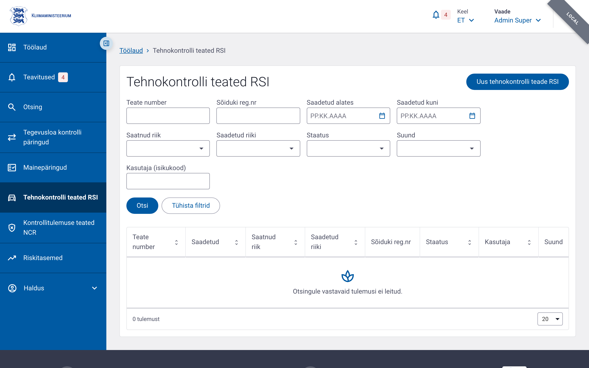
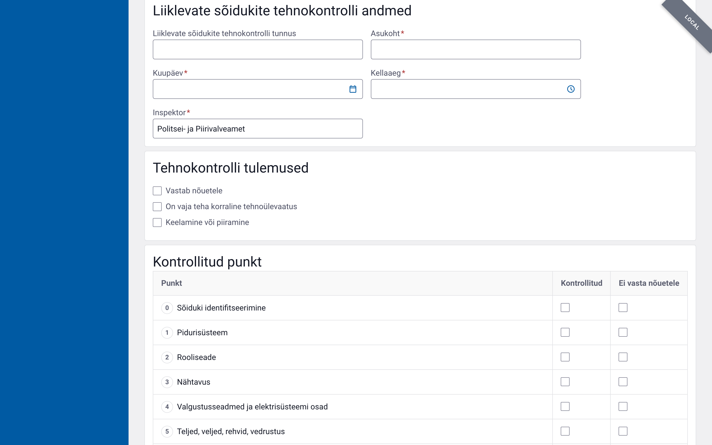
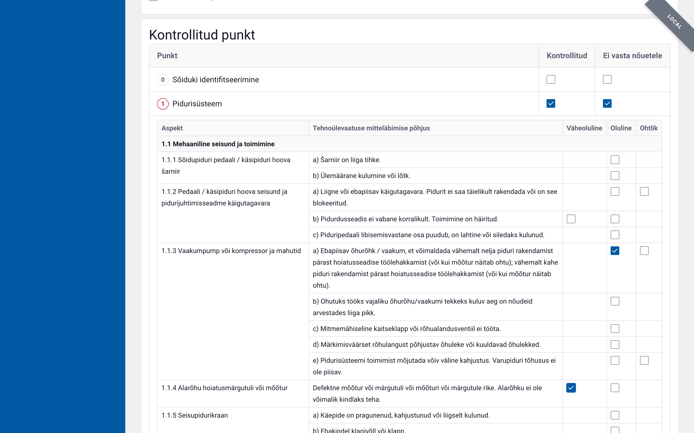

# Tehnokontrolli teated RSI

RSI (*RoadSideInspection*) on ERRU süsteemi kaudu saadetav tehnokontrolli teade,
millega teavitatakse välisriigi sõiduki registreerimisriiki läbiviidud
tehnokontrolli tulemustest.

## Juurdepääs ja õigused

| Õigus | Kirjeldus |
|---|---|
| `rsi.read` | Teadete lugemine |
| `rsi.create` | Uue teate koostamine ja salvestamine |
| `rsi.send` | Teate saatmine ERRU-sse |

## Teate avamine

**Menüü → Tehnokontrolli teated RSI**

Loendis on näha kõik saadetud ja saabunud RSI teated.
Uue teate loomiseks klõpsake **„Uus tehnokontrolli teade RSI"**.

Teate saab luua ka otse tehnilise kontrollkaardi vaatamisvaates —
nupp **„Loo RSI teade"** eeltäidab teate sõiduki, vedaja ja kontrolliandmetega.

## Teate ülesehitus

RSI teade koosneb kaheksast plokist:

| Plokk | Sisu |
|---|---|
| **Teate andmed** | Teate number (määratakse salvestamisel), sihtliikmesriik (tuletatud sõiduki registreerimisriigist), esitanud pädev asutus (Kliimaministeerium), inspektor (PPA) |
| **Sõiduki andmed** | Sõiduki kategooria, registreerimismärk ja -riik, VIN, odomeeter |
| **Juhi andmed** | Valikuline plokk — eesnimi, perekonnanimi, juhiloa number ja -riik |
| **Veoettevõtja / omaniku andmed** | Valikuline plokk — ettevõtja nimi, tegevusloa number, sõiduki omaniku nimi |
| **Kontrollimise andmed** | Koht, kuupäev ja kellaaeg, kontrolliasutus/inspektor |
| **Tehnokontrolli tulemused** | Vastab nõuetele · Korraline tehnoülevaatus · Keelamine või piiramine (märkeruudud) |
| **Kontrollitud punkt** | 12 kontrollpunkti (0–10 ja 20) ning iga nõuetele mittevastava punkti mitteläbimise põhjused koos hinnanguga |
| **Vastuse andmed** | Kuvatakse, kui sihtliikmesriik on vastanud (kirjutuskaitstud) |

### Kontrollitud punkt

Kontrollpunktid ja mitteläbimise põhjused tulevad klassifikaatorist
**RSI kontrollitud punktid ja mitteläbimise põhjused** (`RSI_FAILED_REASON`) —
direktiivi 2014/47/EL II lisa (punktid 0–9) ja III lisa (10 Sõiduki sobivus,
20 Kinnitusmeetodid). Koodid on samad, mis ERRU teates.

Iga kontrollpunkti real on kaks märkeruutu:
- **Kontrollitud** — punkt kontrolliti;
- **Ei vasta nõuetele** — märgib punkti ka kontrollituks ja avab rea all
  punkti kõigi mitteläbimise põhjuste tabeli (aspekt, põhjus, *Väheoluline*,
  *Oluline*, *Ohtlik*).

Põhjuste tabelis on märkeruut ainult nende hinnangute juures, mida direktiiv
selle põhjuse puhul lubab. Ühe põhjuse kohta saab valida ühe hinnangu; märgitud
ruudu uuesti klõpsamine eemaldab valiku. Nõuetele mittevastaval punktil peab
olema valitud vähemalt üks põhjus — muidu teadet salvestada ega saata ei saa.

**Kontrollitud** märke eemaldamine tühjendab ka punkti põhjused.

#### Eeltäitmine tehnoseisundi kontrollkaardilt

Kontrollkaardilt loodud teatel täidetakse kontrollpunktide olek
(punktid 0–9 vastavad kontrollkaardi punktidele; kontrollkaardi punkt 10
„Veose kinnitamine" jaotub RSI punktideks 10 ja 20, punkt 11 „Muu" jääb
välja). Kontrollkaardil märgitud rikked kuvatakse punkti juures vihjena —
vastavad ERRU mitteläbimise põhjused tuleb tabelist ise valida, sest riikliku
kontrollkaardi rikkekood ei määra ERRU põhjuse alapunkti (a, b, c …).

Lisaks eeltäidetakse:
- **Juhi eesnimi ja perekonnanimi** — koondvormi esimeselt juhilt;
- **Veoettevõtja või omaniku andmed** — koondvormi ettevõtja andmetelt (nimi,
  ühenduse tegevusloa number, aadress), kui kõik need väljad on koondvormil
  täidetud. Kui mõni neist puudub, jäetakse plokk tühjaks — pooleliolevat
  plokki ei saaks hiljem salvestada, sest kord avatud plokk nõuab kõiki oma
  kohustuslikke välju korraga.

### Vaikeväärtused

Uuel teatel on eeltäidetud:
- **Teate esitanud pädev asutus**: Kliimaministeerium
- **Inspektor**: Politsei- ja Piirivalveamet

Salvestamisel teisendatakse mõlemad ingliskeelseks ametlikuks nimeks ERRU-sse saatmiseks.

## Elutsükkel

| Olek | Kirjeldus |
|---|---|
| `Salvestatud` | Koostamisjärgus mustand, ametnik saab muuta |
| `Saadetud` | Teade saadetud ERRU-sse, ootab vastust |
| `Vastus saadud` | Sihtliikmesriik vastas, vastuse andmed on nähtavad |
| `Saabuv` | Teiste liikmesriikide poolt saadetud, alati kirjutuskaitstud |
| `Viga` | Saatmine ebaõnnestus — uus teade tuleb koostada |

Koostamisjärgus teate saab muuta kuni nupu **„Saada"** vajutamiseni.
Saadetud teadet enam muuta ei saa.

## PDF-printimine

Igal salvestatud RSI teatel on nupp **„Prindi täidetud vorm"**, mis laadib alla
teate PDF-na. Printimiseks ei avane eraldi printeridialoog.

Väljatrükis on alati kõik 12 kontrollpunkti ning plokk **„Kontrollitud punkti
andmed"** kogu mitteläbimise põhjuste tabeliga — ka nende punktide kohta, mida
ei kontrollitud. Märkeruut on trükitud ainult lubatud hinnangute juurde ja
valitud hinnangud on märgitud ristiga.

## Nipid

- Sihtliikmesriik tuletub automaatselt sõiduki registreerimisriigist — muuta ei saa.
- Kuupäeva ja kellaajaväljal tekivad eraldajad automaatselt (nt `12.03.2026`, `14:30`).
- Teate number on alguses `(määratakse salvestamisel)`; pärast salvestamist kuvatakse tegelik number.
- Veoettevõtja ja juhi plokid on valikulised — lülita sisse ainult siis, kui andmed on olemas.
- Kui teade on olekus `Saabuv`, ei saa seda kunagi muuta, sõltumata õigustest.
