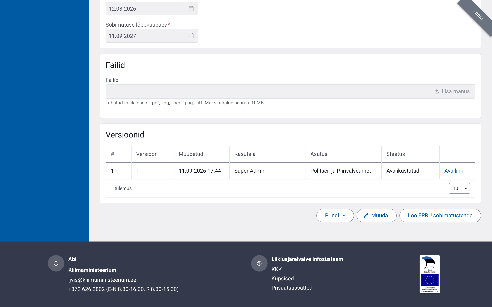
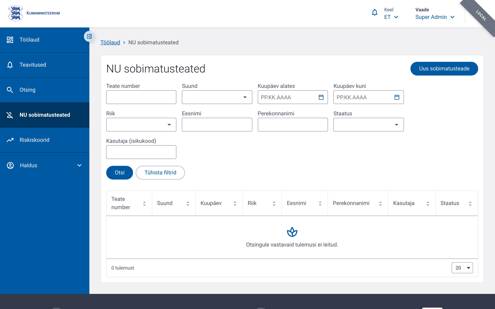
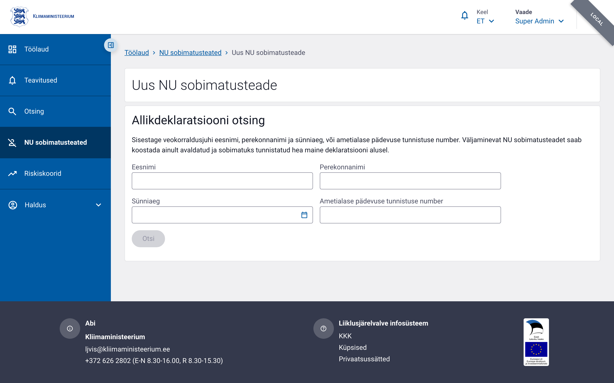
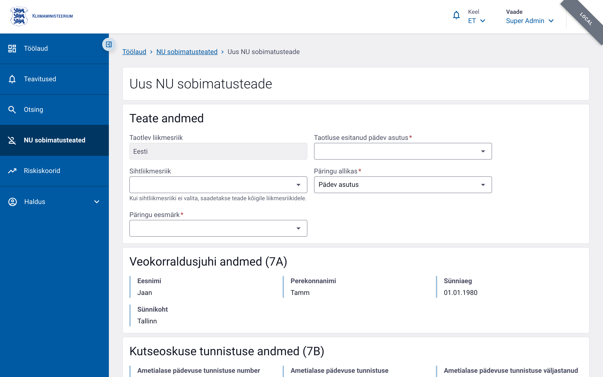

# NU sobimatusteated

NU (*NotifyUnfitness*) on ERRU süsteemi kaudu saadetav teade, millega
teavitatakse teisi liikmesriike veokorraldusjuhi (*transport manager*)
sobimatusest — ta on tunnistatud kõlbmatuks tegutsema veokorraldusjuhina.

Väljaminev NU teade koostatakse **ainult avaldatud ja sobimatuks tunnistatud
hea maine deklaratsiooni** alusel: hea maine kontrollvormi vaates ilmub nupp
**„Loo ERRU sobimatusteade"**, kui vorm on avaldatud ja `fitnessStatus =
sobimatu`.

## Juurdepääs ja õigused

| Õigus | Kirjeldus |
|---|---|
| `nu.list`   | Teadete loendi vaatamine ja filtreerimine |
| `nu.read`   | Teate ja selle koondkinnituse vaatamine |
| `nu.create` | Väljamineva mustandi koostamine ja salvestamine |
| `nu.send`   | Teate saatmine ERRU-sse |

Erinevalt NCR-ist NU teatele **vastust ei koostata** — tegemist on
ühesuunalise teavitusega, millele liikmesriigid annavad ERRU tasandil
ainult vastuvõtukinnituse (koondkinnitus).

## Teate avamine

**Menüü → NU sobimatusteated**

Loendis on kõik väljaminevad ja saabunud NU teated, koos suuna, kuupäeva,
riigi, veokorraldusjuhi nime, kasutaja ja staatuse veeruga; loendit saab
filtreerida kuupäevavahemiku ja kasutaja (isikukood) järgi.

## Teate koostamine hea maine deklaratsioonist

1. Avage avaldatud ja sobimatuks tunnistatud hea maine kontrollvorm.
2. Klõpsake **„Loo ERRU sobimatusteade"** — avaneb otsinguvaade
   (**allikdeklaratsiooni otsing**), kuhu deklaratsiooni võti on juba
   kaasa antud.
3. Otsida saab ka käsitsi (**Menüü → NU sobimatusteated → „Uus
   sobimatusteade"**), sisestades veokorraldusjuhi eesnime, perekonnanime ja
   sünniaja, või ametialase pädevuse tunnistuse numbri.

Leitud deklaratsioon eeltäidab uue teate:

| Plokk | Väljad |
|---|---|
| **Teate andmed** | Taotlev liikmesriik (`nuFrom`), sihtliikmesriik (`nuTo` — tühjaks jättes saadetakse kõigile liikmesriikidele), esitanud pädev asutus, päringu allikas/eesmärk |
| **Veokorraldusjuhi andmed (7A)** | Eesnimi, perekonnanimi, sünniaeg, sünnikoht |
| **Kutseoskuse tunnistuse andmed (7B)** | Tunnistuse number, väljaandmise kuupäev ja riik |
| **Sobimatuse andmed** | Sobimatuse alguskuupäev |

XSD nõuab, et kas nimeplokk (7A) või tunnistuseplokk (7B) oleks täielik —
tavaliselt on täidetud mõlemad, kuna need pärinevad samast deklaratsioonist.

### Allikandmete värskendamine

Kui allikaks olev hea maine deklaratsioon muutub pärast teate mustandi
loomist, kuvatakse vormil teade **„Allikandmed on muutunud"**. Enne saatmist
tuleb klõpsata **„Värskenda allikandmeid"**, muudatused üle vaadata ja
salvestada — muutunud allikandmetega teadet saata ei saa.

## Saatmine

Mustand saadetakse nupuga **„Saada"**. Enne saatmist peavad kõik
salvestamata muudatused olema salvestatud. Saatmisel kontrollitakse:

- väljade pikkuse- ja vormingupiiranguid (ERRU 3.5 skeem),
- et nime- ja tunnistuseplokk on terviklikud,
- et allikdeklaratsioon on endiselt avaldatud, sobimatuks tunnistatud ning
  sobimatuse lõppkuupäev ei ole möödas.

Saatmine on tõrkekindel samaaegsete muudatuste suhtes: kui teadet on
vahepeal teises seansis muudetud või juba saadetud, kuvatakse
versioonikonflikti teade ja leht tuleb uuesti laadida. Ebaõnnestunud
saatmise korral jääb teade olekusse **Viga** — uut saatmiskatset teha ei
saa, tuleb koostada uus teade.

## Elutsükkel

| Olek | Kirjeldus |
|---|---|
| `Salvestatud`      | Mustand (väljaminev), ametnik saab muuta ja saata |
| `Saadetud`         | Väljaminev teade saadetud ERRU-sse |
| `Saabunud`         | Teine liikmesriik on Eestile teate saatnud |
| `Kinnitus saadetud`| Saabunud teatele on ERRU tasandil kinnitus antud |
| `Viga`             | Saatmine ebaõnnestus — uus teade tuleb koostada uuesti |

## Koondkinnitus (väljaminev teade)

Kui teade on saadetud kõigile või mitmele liikmesriigile, kuvatakse
teate vaates **koondkinnituse tabel** — üks rida liikmesriigi kohta:

| Veerg | Kirjeldus |
|---|---|
| Liikmesriik | Riigi kood (`COUNTRY` klassifikaator) |
| Vastust esitav pädev asutus | `COMPETENT_AUTHORITY` klassifikaator |
| Staatus | Vastu võetud / Aegumine / Ei ole saadaval (`NU_MEMBER_STATE_STATUS`) |

Riigi tasandi **Aegumine** või **Ei ole saadaval** ei ole teate enda
veaolukord — need kajastavad ainult selle liikmesriigi vastust.

## Versiooniajalugu

Iga salvestus lisab teatele uue versiooni. Varasema versiooni vaade on
ainult lugemiseks; nupp **„Ava kehtiv versioon"** viib tagasi teate
kehtivale seisule.

## Nipid

- NU teate saab luua ainult **avaldatud ja sobimatuks tunnistatud** hea
  maine deklaratsiooni alusel — muul juhul nuppu „Loo ERRU sobimatusteade"
  ei kuvata.
- Sihtliikmesriigi tühjaks jätmine saadab teate **kõigile** liikmesriikidele.
- NU teatele vastust ei koostata — ainult koondkinnitus liikmesriikide
  kaupa.
- Kui saatmine ebaõnnestub (olek **Viga**), tuleb koostada uus teade;
  vana mustandit uuesti avada ega saata ei saa.
