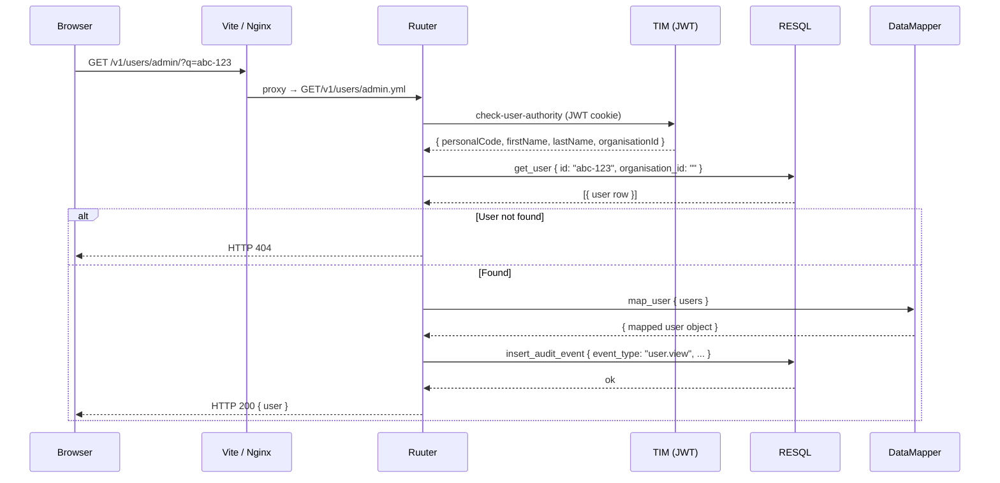
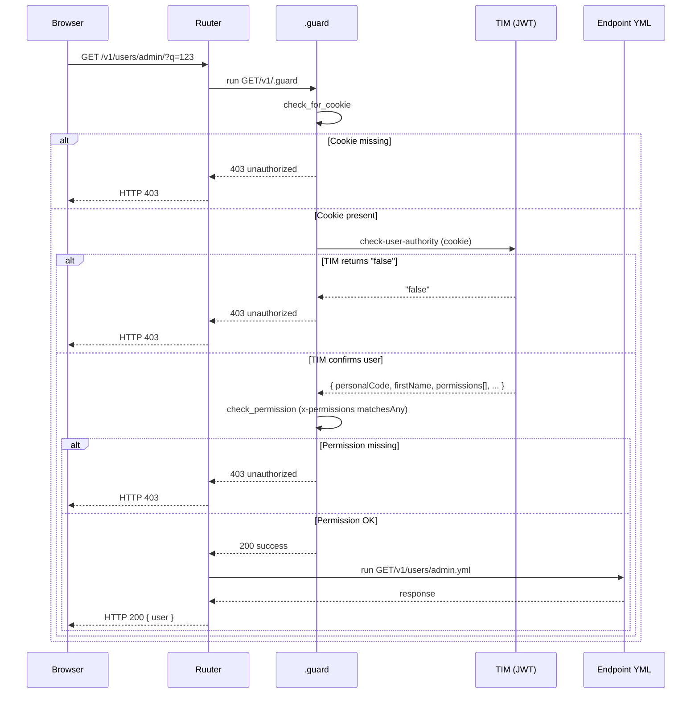

# LJVIS REST API design guide

Project services are developed **contract-first** — the OpenAPI contract
(`docs/openapi.yaml`) is authored before implementation and is the
authoritative source of Ruuter DSL structure.

---

## 1. HTTP method usage

| Method | Usage | Idempotent |
|--------|-------|------------|
| `GET` | Read a resource (single or list) | Yes |
| `POST` | Create a new resource | No |
| `PUT` | Full update of an existing resource | Yes |
| `DELETE` | Remove a resource | Yes |

**Rules:**

- `GET` requests **must not** change server state.
- `POST` is reserved for creation. Complex-filter searches (e.g. CSV
  export) use `GET` with query parameters.
- `PUT` replaces the whole resource — partial updates also use `PUT`
  because DSL does not naturally support `PATCH`. Any field omitted
  from a `PUT` body means "do not change".
- `DELETE` uses query parameters, not a request body.

---

## 2. URI naming rules

### 2.1 General principles

- URIs are **lowercase**, words separated by hyphens (kebab-case):
  `/user-groups`, `/audit-logs`.
- A URI names a **resource collection or an action**, not an HTTP
  method — `GET /v1/users/admin/?q=123`, not
  `GET /v1/users/admin/get-user`.
- Version is the first URI segment: `/v1/...`.

### 2.2 Static path segments vs query parameters

Ruuter DSL uses **static path segments** for file-tree mapping. Dynamic
identifiers travel as **query parameters**.

| Type | Example | Explanation |
|------|---------|-------------|
| Static segment | `/v1/users/admin` | `admin` is a DSL directory name |
| Static action | `/v1/users/admin/search` | `search.yml` file in DSL |
| Query param (id) | `/v1/users/admin/?q=123` | Dynamic identifier (`?q=` is the de facto standard) |
| Query param (filter) | `/v1/users/admin/search/?q=Mari&page=1` | Search and paging on a separate endpoint |

**Scope** (`admin` | `local`) is a **static path segment** — it maps to
different DSL files with different business logic and different guard
checks.

### 2.3 Forbidden patterns

| Wrong URI | Problem |
|-----------|---------|
| `GET /v1/users/admin/123` | `id` in a path segment — Ruuter DSL cannot resolve it to a static file path |
| `GET /v1/users/admin/user?id=123` | Resource name `user` duplicates the collection `users` — use `GET /v1/users/admin/?q=123` |
| `GET /v1/users/admin/get-user` | HTTP method name in the URI — the method already says `GET` |
| `POST /v1/users/admin/read/get` | CRUD-action layering — `read/get` is redundant |
| `POST /v1/users/admin/edit/insert` | CRUD verb in the URI — creation is `POST`, not a path segment |
| `POST /v1/users/admin/list` | List retrieval via `POST` — list operations are `GET` |

### 2.4 Recommended patterns

| Action | Recommended URI | Explanation |
|--------|-----------------|-------------|
| List search | `GET /v1/users/admin/search/?q=Mari&page=0&pageSize=20` | Dedicated `search` endpoint, `?q=` as the filter |
| Single-resource read | `GET /v1/users/admin/?q=123` | `?q=` is the de facto standard id parameter, resource name not duplicated |
| Create | `POST /v1/users/admin` | HTTP method denotes creation |
| Update | `PUT /v1/users/admin` | `id` in the request body |
| Related-resource read | `GET /v1/user-groups/admin/users/?q=456` | `scope` as path segment, `?q=` as query parameter |
| Delete | `DELETE /v1/user-groups/user?q=456&userId=789` | Multiple identifiers as query parameters |

### 2.5 Data-flow example — opening a user's detail view



---

## 3. Error codes

All error responses follow the [RFC 7807 Problem Details](https://datatracker.ietf.org/doc/html/rfc7807)
format.

| HTTP code | Meaning | Usage in LJVIS |
|-----------|---------|----------------|
| `200 OK` | Success | Read, update |
| `201 Created` | Resource created | New user, group, or classifier value |
| `400 Bad Request` | Invalid request | Missing required field, wrong format |
| `401 Unauthorized` | Not authenticated | JWT cookie missing or expired |
| `403 Forbidden` | No permission | Caller lacks the required permission code |
| `404 Not Found` | Resource absent | No row for the given id |
| `409 Conflict` | Conflict | Personal code already registered; group name in use |
| `412 Precondition Failed` | Stale ETag | `If-Match` did not match current `latest_state_id` (see §11) |
| `422 Unprocessable Entity` | Validation error | Field value violates a rule (empty name, invalid date) |
| `428 Precondition Required` | Missing precondition | `PUT`/`DELETE` sent without `If-Match` (see §11) |
| `500 Internal Server Error` | Server error | Unexpected error in RESQL or Ruuter |
| `503 Service Unavailable` | Downstream unavailable | RESQL or DB unreachable |

### Error response format

RFC 7807 Problem Details:

```json
{
  "type": "https://ljvis.kemit.ee/problems/validation-error",
  "title": "Validation failed",
  "status": 422,
  "detail": "One or more fields are invalid.",
  "instance": "/v1/users/admin",
  "code": "ERR-422-004",
  "traceId": "01JAB2C3D4E5F6G7H8J9K0M1N2",
  "errors": [
    { "field": "email",     "code": "invalid_format",  "message": "Not a valid email." },
    { "field": "accessEnd", "code": "before_start",    "message": "accessEnd must be > accessStart." }
  ]
}
```

Extension fields (RFC 7807 §3.2):

- `code` — machine-readable code enumerated in `docs/errors.json`.
- `traceId` — W3C trace id (see §12), lets ops jump straight from an
  error response to the corresponding trace.
- `errors` — array of per-field validation failures on 422.

---

## 4. Request structure

### 4.1 List requests (GET)

Every list endpoint accepts:

| Param | Type | Description |
|-------|------|-------------|
| `q` | string | Free-text search (on `/search/` endpoint) or resource id (on single-resource endpoint) |
| `page` | integer | Page number (0-based) |
| `pageSize` | integer | Rows per page |
| `sorting` | string | Sort field and direction (e.g. `name asc`) |

### 4.2 Resource requests by id

`id` travels as the **`?q=` query parameter**. `?q=` is the de facto
standard short identifier parameter, avoiding duplication of the
resource name in the URI:

```
GET /v1/users/admin/?q=abc-123
GET /v1/classifiers/classifier/?q=42
GET /v1/logs/log/?q=99
```

### 4.3 List search

Search is a dedicated `/search/` endpoint using `?q=`:

```
GET /v1/users/admin/search/?q=Mari&page=0&pageSize=20
GET /v1/user-groups/admin/search/?q=Põhja&page=0
```

### 4.4 Write operations

`id` (identifier of the resource being updated) travels in the **request
body**:

```json
PUT /v1/users/admin
{
  "id": "abc-123",
  "firstName": "Mari",
  ...
}
```

---

## 5. Versioning

- Every API path starts with the `/v1/` prefix.
- On a breaking change, a new version is added (`/v2/`) — the old version
  keeps working until clients have migrated.
- Auth paths (`/auth/...`) do not carry a version prefix because they
  belong to TIM (a separate system).

Deprecation of an existing endpoint uses HTTP headers per RFC 8594:

- `Deprecation: true` on every response of a deprecated operation.
- `Sunset: <RFC 3339 date>` to indicate the removal date.
- `Link: <successor URI>; rel="successor-version"` where applicable.

---

## 6. Authentication and authorization

### 6.1 JWT delivered in a cookie

All endpoints require a JWT issued by TIM after TARA authentication.
The JWT is delivered as an HttpOnly, Secure, `SameSite=Strict` cookie
set by TIM — never as an `Authorization: Bearer` header.

**Cookie flags TIM sets:**

- `HttpOnly` — JavaScript cannot read the cookie. Blocks XSS token
  theft, which is a larger threat than the CSRF window that cookies
  introduce.
- `Secure` — HTTPS only.
- `SameSite=Strict` — the browser will not attach the cookie on
  cross-site navigation or resource loads. Primary CSRF defence.
- `Path=/` — accessible to every application path.

**OpenAPI declaration** — `docs/openapi.yaml` declares:

```yaml
securitySchemes:
  cookieAuth:
    type: apiKey
    in: cookie
    name: <TIM cookie name>
security:
  - cookieAuth: []
```

`bearerAuth` is **not** declared. Generated clients that expect an
`Authorization: Bearer` header will not work against the API.

**Rationale.** RFC 6750 lists three token-passing methods; the header
method is one option, not the mandate. For a browser-single-domain
admin app, cookie delivery is the recommended posture:

- Browser-native token transport, no frontend storage decision to get
  wrong.
- `HttpOnly` blocks XSS token theft.
- Aligns with the TIM/TARA flow used across state services.

### 6.2 CSRF defence

Cookies auto-attach on cross-site requests unless blocked. LJVIS layers
two defences:

1. **`SameSite=Strict` on the TIM cookie** — the browser refuses to
   attach the cookie on cross-origin requests. Effective in every
   modern browser.
2. **Server-side `Origin` / `Referer` allow-list check** on every
   state-changing request (POST, PUT, DELETE, PATCH). Enforced by the
   Ruuter framework layer, not per-endpoint. Catches misconfigured
   proxies or edge cases where the `SameSite` header is stripped.

No per-request CSRF token is required for the single-domain admin app.
If the API is ever embedded cross-origin, add a per-session token in a
second cookie plus a request header echo.

### 6.3 Authorization

- Permissions (`permissions`) are string codes (e.g. `user.list.admin`,
  `classifier.read`) — the caller's JWT must contain the required
  codes.
- The `scope` path segment (`admin` | `local`) determines which DSL
  file executes and which data is visible.
- Per-operation permission requirements are declared as
  `x-permissions` on every OpenAPI operation and generated into
  `.guard` files (see `docs/permissions-matrix.md` §2 preamble).

### 6.4 .guard files

Ruuter automatically executes a `.guard` file before every request if
one exists at the request method's `v1/` directory level. LJVIS has
a guard file in every method directory:

```
DSL/Ruuter/ljvis/
  GET/v1/.guard
  POST/v1/.guard
  PUT/v1/.guard
  DELETE/v1/.guard
```

The `.guard` file runs **before** the endpoint file and returns either
`200 success` (proceed) or `403 unauthorized` (abort).

**Guard-file logic, step by step:**

| Step | Action | Result |
|------|--------|--------|
| `check_for_cookie` | Check that a `cookie` header is present | Absent → `guard_fail` |
| `authenticate` | Call TIM's `check-user-authority` template with the JWT cookie | Returns `authority_result` |
| `check_authority_result` | Check that the result is not `"false"` | False → `guard_fail` |
| `check_permission` | Check `authority_result.permissions` against the operation's `x-permissions` | Missing → `guard_fail` |
| `guard_success` | Return `200 "success"` | Ruuter proceeds to the endpoint file |
| `guard_fail` | Return `403 "unauthorized"` | Request aborts, no endpoint executes |

**Guard-file skeleton** (`GET/v1/.guard`):

```yaml
check_for_cookie:
  switch:
    - condition: ${incoming.headers == null || incoming.headers.cookie == null}
      next: guard_fail
  next: authenticate

authenticate:
  template: "[#LJVIS_PROJECT_LAYER]/check-user-authority"
  requestType: templates
  headers:
    cookie: ${incoming.headers.cookie}
  result: authority_result

check_authority_result:
  switch:
    - condition: ${authority_result !== "false"}
      next: check_permission
  next: guard_fail

check_permission:
  # x-permissions from openapi.yaml is generated into a per-endpoint
  # permission list; the guard checks the caller has any one of them.
  switch:
    - condition: ${authority_result.permissions.matchesAny(REQUIRED_PERMS)}
      next: guard_success
  next: guard_fail

guard_success:
  return: "success"
  status: 200
  next: end

guard_fail:
  return: "unauthorized"
  status: 403
  next: end
```

### 6.5 Guard data flow



---

## 7. Mock endpoints

Every endpoint has a mock counterpart for development. Mocks are
activated by `frontend/.env.local`:

```
VITE_USE_MOCK=true
```

Ruuter resolves the mock file by appending `/mock` to the path:

```
GET /v1/users/admin/search/?q=Mari  →  GET/v1/users/admin/search/mock.yml
GET /v1/users/admin/?q=1  →  GET/v1/users/admin/mock.yml
```

---

## 8. Idempotency

State-changing methods (POST, PUT, DELETE, PATCH) support the
`Idempotency-Key` header at the Ruuter framework layer. No per-endpoint
DSL code is needed.

### 8.1 Client obligation

| Method | Requirement | Rationale |
|--------|-------------|-----------|
| `GET` | Not applicable | Already idempotent per RFC 9110 §9.2.2 |
| `POST` | **Mandatory** | Retries otherwise create duplicates |
| `PUT` | Recommended | Idempotent by protocol, but the header adds dedup for double-click and rebuild-avoidance |
| `DELETE` | Recommended | Delete-then-verify patterns bite otherwise |
| `PATCH` | Mandatory | Non-idempotent per protocol |

The key is a client-generated opaque identifier (ULID or UUIDv4), 26 to
64 characters, `[a-zA-Z0-9_-]`, unique per logical operation. Reusing
a key for a different logical operation is a client-side bug — the
server will replay the previous response.

### 8.2 Server behaviour

- Compute a dedup key `sha256(idempotency_key || route || auth_subject)`.
- Look up in the dedup store (24 h TTL).
- Cache hit → return the cached response with `Idempotency-Replayed: true`
  and the original `Idempotency-Key` echoed.
- Cache miss → execute the DSL, store `(dedup_key, status, body_hash,
  response_body)` after commit, return the response with the header
  echoed.
- If a mandatory-header method omits the key → `400` with
  `code: ERR-400-IDEMPOTENCY-KEY-MISSING`.

### 8.3 Response headers

- `Idempotency-Key: <echoed>` — always echoed when a key was provided.
- `Idempotency-Replayed: true` — set only on cache-hit replays.

Guarantees at-most-once semantics on writes across network retries.

---

## 9. Optimistic concurrency

State mutations use HTTP standard preconditions to guard against
lost updates.

### 9.1 ETag on reads

`GET` responses that return a resource carry:

```
ETag: "<latest_state_id>"
```

`latest_state_id` is the primary key of the most recent state row for
that resource. Append-only architecture makes this cheap and monotonic.

### 9.2 If-Match on writes

`PUT` and `DELETE` requests **must** carry:

```
If-Match: "<latest_state_id>"
```

If absent → `428 Precondition Required` (RFC 6585).

If the current `latest_state_id` on the server ≠ the client's
`If-Match` value → `412 Precondition Failed` with the current ETag in
the response, so the client can reload and retry.

### 9.3 Bulk-operation caveat

Endpoints that write multiple related records (e.g. setting a
user-group's organisations) key off the **aggregate root**'s
`latest_state_id`, not the individual link rows. The frontend layer
tracks one ETag per aggregate — one for the group's name/permissions,
one for the group's organisations, etc.

---

## 10. Correlation and tracing

Every core Buerostack component (Ruuter, RESQL, TIM, DataMapper,
CronManager) participates in **W3C tracecontext** by default. Not
per-DSL.

### 10.1 Headers

- `traceparent` — W3C tracecontext, format `00-<trace_id>-<span_id>-<flags>`.
- `tracestate` — vendor extensions, optional.
- `X-Request-Id` — client-supplied opaque correlation id, echoed on
  the response.

### 10.2 Behaviour

- Incoming `traceparent` present → the request adopts it. Emit a new
  span under the same trace.
- Absent → generate a new trace (32-hex trace id + 16-hex span id +
  flags `01` for sampled). Use it for outgoing calls.
- Propagate `traceparent` on every outgoing HTTP call.
- Emit spans to an OTel collector (Tempo / Jaeger).
- Every response carries `traceparent` and `X-Trace-Id` (32-hex trace
  id extracted from `traceparent` for grep convenience).

### 10.3 Audit-log cross-reference

`audit.audit_event` carries `trace_id` and `span_id` columns (see
`docs/audit-logging.md` field list). An investigator can jump from an
audit row directly to the trace in Grafana Tempo — and vice versa.

---

## 11. Related documents

- `docs/openapi.yaml` — full API contract
- `api-endpoints.md` — tabular list of all endpoints
- `docs/permissions-matrix.md` — resource → permission catalogue, endpoint access matrix
- `docs/audit-logging.md` — audit-event logging rules and hash chain
- `docs/logging-spec.md` — general logging format and forbidden data
- `docs/errors.json` — machine-readable error-type catalogue
- `docs/db_errorhandling_rules.md` — database error-handling rules
- `DSL/Ruuter/ljvis/` — Ruuter DSL files (actual implementation)
