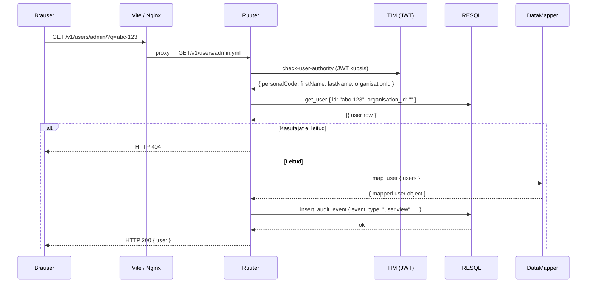
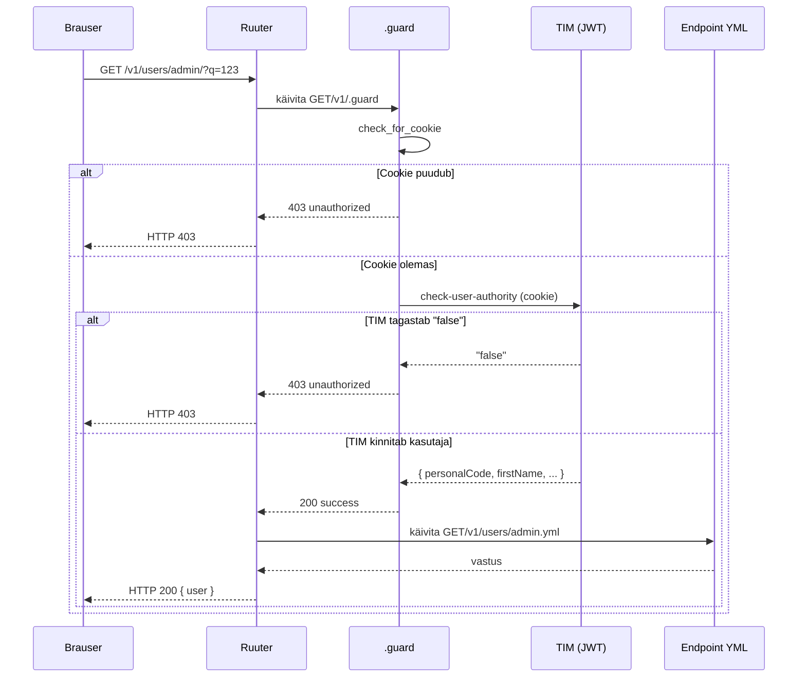

# LJVIS REST API disainijuhend

Projekti teenuste arendamisel kasutatakse **contract-first** lähenemist — enne implementatsiooni koostatakse OpenAPI leping (`docs/openapi.yaml`), mis on Ruuter DSL struktuuri siduv allikas.

---

## 1. HTTP meetodite kasutamine

| Meetod | Kasutus | Idempotentne |
|--------|---------|--------------|
| `GET` | Ressursi lugemine (üksik või nimekiri) | Jah |
| `POST` | Uue ressursi loomine | Ei |
| `PUT` | Olemasoleva ressursi täielik uuendamine | Jah |
| `DELETE` | Ressursi eemaldamine | Jah |

**Reeglid:**

- `GET` päringud **ei tohi** muuta serveripoolset olekut.
- `POST` on reserveeritud loomisoperatsioonidele. Keerukate filtritega otsingud (nt CSV eksport) kasutavad `GET`-i query paramitega.
- `PUT` uuendab tervikuna — partial update'i jaoks kasutatakse samuti `PUT`-i, kuna DSL ei toeta `PATCH`-i loomulikult.
- `DELETE` toimib query paramitega, mitte request body-ga.

---

## 2. URI-de nimetamise reeglid

### 2.1 Üldpõhimõtted

- URI-d on **väiketähelised**, sõnad eraldatakse sidekriipsuga (`kebab-case`): `/user-groups`, `/audit-logs`.
- URI tähistab **ressursikollektsiooni või toimingut**, mitte HTTP meetodit — `GET /v1/users/admin/?q=123`, mitte `GET /v1/users/admin/get-user`.
- Versioon on URI esimene segment: `/v1/...`

### 2.2 Staatilised path segmendid vs query paramid

Ruuter DSL kasutab **staatilisi path segmente** failitee kaardistamiseks. Dünaamilised identifikaatorid edastatakse **query paramitena**.

| Tüüp | Näide | Selgitus |
|------|-------|----------|
| Staatiline segment | `/v1/users/admin` | `admin` on DSL kausta nimi |
| Staatiline toiming | `/v1/users/admin/search` | `search.yml` fail DSL-is |
| Query param (id) | `/v1/users/admin/?q=123` | dünaamiline identifikaator (`?q=` on de facto standard) |
| Query param (filter) | `/v1/users/admin/search/?q=Mari&page=1` | otsing ja leheküljed eraldi endpoint-is |

**Scope** (`admin` | `local`) on **staatiline path segment** — see kaardistub eraldi DSL failidega, millel on erinev äriloogika ja õigusekontrroll.

### 2.3 Keelatud mustrid

| Vale URI | Probleem |
|----------|----------|
| `GET /v1/users/admin/123` | `id` on path segmendina — Ruuter DSL ei suuda seda staatilise failiteena lahendada |
| `GET /v1/users/admin/get-user` | HTTP meetodi nimetus URI-s — meetod ise ütleb juba `GET` |
| `GET /v1/users/admin/user?id=123` | Ressursinimi `user` kordab `users` kogumiku nime — kasuta `GET /v1/users/admin/?q=123` |
| `POST /v1/users/admin/read/get` | CRUD-tegevus lisatasandil — `read/get` on redundantne |
| `POST /v1/users/admin/edit/insert` | CRUD-verb URI-s — loomine on `POST` meetodi ülesanne, mitte URI osa |
| `POST /v1/users/admin/list` | Nimekirja lugemine `POST`-iga — nimekirioperatsioonid on `GET` |

### 2.4 Soovituslikud mustrid

| Toiming | Soovituslik URI | Selgitus |
|---------|-----------------|----------|
| Nimekirja otsing | `GET /v1/users/admin/search/?q=Mari&page=0&pageSize=20` | Eraldi `search` endpoint, `?q=` filtrina |
| Üksiku ressursi lugemine | `GET /v1/users/admin/?q=123` | `?q=` on de facto standard ID-paramina, ressursinimi ei kordu |
| Ressursi loomine | `POST /v1/users/admin` | HTTP meetod tähistab loomist |
| Ressursi uuendamine | `PUT /v1/users/admin/update` | Toiming staatilise segmendina, `id` request body-s |
| Seosega ressursi lugemine | `GET /v1/user-groups/admin/users/?q=456` | `scope` path segmendina, `?q=` query paramina |
| Ressursi kustutamine | `DELETE /v1/user-groups/user?id=456&userId=789` | Mitu identifikaatorit query paramitena |

### 2.5 Andmevoo näidis — kasutaja detailvaate avamine



---

## 3. Veakoodid

Kõik veavastused järgivad [RFC 7807 Problem Details](https://datatracker.ietf.org/doc/html/rfc7807) formaati.

| HTTP kood | Tähendus | Kasutus LJVIS-is |
|-----------|----------|-----------------|
| `200 OK` | Päring õnnestus | Lugemine, uuendamine |
| `201 Created` | Ressurss loodud | Uue kasutaja, grupi, klassifikaatori väärtuse loomine |
| `400 Bad Request` | Vigane päring | Puuduv kohustuslik väli, vale formaat |
| `401 Unauthorized` | Autentimata | JWT küpsis puudub või on aegunud |
| `403 Forbidden` | Puudub õigus | Kasutajal pole vajalikku permission koodi |
| `404 Not Found` | Ressurss puudub | Antud id-ga kirjet andmebaasis pole |
| `409 Conflict` | Konflikt | Isikukood on juba registreeritud, grupi nimi on juba olemas |
| `422 Unprocessable Entity` | Valideerimise viga | Välja väärtus ei vasta reeglitele (tühi nimi, vale kuupäev jne) |
| `500 Internal Server Error` | Serveriviga | Ootamatu viga RESQL-is või Ruuteris |
| `503 Service Unavailable` | Teenus maas | RESQL või andmebaas ei vasta |

### Vea vastuse formaat

```json
{
  "type": "VALIDATION_ERROR",
  "field": "email",
  "code": "invalid_format"
}
```

Kirjutamisoperatsioonide valideerimisvigu tagastab Ruuter DSL `status: 422` koos väljaga `field_error`.

---

## 4. Päringute struktuur

### 4.1 Nimekirja päringud (GET)

Kõik nimekirja-otspunktid toetavad järgmisi query parameid:

| Param | Tüüp | Kirjeldus |
|-------|------|-----------|
| `q` | string | Vabatekstotsing (`/search/` endpoint) või ressursi ID (üksiku ressursi endpoint) |
| `page` | integer | Lehekülje number (0-põhine) |
| `pageSize` | integer | Kirjete arv lehel |
| `sorting` | string | Sortimisväli ja suund (nt `name asc`) |

### 4.2 Ressursi päringud id järgi

`id` edastatakse **`?q=` query paramina** — see on de facto standard lühike identifikaatoriparameeter ja väldib ressursinime kordamist URI-s:

```
GET /v1/users/admin/?q=abc-123
GET /v1/classifiers/classifier/?q=42
GET /v1/logs/log/?q=99
```

### 4.3 Nimekirja otsing

Otsing toimub eraldi `/search/` endpointis `?q=` paramiga:

```
GET /v1/users/admin/search/?q=Mari&page=0&pageSize=20
GET /v1/user-groups/admin/search/?q=Põhja&page=0
```

### 4.4 Kirjutamisoperatsioonid

`id` (uuendatava ressursi identifikaator) edastatakse **request body-s**:

```json
PUT /v1/users/admin/update
{
  "id": "abc-123",
  "firstName": "Mari",
  ...
}
```

---

## 5. Versionimine

- Kõik API teed algavad `/v1/` prefiksiga.
- Murduva muutuse korral (breaking change) lisatakse uus versioon (`/v2/`) — vana versioon jääb tööle kuni kliendid on migreerinud.
- Auth teed (`/auth/...`) ei kasuta versiooniprefksit, kuna need on TIM-i omasüsteem.

---

## 6. Autentimine ja autoriseerimine

- Kõik otspunktid nõuavad JWT küpsist, mille väljastab TIM pärast TARA autentimist.
- Ruuter kontrollib iga päringu alguses `check-user-authority` templiga kasutaja olemasolut ja aktiivsust.
- Õigused (`permissions`) on stringikoodid (nt `user.list.admin`, `classifier.read`) — kasutajal peavad olema vajalikud koodid JWT-s.
- `scope` path segment (`admin` | `local`) määrab, milline DSL fail käivitub ja millised andmed on nähtavad.

### 6.1 .guard failid

Ruuter täidab iga päringu eel automaatselt `.guard` faili, kui see asub vastava meetodi kausta `v1/` tasemel. LJVIS-is on guard fail kõikides meetodikataloogides:

```
DSL/Ruuter/ljvis/
  GET/v1/.guard
  POST/v1/.guard
  PUT/v1/.guard
  DELETE/v1/.guard
```

`.guard` fail käivitub **enne** tegelikku endpoint-faili ja tagastab kas `200 success` (lubab edasi) või `403 unauthorized` (katkestab).

**Guard faili loogika sammhaaval:**

| Samm | Toiming | Tulemus |
|------|---------|---------|
| `check_for_cookie` | Kontrollib, kas `cookie` päis on olemas | Puudub → `guard_fail` |
| `authenticate` | Kutsub TIM-i `check-user-authority` template'i JWT küpsisega | Tagastab `authority_result` |
| `check_authority_result` | Kontrollib, et tulemus ei ole `"false"` | Vale → `guard_fail` |
| `guard_success` | Tagastab `200 "success"` | Ruuter jätkab endpoint-failiga |
| `guard_fail` | Tagastab `403 "unauthorized"` | Päring katkeb, vastust ei saadeta |

**Guard faili struktuur** (`GET/v1/.guard`):

```yaml
check_for_cookie:
  switch:
    - condition: ${incoming.headers == null || incoming.headers.cookie == null}
      next: guard_fail
  next: authenticate

authenticate:
  template: "[#LJVIS_PROJECT_LAYER]/check-user-authority"
  requestType: templates
  headers:
    cookie: ${incoming.headers.cookie}
  result: authority_result

check_authority_result:
  switch:
    - condition: ${authority_result !== "false"}
      next: guard_success
  next: guard_fail

guard_success:
  return: "success"
  status: 200
  next: end

guard_fail:
  return: "unauthorized"
  status: 403
  next: end
```

### 6.2 Guard andmevoog



---

## 7. Mock otspunktid

Arenduseks on kõigil otspunktidel mock vaste. Mock aktiveeritakse `frontend/.env.local` failiga:

```
VITE_USE_MOCK=true
```

Ruuter resolveerib mock faili lisades tee lõppu `/mock`:

```
GET /v1/users/admin/search/?q=Mari  →  GET/v1/users/admin/search/mock.yml
GET /v1/users/admin/?q=1  →  GET/v1/users/admin/mock.yml
```

---

## 8. DSL YAML valideerimine

Pärast iga Ruuter DSL faili loomist või muutmist käivita valideerimiskäsk repo juurkataloogist:

```bash
python3 -c "
import yaml, glob
for f in glob.glob('DSL/Ruuter/**/*.yml', recursive=True):
    try: yaml.safe_load(open(f))
    except yaml.YAMLError as e: print(f'FAIL {f}: {e}')
"
```

| Tulemus | Tähendus |
|---------|---------|
| Väljund puudub | Kõik failid on süntaktiliselt korrektsed |
| `FAIL DSL/Ruuter/.../foo.yml: ...` | Selles failis on YAML süntaksiviga — paranda enne commit'i |

> **Kohustuslik:** kõik vead tuleb parandada enne commit'i. CI pipeline lükkab tagasi malformeeritud YAML-i.

---

## 9. Seotud dokumendid

- `docs/openapi.yaml` — täielik API leping
- `api-endpoints.md` — kõigi otspunktide loend tabelina
- `docs/audit-logging.md` — audit sündmuste logimise reeglid
- `docs/errors.json` — kõigi veatüüpide masinarloetav kataloog (kood, sõnum, stsenaariumid, otspunktid)
- `docs/db_errorhandling_rules.md` — andmebaasi veakäsitluse reeglid
- `DSL/Ruuter/ljvis/` — Ruuter DSL failid (tegelik implementatsioon)

---

## 10. Ruuter DSL `declaration:` blokk

Iga Ruuter DSL fail võib alata valikulise `declaration:` blokiga. See annab Ruuterile lisainfot OpenAPI speci genereerimiseks ja strict-key posture'i jaoks.

### 10.1 Kehtiv formaat (turnerrainer/ruuter:rc — 0.9.0-rc.1+)

```yaml
declaration:
  version: "1.0"
  description: "Loo uus kohalik kasutaja"
  namespace: users
  allowlist:
    body:
      - field: firstName
        type: string
      - field: lastName
        type: string
      - field: personalCode
        type: string

create_user:
  call: http.post
  args:
    url: "[#LJVIS_RESQL]/v1/users/local/insert"
    body:
      firstName: ${incoming.body.firstName}
      lastName: ${incoming.body.lastName}
  result: insertResult
  next: respond
```

**Kehtivad `declaration:` väljad:**

| Väli | Tüüp | Kirjeldus |
|---|---|---|
| `version` | string | DSL versiooni märge (informatiivne) |
| `description` | string | OpenAPI summary/description |
| `namespace` | string | OpenAPI `tags` grupeering |
| `allowlist.body` | list | Lubatud keha väljad (strict-key mode + OpenAPI `requestBody`) |
| `allowlist.header` | list | Lubatud päise väljad |
| `allowlist.params` | list | Lubatud query parameetrid |
| `override_ancestors` | bool | `true` = asenda kõik esivanem-guard'id (guard failides) |

### 10.2 Eemaldatud väljad (0.9.0-rc.1-s eemaldatud)

Järgmised väljad olid kasutusel vanas Java-Ruuteri-ühilduvus-kihis ja **ei tohi esineda** uutes DSL failides — Ruuter `0.9.0-rc.1` lükkab need tagasi:

| Eemaldatud väli | Selgitus |
|---|---|
| `method: post` | HTTP meetod tuleneb kaustast (`GET/`, `POST/` jne) — redundantne |
| `accepts: json` | Kõik päringud aktsepteerivad JSON-i vaikimisi |
| `returns: json` | Asendunud `returns:` listiga Resql-is; Ruuteris ei ole mõistlik |

> **Kui `method`, `accepts` või `returns: json` esineb `declaration:` blokis, katkestab Ruuter 0.9.0-rc.1+ käivitumise parse-veaga.**

### 10.3 `declaration:` on valikuline

Kui `declaration:` puudub, laeb Ruuter DSL faili edukalt — genereerib lihtsalt minimaalse OpenAPI kirje. Strict-key mode ja kehaparam-filtreerimine on siis väljas.

---

## 11. Resql SQL deklaratsioonid

Alates `turnerrainer/resql:alpha` (0.1.0-alpha.3+) on **iga `.sql` fail kohustuslik algama YAML-deklaratsiooni blokiga** `/* ... */` kommentaarina.

> Resql keeldub käivitumast, kui mõni SQL fail on deklaratsiooniblokita või deklaratsioon on vigane.

### 11.1 Minimaalne nõutav formaat

```sql
/*
params: {}
*/
SELECT * FROM classifier.classifier;
```

Isegi kui SQL-il pole ühtegi parameetrit, peab `params:` väli olema olemas (tühja mappinguna `{}`).

### 11.2 Täielik formaat

```sql
/*
description: "Loo uus klassifikaator"
namespace: classifier
params:
  code:
    type: string
    required: false
  name:
    type: string
    required: false
    description: "Inimloetav nimi"
  created_by:
    type: string
    required: false
returns:
  - name: id
    type: number
    nullable: true
*/
INSERT INTO classifier.classifier (classifier_key, code, name, created_by)
VALUES (nextval('classifier.seq_classifier_key'), :code, :name, :created_by)
RETURNING classifier_key AS id;
```

**Deklaratsioonibloki väljad:**

| Väli | Kohustuslik | Kirjeldus |
|---|---|---|
| `params:` | **Jah** | Parameetrite mapping. Tühi `{}` kui parameetreid pole. |
| `description:` | Ei | SQL faili eesmärgi kirjeldus |
| `namespace:` | Ei | Grupeering (nt `classifier`, `user`) |
| `returns:` | Ei | Tagastusväljad OpenAPI jaoks |

### 11.3 `params:` välja reeglid

Iga parameeter on mapping, mille võtmeks on parameeter nime täpselt nii nagu ta esineb SQL-is (`:paramNimi`):

```yaml
params:
  pageSize:       # vastab SQL-is :pageSize
    type: integer
    required: false
  search:
    type: string
    required: false
    description: "Otsingufraas"
```

**Parameetri väljad:**

| Väli | Kirjeldus |
|---|---|
| `type` | Kohustuslik. Vt kehtivad tüübid allpool. |
| `required` | `true` / `false`. Vaikimisi `false`. |
| `description` | Valikuline kirjeldus. |

**Kehtivad tüübid:**

| Tüüp | Kasutus |
|---|---|
| `string` | Tekstiväljad, koodid, UUIDid (vaikimisi) |
| `integer` | Täisarvud (`page`, `pageSize`, ID-d kui `BIGINT`) |
| `number` | Ujukomaarvud |
| `boolean` | Tõeväärtused |
| `array` | JSON-massiivid |
| `object` | JSON-objektid |
| `date` | Kuupäev (`YYYY-MM-DD`) |
| `datetime` | Kuupäev ja kellaaeg (ISO 8601) |
| `uuid` | UUID formaat |

> **Märkus:** `json` ei ole kehtiv tüüp — kasuta `object` või `array`.

### 11.4 `returns:` välja formaat

```yaml
returns:
  - name: id
    type: number
    nullable: true
  - name: code
    type: string
    nullable: false
  - name: metadata
    type: object
    nullable: true
```

### 11.5 Kriitilised valideerimisreeglid

Resql kontrollib käivitamisel kõiki SQL faile:

| Reegel | Rikkumise tulemus |
|---|---|
| Iga `/* ... */`-ta fail katkestab käivitumise | Boot error |
| Iga `:paramNimi` SQL-is peab olema `params:` all | Boot error: "declaration fails to cover :paramNimi" |
| Iga `params:` kirje peab SQL-is `:paramNimi`-na esinema | Boot error: "orphan param paramNimi" |
| `params:` väli on kohustuslik (ka `{}`) | Boot error: "missing field params" |
| `type: json` ei ole kehtiv | Boot error: "unknown variant json, expected..." |

### 11.6 Resql valideerimine käsureal

```bash
docker run --rm \
  -e RESQL_DB_PASSWORD=test \
  -v $(pwd)/DSL/Resql:/DSL \
  -v $(pwd)/docker/resql-ljvis/resql.yaml:/app/resql.yaml \
  turnerrainer/resql:alpha 2>&1 | head -5
```

Kui kõik deklaratsioonid on korrektsed, saad ainult DB-ühenduse vea (mis on oodatav ilma andmebaasita) — **mitte** "Invalid declaration" viga.

---

## 12. Seotud dokumendid (uuendatud)

- `docs/openapi.yaml` — täielik API leping
- `api-endpoints.md` — kõigi otspunktide loend tabelina
- `docs/audit-logging.md` — audit sündmuste logimise reeglid
- `docs/errors.json` — kõigi veatüüpide masinarloetav kataloog (kood, sõnum, stsenaariumid, otspunktid)
- `docs/db_errorhandling_rules.md` — andmebaasi veakäsitluse reeglid
- `docs/workingdocs/migration_guide_to_rust_ruuter.md` — Ruuter ja Resql migratsioonijuhend
- `DSL/Ruuter/ljvis/` — Ruuter DSL failid (tegelik implementatsioon)
- `DSL/Resql/ljvis/` — Resql SQL failid (tegelik implementatsioon)
