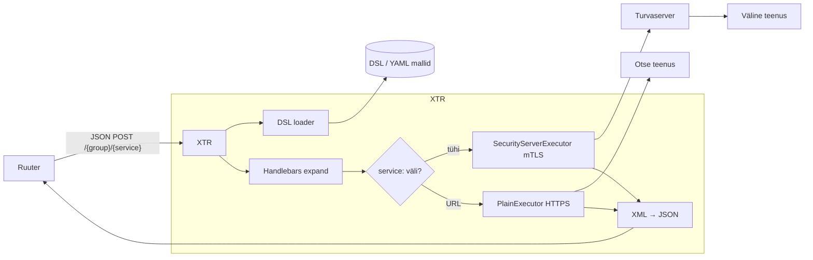
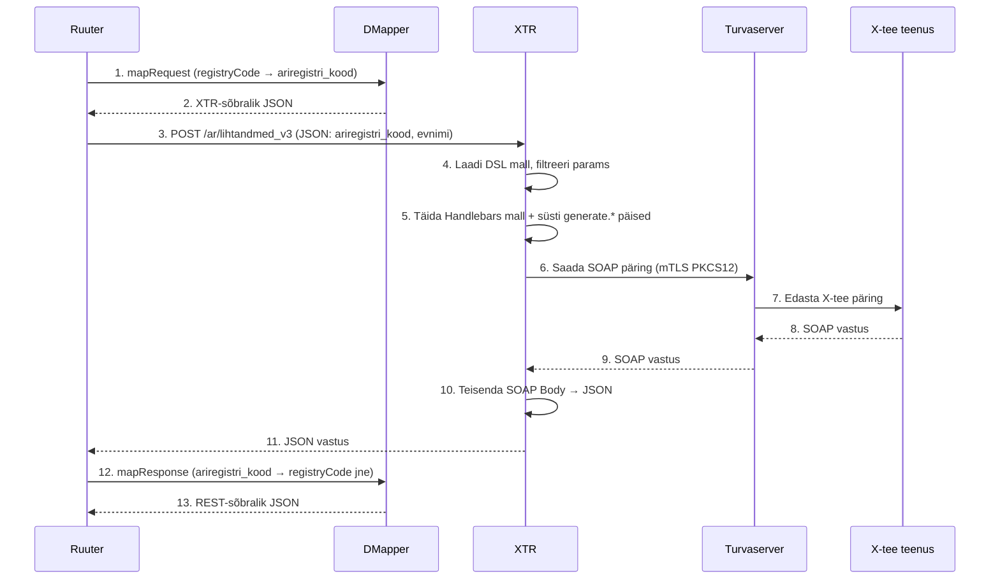
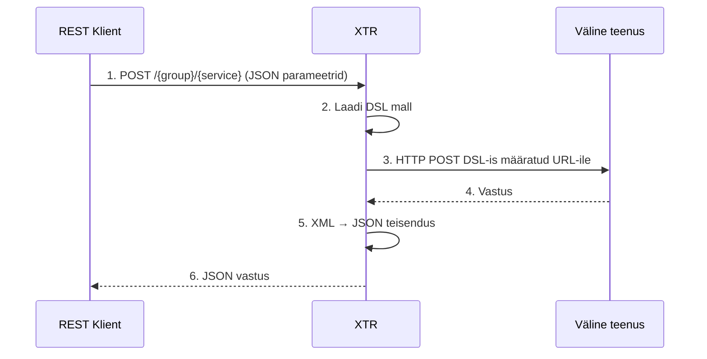

# X-tee implementatsioon

## Ülevaade

X-tee on Eesti riigi infosüsteemi kiht, mille kaudu liikmed (asutused) saavad omavahel turvaliselt teenuseid pakkuda ja tarbida.

**XTR (X-tee Translator)** on teenus, mis pakub X-tee **SOAP**-teenustele REST-liidest. XTR võtab vastu JSON-päringud, laeb vastava DSL-malli, täidab mallis olevad parameetrid (sh X-tee päised automaatselt), saadab päringu mTLS kaudu X-tee turvaserverisse ja tagastab SOAP vastuse JSON-ina.

Image: `turnerrainer/xtr:rc`

## Kasutusreeglid LJVIS-i jaoks

| Suund | Protokoll | Komponent |
|-------|-----------|-----------|
| LJVIS tarbib välist teenust | SOAP | XTR (REST → SOAP) |
| LJVIS tarbib välist teenust | REST | otse turvaserver ↔ Ruuter |
| LJVIS pakub teenust | REST | otse turvaserver ↔ Ruuter |
| LJVIS pakub teenust | SOAP | eraldi SOAP adapter (XTR seda ei toeta) |

> **Nõue:** Kõik LJVIS-2 poolt pakutavad X-tee teenused peavad olema **REST-põhised**. SOAP teenuste pakkumine ei kuulu hetke lahenduse skoopi.

**Milles XTR-i ei vajata:**
- **Sisemiste teenuste** puhul (nt Ruuter) pole X-tee liidest vaja, neid otse REST-ga välja kutsuda on otstarbekam.
- **X-tee REST teenuste** puhul (nii tarbimine kui pakkumine) ei ole vaja XTR-i, sest X-tee liige ja LJVIS suudavad REST päringuid vahetada otse turvaserveri kaudu.
- **X-tee SOAP teenuse pakkumise** puhul ei sobi XTR, sest XTR ei kuula X-tee/SOAP sissepääsu. Selleks tuleks luua eraldi SOAP adapter.

**Milles XTR-i vajatakse:**
- **X-tee SOAP teenuse tarbimise** korral, et teisendada REST → SOAP ja vastupidi. Eesmärk on muinasaegse SOAP asemel kasutada lihtsamaid REST päringuid.

Hetkel töötab XTR ühes suunas: **REST klient (Ruuter) → XTR → turvaserver → väline teenus**.

---

## Arhitektuur



---

## Päringu vool

### 1. REST klient → X-tee turvaserver (peamine vool)

Kõige levinum vool, kus XTR saadab päringu X-tee turvaserverisse ja tagastab vastuse JSON-ina.



### 2. REST klient → otseühendus (service: URL olemas)

Kui DSL-is on määratud `service` URL, suunab XTR päringu otse sellele aadressile ilma turvaserverita.



### 3. X-tee klient → XTR → Ruuter (kontseptuaalne)

See on võimalik tulevikuvool, kus XTR oleks X-tee teenusepakkuja ja suunaks päringu sisemisse Ruuterisse. **Praegune XTR seda ei toeta**, sest tal puudub X-tee/SOAP sissepääsuendpunkt.

---

## DSL malli formaat

DSL-id asuvad kaustas, mille määrab `dsl_path` (vaikimisi `./DSL/`). URL kujuneb `POST /{group}/{service}` kus `group` on alamkataloog ja `service` on failinimi (ilma `.yml`-ta).

```yaml
params:
  - ariregistri_kood
  - evnimi
# service: https://...  # Kui puudub, kasutatakse security_server.url-i
method: POST

envelope: |
  <soapenv:Envelope xmlns:soapenv="http://schemas.xmlsoap.org/soap/envelope/"
                    xmlns:xroad="http://x-road.eu/xsd/xroad.xsd"
                    xmlns:id="http://x-road.eu/xsd/identifiers"
                    xmlns:prod="http://arireg.x-road.eu/producer/">
    <soapenv:Header>
      <xroad:protocolVersion>{{generate.protocol_version}}</xroad:protocolVersion>
      <xroad:id>{{generate.uuid}}</xroad:id>
      <xroad:userId/>
      {{{generate.client}}}
      <xroad:service id:objectType="SERVICE">
        <id:xRoadInstance>{{generate.instance}}</id:xRoadInstance>
        <id:memberClass>GOV</id:memberClass>
        <id:memberCode>70000310</id:memberCode>
        <id:subsystemCode>arireg</id:subsystemCode>
        <id:serviceCode>lihtandmed</id:serviceCode>
        <id:serviceVersion>v3</id:serviceVersion>
      </xroad:service>
    </soapenv:Header>
    <soapenv:Body>
      <prod:lihtandmed_v3>
        <prod:keha>
          <prod:ariregistri_kood>{{ariregistri_kood}}</prod:ariregistri_kood>
          <prod:evnimi>{{evnimi}}</prod:evnimi>
          <prod:keel>est</prod:keel>
        </prod:keha>
      </prod:lihtandmed_v3>
    </soapenv:Body>
  </soapenv:Envelope>
```

### DSL väljad

- `params` — lubatud parameetrite loend. Kõik muud JSON-i võtmed filtreeritakse välja (turvalisus).
- `service` — otseühenduse URL. **Kui puudub**, kasutatakse `security_server.url`-i (turvaserveri kaudu).
- `method` — HTTP meetod (`POST`, `GET` jne).
- `envelope` — Handlebars mall. Toetab `{{param}}` kasutaja parameetrite ja `{{{generate.*}}}` auto-konteksti jaoks.

### Automaatsed Handlebars helperid (`generate.*`)

XTR süstib igasse päringukonteksti automaatselt:

| Helper | Kirjeldus |
|--------|-----------|
| `{{generate.uuid}}` | Unikaalne UUID per päring — X-Road `<xroad:id>` jaoks |
| `{{generate.instance}}` | X-Road instance (`xroad_instance` konfiguratsioonist) |
| `{{{generate.client}}}` | Valmis `<xroad:client>` element (`client_data` konfiguratsioonist) |
| `{{generate.protocol_version}}` | X-Road protokolliversioon (`xroad_protocol_version` konfiguratsioonist) |

> **NB:** `{{{generate.client}}}` kasutab kolmekordset loogelise suluga märgistust (`{{{ }}}`), et vältida HTML-kodeerimist XML-is.

---

## Konfiguratsioon

Põhikonfiguratsioon asub `xtr.yaml` failis (projekti juurkaustas):

```yaml
dsl_path: /app/DSL
port: 8080

xroad_instance: ee-test
xroad_protocol_version: "4.0"

client_data:
  member_class: GOV
  member_code: "70006317"
  subsystem_code: ljvis

security_server:
  url: "https://urien.ml.ee:5500/"
  keystore_path: /app/ssl/xtr-client.p12
  keystore_password_env: XTR_KEYSTORE_PASSWORD

wsdl_watch_dir: /app/wsdl

limits:
  max_request_bytes: 1048576
  max_response_bytes: 16777216
  request_timeout_secs: 30
```

### docker-compose seadistus

```yaml
xtr:
  image: turnerrainer/xtr:rc
  environment:
    - RUST_LOG=info
    - XTR_KEYSTORE_PASSWORD=${XTR_KEYSTORE_PASSWORD}
  volumes:
    - ./DSL/xtr:/app/DSL
    - ./xtr.yaml:/app/xtr.yaml:ro
    - ./wsdl:/app/wsdl:ro
    - ./ssl:/app/ssl:ro
```

---

## WSDL folder-drop

XTR parsib käivitumisel kõik `wsdl_watch_dir` alamkaustades olevad `*.wsdl` failid ja genereerib vastavad DSL-id automaatselt `dsl_path`-i.

LJVIS-is asuvad WSDL-id kaustas `wsdl/ar/ariregister.wsdl`. Genereeritud DSL-id on märgistatud kommentaariga:
```
# GENERATED BY XTR from WSDL — do not edit; delete this line to convert into a hand-written override
```

Käsitsi kirjutatud DSL-id (ilma markerrita) võidavad nimekonflikti korral.

---

## Äriregistri X-tee identifikaatorid

| Väli | Väärtus |
|------|---------|
| `memberClass` | `GOV` |
| `memberCode` | `70000310` |
| `subsystemCode` | `arireg` |
| `xRoadInstance` | `ee-test` (test) / `ee-dev` (arendus) |

WSDL allikas: `https://x-tee.ee/catalogue-data/ee-test/ee-test/GOV/70000310/arireg/262.wsdl`

Kasutusel olevad teenused:

| DSL fail | `serviceCode` | `serviceVersion` |
|----------|---------------|-----------------|
| `ar/lihtandmed_v3.yml` | `lihtandmed` | `v3` |
| `ar/detailandmed_v4.yml` | `detailandmed` | `v4` |
| `ar/ettevottegaSeotudIsikud_v1.yml` | `ettevottegaSeotudIsikud` | `v1` |
| `ar/esindus_v2.yml` | `esindus` | `v2` |

---

## DMapper — parameetrite teisendus

Ruuter kasutab REST-sõbralikke väljanimed (`registryCode`, `companyName`), kuid XTR DSL nõuab äriregistri WSDL-i väljanimed (`ariregistri_kood`, `evnimi`). DMapper Handlebars mallid lahendavad selle nimeruumi teisenduse mõlemas suunas.

### Näide: `lihtandmed_v3`

**`DSL/DMapper/ljvis/hbs/arireg_lihtandmed_request.handlebars`** — teisendab Ruuteri JSON XTR-i jaoks:

```json
{
  "ariregistri_kood": "{{registryCode}}",
  "evnimi": "{{companyName}}",
  "keel": "est"
}
```

**`DSL/DMapper/ljvis/hbs/arireg_lihtandmed_response.handlebars`** — teisendab XTR vastuse Ruuteri jaoks:

```json
{
  "totalFound": {{#if lihtandmed_v3Response.keha.leitud}}{{lihtandmed_v3Response.keha.leitud}}{{else}}0{{/if}},
  "data": [
    {{#each lihtandmed_v3Response.keha.ettevotjad.item}}
    {
      "registryCode": "{{this.ariregistri_kood}}",
      "companyName": "{{this.ettevotja_nimi}}",
      "status": "{{this.ettevotja_staatus}}"
    }{{#unless @last}},{{/unless}}
    {{/each}}
  ]
}
```

### Ruuter DSL voog

```yaml
mapRequest:               # registryCode → ariregistri_kood
  call: http.post
  args:
    url: "[#LJVIS_DMAPPER_HBS]/arireg_lihtandmed_request"
    body:
      registryCode: "${reg_code}"
      companyName: "${company_name}"
  result: mappedRequest
  next: callXtr

callXtr:
  call: http.post
  args:
    url: "[#LJVIS_XTR]/ar/lihtandmed_v3"
    body: "${mappedRequest.response.body}"
  result: xtrResponse
  next: mapResponse

mapResponse:              # lihtandmed_v3Response.keha → {registryCode, companyName, ...}
  call: http.post
  args:
    url: "[#LJVIS_DMAPPER_HBS]/arireg_lihtandmed_response"
    body: "${xtrResponse.response.body}"
  result: mappedResponse
  next: logSuccess
```

---

## Piirangud ja laiendamise võimalused

- **Ainult üks suund**: XTR võtab vastu REST päringuid ja väljastab JSON-i. Ta ei kuula X-tee SOAP päringuid.
- **Handlebars**: mallid kasutavad Handlebarsi süntaksit; `{{{ }}}` on vajalik XML-i sisaldavate helperite jaoks.
- **mTLS**: turvaserveri ühendus nõuab PKCS12 keystoret (`ssl/xtr-client.p12`). Ilma keystoreta saab kasutada ainult `service:` URL-iga DSL-e (otseühendus).
- **Võimalik laiendus**: X-tee sissepääsu endpunkti lisamiseks tuleks luua eraldi SOAP adapter, mis dekrüpteerib X-tee päringu ja suunab selle Ruuterisse.
