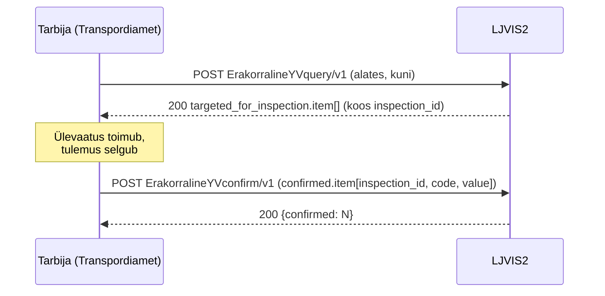
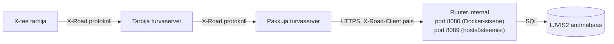

# LJVIS2 X-tee pakutavad teenused — publitseerimise ja turvaserveri seadistuse juhend

Dokument kirjeldab kõiki LJVIS2 alamsüsteemi poolt pakutavaid X-tee teenuseid: teenuse kood, sisendid, väljundid, näidispäringud ja turvaserveri admin juhend.

Masinloetav OpenAPI 3.0.3 leping (kuus LJVIS2 teenust, sh näidis sisendid/väljundid iga vastuskoodi kohta): [XroadOpenapi.yaml](XroadOpenapi.yaml).
Andmejälgija (AJ) teenusel `findUsage` on eraldi leping: [FindUsageOpenapi.yaml](FindUsageOpenapi.yaml).
Sama sisu on turvaserverile kättesaadav ka otse Ruuter.internal-i kaudu (vt [4.8](#48-openapi-kirjelduse-registreerimine-turvaserveris)) — turvaserver saab selle URL-i teenuse kirjeldusena registreerida ja lepingut automaatselt uuendada.
Sünteetiliste testandmetega mocki leping on eraldi failis [../developer/xtee-openapi.yaml](../developer/xtee-openapi.yaml).

---

## 1. LJVIS2 X-tee identiteet

| Keskkond | Alamsüsteem |
|---|---|
| LIVE (toodang) | `EE/GOV/70001231/ljvis2` |
| TEST | `ee-test/GOV/70001231/ljvis2` |
| DEV | `ee-dev/GOV/70001231/ljvis2` |

**Protokoll:** REST/JSON (erinevalt LJVIS1 SOAP teenustest).

---

## 2. Teenuste koondtabel

| # | Teenuse kood | Meetod | Tee | Versioon | Tarbija |
|---|---|---|---|---|---|
| 1 | `IsikuKontroll` | POST | `/ljvis/xroad/provide/isiku-kontroll` | v1 | Transpordiamet jt |
| 2 | `IsikuEttevoteKontrollid` | POST | `/ljvis/xroad/provide/isiku-ettevote-kontrollid` | v1 | Transpordiamet jt |
| 3 | `ErakorralineYVquery` | POST | `/ljvis/xroad/provide/erakorraline-yv-query` | v1 | MNT / Transpordiamet |
| 4 | `ErakorralineYVconfirm` | POST | `/ljvis/xroad/provide/erakorraline-yv-confirm` | v1 | MNT / Transpordiamet |
| 5 | `RegisterJobInspection` | POST | `/ljvis/xroad/provide/register-job-inspection` | v1 | Tööinspektsioon |
| 6 | `RegisterJobInspection_v3` | POST | `/ljvis/xroad/provide/register-job-inspection-v3` | v3 | Tööinspektsioon |
| 7 | `findUsage` (AJ) — otspunkt `/v2/findUsage` | GET | `/ljvis/xroad/v2/findUsage` | v2 | eesti.ee Andmejälgija |
| 8 | `findUsage` (AJ) — otspunkt `/v2/usagePeriod` | GET | `/ljvis/xroad/v2/usagePeriod` | v2 | eesti.ee Andmejälgija |
| 9 | `findUsage` (AJ) — otspunkt `/v2/heartbeat` | GET | `/ljvis/xroad/v2/heartbeat` | v2 | eesti.ee Andmejälgija |

Read 7–9 on **üks** X-tee REST teenus koodiga `findUsage` kolme otspunktiga (AJ protokoll §6), mitte kolm eraldi teenust.

---

## 3. Teenuste kirjeldused

---

### 3.1 IsikuKontroll

**DSL:** `DSL/Ruuter.internal/ljvis/POST/xroad/provide/isiku-kontroll.yml`

Tagastab kõik LJVIS-i kontrollid ja rikkumised ühe isikukoodi kohta.
Andmeallikad: koondvorm (juhi andmed) ja tööinspektsiooniakt (karistatu isikukood).
Read-only — andmebaasi ei kirjutata.

#### Sisendid

| Väli | Tüüp | Kohustuslik | Kirjeldus |
|---|---|---|---|
| `X-Road-Client` (header) | string | Jah | Tarbija turvaserveri identiteet (`instance/memberClass/memberCode/subsystem`) |
| `isikukood` (body) | string | Jah | Eesti isikukood — 11 numbrit, algab 1–6 |

#### Väljundid

| Väli | Tüüp | Kirjeldus |
|---|---|---|
| `kontrollid.item[]` | array | Leitud kontrollikirjed (tühi array = 0 kirjet, HTTP 200) |
| `.kuupaev` | string | Kontrolli kuupäev (ISO) |
| `.nimetus` | string | Vormi number |
| `.asutus` | string | Ettevõtte nimi |
| `.soiduki_reg_nr` | string | Sõiduki registreerimisnumber |
| `.rikkumise_liik` | string | Tehnoülevaatuse tulemus (`result_type`) |
| `.kontrolli_nimetus` | string | `KOONDVORM` või `TOOINSPEKTION` |
| `.juhi_nimi` | string | Juhi eesnimi |
| `.juhi_perekonnanimi` | string | Juhi perekonnanimi |
| `.rikkumised` | string | Rikkumiste loend (tööinspektsiooniaktil) |
| `.rikkumised_lopetatud` | string | Menetluse lõpetamise alus |

#### Näidispäring

```bash
curl -X POST https://<turvaserver>/r1/EE/GOV/70001231/ljvis2/IsikuKontroll/v1 \
  -H "Content-Type: application/json" \
  -H "X-Road-Client: EE/GOV/70001490/liiklusregister" \
  -d '{"isikukood": "39001010001"}'
```

**Vastus (HTTP 200):**
```json
{
  "kontrollid": {
    "item": [
      {
        "kuupaev": "2026-06-15",
        "nimetus": "kv-2026-00042",
        "asutus": "OÜ Kiirkaubaveos",
        "soiduki_reg_nr": "123ABC",
        "rikkumise_liik": "extraordinary_inspection",
        "kontrolli_nimetus": "KOONDVORM",
        "juhi_nimi": "Jaan",
        "juhi_perekonnanimi": "Tamm",
        "rikkumised": null,
        "rikkumised_lopetatud": null
      }
    ]
  }
}
```

---

### 3.2 IsikuEttevoteKontrollid

**DSL:** `DSL/Ruuter.internal/ljvis/POST/xroad/provide/isiku-ettevote-kontrollid.yml`

Tagastab kõik LJVIS-i kontrollid ettevõtete kohta, millega antud isik on juhi rollis seotud.
Äriregistri välispäringut ei tehta — ainult lokaalne andmebaas. Read-only.

#### Sisendid

| Väli | Tüüp | Kohustuslik | Kirjeldus |
|---|---|---|---|
| `X-Road-Client` (header) | string | Jah | Tarbija identiteet |
| `isikukood` (body) | string | Jah | Eesti isikukood — 11 numbrit, algab 1–6 |

#### Väljundid

| Väli | Tüüp | Kirjeldus |
|---|---|---|
| `kontrollid.item[]` | array | Kontrollide loend |
| `.ettevote_reg_nr` | string | Ettevõtte registrikood |
| `.kuupaev` | string | Kontrolli kuupäev |
| `.kontrolli_nimetus` | string | `KOONDVORM` või `TOOINSPEKTION` |
| `.asutus` | string | Ettevõtte nimi |
| `.nimetus` | string | Vormi number |
| `.soiduki_reg_nr` | string | Sõiduki reg.nr (koondvormil) |
| `.juhi_nimi` | string | Karistatu eesnimi (tööinspektsiooniaktil) |
| `.juhi_perekonnanimi` | string | Karistatu perekonnanimi |

#### Näidispäring

```bash
curl -X POST https://<turvaserver>/r1/EE/GOV/70001231/ljvis2/IsikuEttevoteKontrollid/v1 \
  -H "Content-Type: application/json" \
  -H "X-Road-Client: EE/GOV/70001490/liiklusregister" \
  -d '{"isikukood": "39001010001"}'
```

**Vastus (HTTP 200):**
```json
{
  "kontrollid": {
    "item": [
      {
        "ettevote_reg_nr": "12345678",
        "kuupaev": "2026-05-10",
        "kontrolli_nimetus": "KOONDVORM",
        "asutus": "OÜ Kiirkaubaveos",
        "nimetus": "kv-2026-00042",
        "soiduki_reg_nr": "123ABC",
        "juhi_nimi": null,
        "juhi_perekonnanimi": null
      }
    ]
  }
}
```

---

### 3.3 ErakorralineYVquery

**DSL:** `DSL/Ruuter.internal/ljvis/POST/xroad/provide/erakorraline-yv-query.yml`

Tagastab ajavahemikul erakorralisele tehnoülevaatusele suunatud sõidukid.
Mõlemad kuupäevad on kohustuslikud (piiramatu päring pole lubatud). Read-only.

#### Sisendid

| Väli | Tüüp | Kohustuslik | Kirjeldus |
|---|---|---|---|
| `X-Road-Client` (header) | string | Jah | Tarbija identiteet |
| `alates` (body) | string (ISO kuupäev) | Jah | Perioodi algus (kaasav), nt `2026-01-01` |
| `kuni` (body) | string (ISO kuupäev) | Jah | Perioodi lõpp (kaasav), nt `2026-06-30` |

**Nõue:** `alates` ≤ `kuni`, muidu HTTP 400.

#### Väljundid

| Väli | Tüüp | Kirjeldus |
|---|---|---|
| `targeted_for_inspection.item[]` | array | Sõidukite loend |
| `.licence_plate_no` | string | Registreerimisnumber |
| `.trailer_no` | string\|null | Haagise number |
| `.inspection_id` | string | Vormi võti (kasutatakse `ErakorralineYVconfirm`-is) |
| `.inspection_no` | string | Kontrollvormi number |
| `.inspection_date` | string | Kontrolli kuupäev |
| `.inspection_type` | string | `extraordinary_inspection` / `extraordinary_inspection_ta` |
| `.inspection_unit` | string | Kontrolliüksus |
| `.inspector` | string\|null | Kontrollija nimi |
| `.issues.item[]` | array | Tuvastatud rikked (`code` + `value`) |
| `.inspection_refine_options.item[]` | array | MNT täiendusvalikud: `REGNR`, `VINTIN`, `AXLES`, `PLACES`, `REBUILT` |

#### Näidispäring

```bash
curl -X POST https://<turvaserver>/r1/EE/GOV/70001231/ljvis2/ErakorralineYVquery/v1 \
  -H "Content-Type: application/json" \
  -H "X-Road-Client: EE/GOV/70001490/liiklusregister" \
  -d '{"alates": "2026-01-01", "kuni": "2026-06-30"}'
```

**Vastus (HTTP 200):**
```json
{
  "targeted_for_inspection": {
    "item": [
      {
        "licence_plate_no": "123ABC",
        "trailer_no": null,
        "inspection_id": "42",
        "inspection_no": "kv-2026-00042",
        "inspection_date": "2026-03-15",
        "inspection_type": "extraordinary_inspection",
        "inspection_unit": "PPA",
        "inspector": "Jaan Tamm",
        "issues": {
          "item": [
            {"code": "B01", "value": "defect_minor"}
          ]
        },
        "inspection_refine_options": {
          "item": ["REGNR", "AXLES"]
        }
      }
    ]
  }
}
```

---

### 3.4 ErakorralineYVconfirm

**DSL:** `DSL/Ruuter.internal/ljvis/POST/xroad/provide/erakorraline-yv-confirm.yml`

Võtab vastu erakorralise tehnoülevaatuse tulemuse ja salvestab LJVIS-i koondvormi.
**Kirjutav teenus.** Atomaarne — ühe vea korral kogu batch katkeb. Idempotentne.

#### Sisendid

| Väli | Tüüp | Kohustuslik | Kirjeldus |
|---|---|---|---|
| `X-Road-Client` (header) | string | Jah | Tarbija identiteet |
| `confirmed.item[]` (body) | array | Jah | Kinnituste loend (mitte-tühi) |
| `.inspection_id` | string | Jah | Vormi võti (`ErakorralineYVquery` vastusest) |
| `.code` | enum | Jah | `INSPECTION_DATE` / `ENFORCEMENT_DECISION` / `CLOSURE_BASIS` |
| `.value` | string | Jah | Salvestatav väärtus |

**Kinnituskoodide tähendus:**

| `code` | DB veerg |
|---|---|
| `INSPECTION_DATE` | `extraordinary_inspection_date` |
| `ENFORCEMENT_DECISION` | `enforcement_decision` |
| `CLOSURE_BASIS` | `proceeding_closure_basis` |

#### Väljundid

| Väli | Tüüp | Kirjeldus |
|---|---|---|
| `confirmed` | integer | Edukalt salvestatud elementide arv |

#### Näidispäring

```bash
curl -X POST https://<turvaserver>/r1/EE/GOV/70001231/ljvis2/ErakorralineYVconfirm/v1 \
  -H "Content-Type: application/json" \
  -H "X-Road-Client: EE/GOV/70001490/liiklusregister" \
  -d '{
    "confirmed": {
      "item": [
        {"inspection_id": "42", "code": "INSPECTION_DATE", "value": "2026-07-01"},
        {"inspection_id": "42", "code": "ENFORCEMENT_DECISION", "value": "Otsus jõustus"}
      ]
    }
  }'
```

**Vastus (HTTP 200):**
```json
{"confirmed": 2}
```

#### Kahesammuline voog

`ErakorralineYVquery` ja `ErakorralineYVconfirm` moodustavad koos ühe töövoo: päring toob sõidukid koos nende `inspection_id`-dega, kinnitus salvestab tulemuse samade `inspection_id` väärtuste peale.



---

### 3.5 RegisterJobInspection (v1)

**DSL:** `DSL/Ruuter.internal/ljvis/POST/xroad/provide/register-job-inspection.yml`

Võtab vastu Tööinspektsiooni töökontrolli andmed (vana WSDL `RegisterJobInspectionRequestType`, teisendatud REST/JSON-iks) ja salvestab `forms.labour_inspection_form` tabelisse.
**Idempotentne** — sama `kontrolli_id` uuesti saatmine ei tekita duplikaati.

#### Sisendid

| Väli | Tüüp | Kohustuslik | Kirjeldus |
|---|---|---|---|
| `X-Road-Client` (header) | string | Jah | Tarbija identiteet |
| `kontrollija` | string | Jah | Kontrollija nimi |
| `kontrolli_id` | integer | Jah | Unikaalne kontroll-ID (idempotentsuse võti) |
| `kontrolli_kp` | string (ISO kuupäev) | Jah | Kontrolli kuupäev |
| `tooandja_nimi` | string | Jah | Tööandja nimi |
| `tooandja_reg_kood` | string | Jah | Tööandja registrikood |
| `soidukite_arv` | integer | Ei | Kontrollitud sõidukite arv |
| `koostatatud_ettekirjutus` | boolean | Jah | Kas ettekirjutus koostati |
| `kontrollimised` | object | Jah | Kontrollimiste maatriks (JSONB) |
| `rikkumised` | object | Jah | Rikkumiste loend (JSONB) |
| `vaarteomenetlus` | string | Ei | Väärteomenetluse number |

#### Väljundid

| Väli | Tüüp | Kirjeldus |
|---|---|---|
| `message` | string | `"Success"` |

#### Näidispäring

```bash
curl -X POST https://<turvaserver>/r1/EE/GOV/70001231/ljvis2/RegisterJobInspection/v1 \
  -H "Content-Type: application/json" \
  -H "X-Road-Client: EE/GOV/70001969/tookeskk" \
  -d '{
    "kontrollija": "Mari Mets",
    "kontrolli_id": 12345,
    "kontrolli_kp": "2026-06-10",
    "tooandja_nimi": "OÜ Kiirkaubaveos",
    "tooandja_reg_kood": "12345678",
    "soidukite_arv": 3,
    "koostatatud_ettekirjutus": true,
    "kontrollimised": {"kontrollitud_soitjate_veol": false},
    "rikkumised": {"rikkumised_loend": []},
    "vaarteomenetlus": "VM-2026-001"
  }'
```

**Vastus (HTTP 200):**
```json
{"message": "Success"}
```

---

### 3.6 RegisterJobInspection_v3

**DSL:** `DSL/Ruuter.internal/ljvis/POST/xroad/provide/register-job-inspection-v3.yml`

Laiendatud töökontrolli leping — lisanduvad sõiduki (reg.nr, VIN), juhi isikukoodi ja menetluse lisaväljad. Salvestatakse samasse `forms.labour_inspection_form` tabelisse.
**Idempotentsuse võti:** `v3-` + `kontrolli_id` (eraldab v1 kirjetest).

#### Sisendid (lisanduvad v1-le)

| Väli | Tüüp | Kohustuslik | Kirjeldus |
|---|---|---|---|
| `X-Road-Client` (header) | string | Jah | **Peab olema 4-osalises formaadis** — puuduv/vale → HTTP 403 |
| *(kõik v1 väljad)* | — | Jah | Samad nõuded mis v1-s |
| `soiduki_reg_nr` | string | Ei | Sõiduki registreerimisnumber |
| `soiduki_vin` | string | Ei | Sõiduki VIN-kood |
| `juhi_isikukood` | string | Ei | Juhi Eesti isikukood (11 numbrit, algab 1–6) — kui esitatud, valideeritakse |
| `juhi_eesnimi` | string | Ei | Juhi eesnimi |
| `juhi_perekonnanimi` | string | Ei | Juhi perekonnanimi |
| `menetluse_liik` | enum | Ei | `lyhimenetlus` / `kiirmenetlus` / `uldmenetlus` |
| `menetluse_number` | string | Ei | Menetluse viitenumber |

#### Väljundid

| Väli | Tüüp | Kirjeldus |
|---|---|---|
| `message` | string | `"Success"` |

#### Näidispäring

```bash
curl -X POST https://<turvaserver>/r1/EE/GOV/70001231/ljvis2/RegisterJobInspection_v3/v3 \
  -H "Content-Type: application/json" \
  -H "X-Road-Client: EE/GOV/70001969/tookeskk" \
  -d '{
    "kontrollija": "Mari Mets",
    "kontrolli_id": 12346,
    "kontrolli_kp": "2026-06-10",
    "tooandja_nimi": "OÜ Kiirkaubaveos",
    "tooandja_reg_kood": "12345678",
    "soidukite_arv": 2,
    "koostatatud_ettekirjutus": false,
    "kontrollimised": {"kontrollitud_soitjate_veol": false},
    "rikkumised": {"rikkumised_loend": []},
    "soiduki_reg_nr": "123ABC",
    "soiduki_vin": "WDB9634031L123456",
    "juhi_isikukood": "39001010001",
    "juhi_eesnimi": "Jaan",
    "juhi_perekonnanimi": "Tamm",
    "menetluse_liik": "kiirmenetlus",
    "menetluse_number": "KM-2026-001"
  }'
```

**Vastus (HTTP 200):**
```json
{"message": "Success"}
```

---

### 3.7 findUsage (Andmejälgija) — `/v2/findUsage`

**DSL:** `DSL/Ruuter.internal/ljvis/GET/xroad/v2/findUsage.yml`

Andmejälgija kasutusteabe esitamise protokolli v1.6.1 §6.1 otspunkt — tagastab isikukoodi järgi kasutusteabe kirjed ajamomendi kahanemise järjekorras. Leping: [FindUsageOpenapi.yaml](FindUsageOpenapi.yaml).

- `X-Road-UserId` on kohustuslik, kuid **võib erineda** `userCode`-ist — nt vanem vaatab eesti.ee-s lapse andmeid esindusõiguse alusel (§6.1.3).
- Isikukoodi võib anda `EE` eesliitega või ilma (`EE39001010001` ja `39001010001` annavad sama tulemuse).
- `totalUsages` on kirjete koguarv, mida `limit`/`offset` ei mõjuta. Küsitud `limit`-it ei kärbita.

#### Sisendid

| Väli | Tüüp | Kohustuslik | Kirjeldus |
|---|---|---|---|
| `X-Road-UserId` (header) | string | Jah | Päringu algataja isikukood |
| `userCode` (query) | string | Jah | Andmesubjekti isikukood (EE eesliitega või ilma) |
| `periodStart` (query) | date-time (RFC 3339) | Ei | Kirjed alates, nt `2026-01-01T00:00:00Z` |
| `periodEnd` (query) | date-time (RFC 3339) | Ei | Kirjed kuni |
| `offset` (query) | integer ≥ 0 | Ei | Vahelejäetavate kirjete arv (vaikimisi 0) |
| `limit` (query) | integer ≥ 1 | Ei | Kirjete arv lehel (vaikimisi 1000) |

#### Väljundid

| Väli | Tüüp | Kohustuslik | Kirjeldus |
|---|---|---|---|
| `totalUsages` | integer | Jah | Kirjete koguarv |
| `usages[]` | array | Jah | Kasutusteabe kirjed, uusim eespool |
| `.logtime` | date-time | Jah | Andmetöötluse aeg (UTC, `Z`) |
| `.action` | string | Jah | Andmetöötluse põhjus |
| `.receiverCode` | string | Jah | Asutuse registrikood |
| `.receiverName` | string | Ei | Asutuse nimi — puudumisel väli välja jäetud |
| `.receiverSystem` | string | Ei | Infosüsteem — puudumisel väli välja jäetud |

Vead: 400 (`MISSING_HEADER`, `MISSING_PARAMETER`, `INVALID_PARAMETER`), 500 (`SERVER_ERROR`).

#### Näidispäring

```bash
curl "https://<turvaserver>/r1/EE/GOV/70001231/ljvis2/findUsage/v2/findUsage?userCode=EE39001010001&offset=0&limit=10" \
  -H "X-Road-UserId: EE39001010001" \
  -H "X-Road-Client: EE/GOV/70009317/eesti-ee"
```

**Vastus (HTTP 200):**
```json
{
  "totalUsages": 1,
  "usages": [
    {
      "logtime": "2026-06-10T14:32:00Z",
      "action": "Järelevalve käigus isiku andmete päring rahvastikuregistrist",
      "receiverCode": "70001231",
      "receiverName": "Kliimaministeerium",
      "receiverSystem": "Liiklusjärelevalve infosüsteem (LJVIS2)"
    }
  ]
}
```

---

### 3.8 findUsage (Andmejälgija) — `/v2/usagePeriod`

**DSL:** `DSL/Ruuter.internal/ljvis/GET/xroad/v2/usagePeriod.yml`

AJ protokoll §6.2 — ajavahemik, mille kohta saab kasutusteavet pärida. `periodStart` on varaseima kirje aeg; kui kirjeid veel pole, siis praegune aeg (väli on kohustuslik). `periodEnd` jäetakse välja — kirjeid saab küsida kuni praeguse ajani.

#### Väljundid

| Väli | Tüüp | Kohustuslik | Kirjeldus |
|---|---|---|---|
| `periodStart` | date-time | Jah | Varaseim kasutusteabe aeg |

Vead: 400, 500 (`SERVER_ERROR`).

#### Näidispäring

```bash
curl "https://<turvaserver>/r1/EE/GOV/70001231/ljvis2/findUsage/v2/usagePeriod" \
  -H "X-Road-Client: EE/GOV/70009317/eesti-ee"
```

**Vastus (HTTP 200):**
```json
{"periodStart": "2026-01-15T09:00:00Z"}
```

---

### 3.9 findUsage (Andmejälgija) — `/v2/heartbeat`

**DSL:** `DSL/Ruuter.internal/ljvis/GET/xroad/v2/heartbeat.yml`

AJ protokoll §6.3 — elutuks. Kontrollib, et kasutusteabe andmebaas vastab: `"status": "OK"` kui vastab, `"status": "FAIL"` kui ei vasta.

#### Näidispäring

```bash
curl "https://<turvaserver>/r1/EE/GOV/70001231/ljvis2/findUsage/v2/heartbeat" \
  -H "X-Road-Client: EE/GOV/70009317/eesti-ee"
```

**Vastus (HTTP 200):**
```json
{"status": "OK", "message": "API is ready"}
```

Andmebaasi rikke korral:
```json
{"status": "FAIL", "message": "Usage log database is not available"}
```

---

## 4. Turvaserveri admin juhend

### 4.1 Ülevaade

LJVIS2 pakub X-tee teenuseid läbi **Ruuter.internal** komponendi, mis ei ole nginx-ist publiku poolt kättesaadav. Turvaserver peab päringud suunama otse Ruuter.internal-ile.



### 4.2 Sihtaadress

Turvaserver edastab X-tee päringud Ruuter.internal-ile keskkonna X-tee pakkuja hosti kaudu (HTTPS, port 443). Sellel hostil on avatud ainult X-tee teed: `POST /ljvis/xroad/provide/*`, `GET /ljvis/xroad/provide/openapi` ja `GET /ljvis/xroad/v2/*`. Juurtee (`/`) annab 404.

| Keskkond | X-tee pakkuja host (turvaserveri vaade) |
|---|---|
| DEV | `https://ljvis2dev.xtpnl.kemitaws.ee` |
| TEST | `https://ljvis2test.xtpnl.kemitaws.ee` |
| PRELIVE | `https://ljvis2prelive.xtpnl.kemitaws.ee` |
| Docker-sisevõrk (lokaalne) | `http://ruuter-internal:8080` |

Tee prefiks on kõigis keskkondades `/ljvis`.

**Täielik URL turvaserverile (DEV):**
```
https://ljvis2dev.xtpnl.kemitaws.ee/ljvis/xroad/provide/isiku-kontroll
```

**Täielik URL Docker-sisevõrgust:**
```
http://ruuter-internal:8080/ljvis/xroad/provide/isiku-kontroll
```

### 4.3 Suunamisreeglid teenuse kaupa

| Teenuse kood | Meetod | Ruuter.internal tee |
|---|---|---|
| `IsikuKontroll` | POST | `/ljvis/xroad/provide/isiku-kontroll` |
| `IsikuEttevoteKontrollid` | POST | `/ljvis/xroad/provide/isiku-ettevote-kontrollid` |
| `ErakorralineYVquery` | POST | `/ljvis/xroad/provide/erakorraline-yv-query` |
| `ErakorralineYVconfirm` | POST | `/ljvis/xroad/provide/erakorraline-yv-confirm` |
| `RegisterJobInspection` | POST | `/ljvis/xroad/provide/register-job-inspection` |
| `RegisterJobInspection_v3` | POST | `/ljvis/xroad/provide/register-job-inspection-v3` |
| `findUsage` (AJ) — `/v2/findUsage` | GET | `/ljvis/xroad/v2/findUsage` |
| `findUsage` (AJ) — `/v2/usagePeriod` | GET | `/ljvis/xroad/v2/usagePeriod` |
| `findUsage` (AJ) — `/v2/heartbeat` | GET | `/ljvis/xroad/v2/heartbeat` |

**AJ teenus `findUsage`** registreeritakse ühe REST teenusena, mille teenuse URL on Ruuter.internal-i `/ljvis/xroad` (DEV: `https://ljvis2dev.xtpnl.kemitaws.ee/ljvis/xroad`). Tarbija kutsub `…/ljvis2/findUsage/v2/findUsage` ja turvaserver lisab teenusekoodi järel oleva tee (`/v2/findUsage`) teenuse URL-i lõppu → `/ljvis/xroad/v2/findUsage`. Kirjeldus URL-ilt: `…/ljvis/xroad/v2/openapi` ([FindUsageOpenapi.yaml](FindUsageOpenapi.yaml)); anda eesti.ee alamsüsteemile õigus kõigile kolmele otspunktile.

### 4.4 Kohustuslik X-Road-Client päis

**Kõik pakutavad teenused** nõuavad `X-Road-Client` HTTP päist 4-osalises formaadis:

```
X-Road-Client: {instance}/{memberClass}/{memberCode}/{subsystem}
```

Näide:
```
X-Road-Client: EE/GOV/70001490/liiklusregister
```

Puuduv või vale formaat (mitte 4 osa) tagastab **HTTP 403 FORBIDDEN**:
```json
{"error": "FORBIDDEN", "message": "X-Road-Client header is missing or has invalid format (expected: instance/memberClass/memberCode/subsystem)"}
```

Turvaserver lisab selle päise automaatselt (standardne X-tee käitumine).

### 4.5 Content-Type

Kõik POST päringud peavad saatma:
```
Content-Type: application/json
```

### 4.6 Ühenduse testimine

Pärast turvaserveri seadistamist saab ühendust testida:

```bash
# Heartbeat (lihtsaim test — ei nõua päris andmeid)
curl -v "https://<turvaserver>/r1/EE/GOV/70001231/ljvis2/findUsage/v2/heartbeat" \
  -H "X-Road-Client: EE/GOV/70001231/ljvis2"
# Oodatav: HTTP 200, {"status":"OK","message":"API is ready"}

# Isiku kontroll (isikukoodi formaat peab olema korrektne)
curl -v -X POST "https://<turvaserver>/r1/EE/GOV/70001231/ljvis2/IsikuKontroll/v1" \
  -H "Content-Type: application/json" \
  -H "X-Road-Client: EE/GOV/70001231/ljvis2" \
  -d '{"isikukood": "39001010001"}'
# Oodatav: HTTP 200, {"kontrollid":{"item":[]}} (tühi loend = korrektne vastus kui andmed puuduvad)
```

### 4.7 Veakoodid

| HTTP kood | Põhjus |
|---|---|
| 400 `MISSING_HEADER` | `X-Road-UserId` päis puudub (`findUsage`) |
| 400 `MISSING_PARAMETER` | Kohustuslik parameeter puudub |
| 400 `INVALID_PARAMETER` | Parameeter on vale formaadiga (nt isikukood, kuupäev) |
| 403 `FORBIDDEN` | `X-Road-Client` päis puudub või vale formaat |
| 404 `NOT_FOUND` | Otsitav kirje puudub andmebaasist (`ErakorralineYVconfirm`) |
| 500 `SERVER_ERROR` | Sisemine viga — ei sisalda SQL-i ega stack trace'i |

### 4.8 OpenAPI kirjelduse registreerimine turvaserveris

**DSL:** `DSL/Ruuter.internal/ljvis/GET/xroad/provide/openapi.yml` (kuus LJVIS2 teenust) ja `DSL/Ruuter.internal/ljvis/GET/xroad/v2/openapi.yml` (AJ teenus `findUsage`, allikas [FindUsageOpenapi.yaml](FindUsageOpenapi.yaml), URL `…/ljvis/xroad/v2/openapi`)

Sama Ruuter.internal komponent serveerib [XroadOpenapi.yaml](XroadOpenapi.yaml) sisu GET-päringu peale JSON-kujul (`Content-Type: application/json`, ilma Ruuteri `{"response": …}` ümbriseta) — sisuliselt sama dokument, mida Swagger UI/Editor ja turvaserver otse parsivad. Turvaserver saab selle URL-i registreerida REST-teenuse **kirjeldusena** ja lepingut sealt automaatselt värskendada, selle asemel et OpenAPI faili käsitsi üles laadida.

**URL-id turvaserveri jaoks (DEV):**

| Leping | Kirjelduse URL |
|---|---|
| Kuus LJVIS2 teenust ([XroadOpenapi.yaml](XroadOpenapi.yaml)) | `https://ljvis2dev.xtpnl.kemitaws.ee/ljvis/xroad/provide/openapi` |
| Andmejälgija teenus `findUsage` ([FindUsageOpenapi.yaml](FindUsageOpenapi.yaml)) | `https://ljvis2dev.xtpnl.kemitaws.ee/ljvis/xroad/v2/openapi` |

TEST-is ja PRELIVE-is on sama tee vastava keskkonna hostil ([4.2](#42-sihtaadress)).

**URL Docker-sisevõrgust:**
```
http://ruuter-internal:8080/ljvis/xroad/provide/openapi
```

**Registreerimine turvaserveri admin liideses:**

1. Vali vasakul alamsüsteem → **Teenused** → **Lisa REST**.
2. Vali kirjelduse tüüp **"Kirjeldus URL-ilt"** (mitte fail).
3. Sisesta ülalpool toodud URL (vastavalt keskkonnale) ja teenuse kood/versioon.
4. Kinnita — turvaserver laeb OpenAPI kirjelduse ja loob iga `paths` all oleva operatsiooni jaoks eraldi X-tee teenuse (vastavalt kirjelduses olevale `x-provider-path` laiendile, mis viitab tabelis [4.3](#43-suunamisreeglid-teenuse-kaupa) toodud teele).
5. Edaspidi saab lepingut värskendada nupuga **"Värskenda"** — käsitsi uuesti üleslaadimist pole vaja.

**Oluline:**
- See endpoint ei nõua `X-Road-Client` päist ega muud autentimist — turvaserver ei toeta kirjelduse tõmbamisel autentimist. Seega peab tee jääma samasse Ruuter.internal komponenti, mis muidu polegi avalikult (nginx-i kaudu) ligipääsetav ([4.1](#41-ülevaade)) — ainult turvaserverile otse.
- Ruuter DSL ei toeta faili lugemist kettalt, seega on kirjelduse sisu embed'itud otse DSL-faili sisse. Sisu hoiab failiga `XroadOpenapi.yaml` sünkroonis skript `scripts/generate-xroad-openapi-dsl.py` — kui leping muutub, jooksuta:
  ```bash
  python3 scripts/generate-xroad-openapi-dsl.py
  ```
  CI (`dsl-lint` job, samm "X-Road OpenAPI DSL route — in sync with docs/xtee/XroadOpenapi.yaml") jooksutab sama skripti `--check` lipuga ja nurjub, kui `openapi.yml` on lähtefailiga lahknenud — DSL-faili käsitsi ei muudeta.

**Testimine:**
```bash
curl -v "https://ljvis2dev.xtpnl.kemitaws.ee/ljvis/xroad/provide/openapi"
# Oodatav: HTTP 200, XroadOpenapi.yaml sisu JSON-objektina, mis algab {"components":…,"info":…,"openapi":"3.0.3",…}

curl -v "https://ljvis2dev.xtpnl.kemitaws.ee/ljvis/xroad/v2/openapi"
# Oodatav: HTTP 200, FindUsageOpenapi.yaml sisu JSON-objektina ("title": "FindUsage")
```
