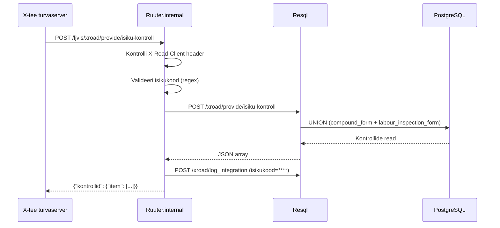

# IsikuKontroll

Tagastab kõik LJVIS-i kontrollid ja rikkumised ühe isikukoodi kohta.

---

## 1. Eesmärk

Välissüsteem (nt Transpordiamet) saab pärida, kas LJVIS-is leidub antud isikuga seotud
kontrollisündmusi. Päring on loetav (read-only) ja tagastab kõik leitud kirjed, sh tühi
loend on edukas vastus (HTTP 200).

---

## 2. X-tee identiteet

| Väli | Väärtus |
|------|---------|
| Teenuse kood | `IsikuKontroll` |
| Endpoint | `POST /ljvis/xroad/provide/isiku-kontroll` |
| Versioon | v1 |
| DSL fail | `DSL/Ruuter.internal/ljvis/POST/xroad/provide/isiku-kontroll.yml` |
| SQL fail | `DSL/Resql/ljvis/POST/xroad/provide/isiku-kontroll.sql` |

---

## 3. Request

### 3.1 Päised

| Päis | Kohustuslik | Kirjeldus |
|------|-------------|-----------|
| `X-Road-Client` | Jah | Tarbija turvaserveri identiteet |
| `Content-Type` | Jah | `application/json` |

### 3.2 Keha väljad

| Väli | Tüüp | Kohustuslik | Kirjeldus |
|------|------|-------------|-----------|
| `isikukood` | string | Jah | Eesti isikukood (11 numbrit, algab 1–6) |

### 3.3 Näide

```json
{ "isikukood": "39001010001" }
```

---

## 4. Response

### 4.1 Struktuur

| Väli | Tüüp | Kirjeldus |
|------|------|-----------|
| `kontrollid.item[]` | array | Leitud kontrollikirjed (tühi array = 0 kirjet) |
| `.kuupaev` | string | Kontrolli kuupäev |
| `.nimetus` | string | Vormi number |
| `.asutus` | string | Ettevõtte nimi |
| `.soiduki_reg_nr` | string | Sõiduki registreerimisnumber (koondvormil) |
| `.rikkumise_liik` | string | Tehnoülevaatuse tulemus (result_type) |
| `.kontrolli_nimetus` | string | `KOONDVORM` või `TOOINSPEKTION` |
| `.juhi_nimi` | string | Juhi eesnimi |
| `.juhi_perekonnanimi` | string | Juhi perekonnanimi |
| `.rikkumised` | string | Rikkumiste loend (tööinspektsiooniaktil) |
| `.rikkumised_lopetatud` | string | Menetluse lõpetamise alus |

### 4.2 Näide

```json
{
  "kontrollid": {
    "item": [
      {
        "kuupaev": "2026-06-15",
        "nimetus": "kv-2026-00042",
        "asutus": "OÜ Kiirkaubaveos",
        "soiduki_reg_nr": "123ABC",
        "rikkumise_liik": "extraordinary_inspection",
        "kontrolli_nimetus": "KOONDVORM",
        "juhi_nimi": "Jaan",
        "juhi_perekonnanimi": "Tamm",
        "rikkumised": null,
        "rikkumised_lopetatud": null
      }
    ]
  }
}
```

---

## 5. Andmevoog



---

## 6. Valideerimine

| Väli | Reegel | Viga |
|------|--------|------|
| `X-Road-Client` | Ei tohi puududa | 400 `MISSING_HEADER` |
| `isikukood` | Kohustuslik | 400 `MISSING_PARAMETER` |
| `isikukood` | `/^[1-6][0-9]{10}$/` | 400 `INVALID_PARAMETER` |

---

## 7. Turvalisus

- Päring on read-only — andmebaasi ei kirjutata.
- Isikukood maskitakse logikirjes (`****`).
- Fault vastuses ei ole SQL-i ega stack trace'i.

---

## 8. Testimisjuhud

| # | Sisend | Oodatav tulemus |
|---|--------|-----------------|
| T1 | Kehtiv isikukood, kontrollid olemas | HTTP 200, `item` sisaldab kirjeid |
| T2 | Kehtiv isikukood, kontrollid puuduvad | HTTP 200, `item: []` |
| T3 | Isikukood puudub | HTTP 400 `MISSING_PARAMETER` |
| T4 | Isikukood vale formaadiga | HTTP 400 `INVALID_PARAMETER` |
| T5 | `X-Road-Client` puudub | HTTP 400 `MISSING_HEADER` |
| T6 | Kustutatud staatuses kontrollid | Ei ilmu vastuses |
