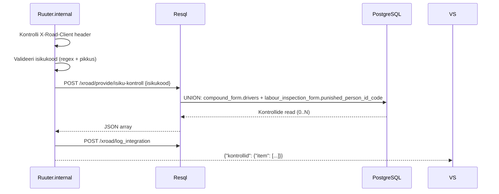

# IsikuKontroll

Tagastab LJVIS-is talletatud kontrolli- ja rikkumisinfo ühe isikukoodi kohta kõigist vormitüüpidest.

---

## 1. Eesmärk

Välissüsteem (nt politsei infosüsteem, Transpordiamet) saab pärida, millised LJVIS-i kontrollid ja rikkumised on isiku kohta kirjas. Teenus tagastab kõigist vormitest leitud tulemused.

---

## 2. X-tee identiteet

| Väli | Väärtus |
|------|---------|
| Teenuse kood | `IsikuKontroll` |
| Endpoint | `POST /ljvis/xroad/provide/isiku-kontroll` |
| Versioon | v1 |
| DSL fail | `DSL/Ruuter.internal/ljvis/POST/xroad/provide/isiku-kontroll.yml` |
| SQL fail | `DSL/Resql/ljvis/POST/xroad/provide/isiku-kontroll.sql` |

---

## 3. Request

### 3.1 Päised

| Päis | Kohustuslik | Kirjeldus |
|------|-------------|-----------|
| `X-Road-Client` | Jah | Tarbija turvaserveri identiteet |
| `Content-Type` | Jah | `application/json` |

### 3.2 Keha väljad

| Väli | Tüüp | Kohustuslik | Kirjeldus |
|------|------|-------------|-----------|
| `isikukood` | string | Jah | Eesti isikukood (11 numbrit, algab 1–6) |

### 3.3 Näide

```json
{
  "isikukood": "39001010001"
}
```

---

## 4. Response

### 4.1 Väljad

| Väli | Tüüp | Kirjeldus |
|------|------|-----------|
| `kontrollid.item[]` | array | Kontrollide loend (võib olla tühi) |
| `kontrollid.item[].kuupaev` | string (ISO date) | Kontrolli kuupäev |
| `kontrollid.item[].nimetus` | string | Vormi number (nt `kv-2026-00001`) |
| `kontrollid.item[].asutus` | string | Kontrolliv asutus / ettevõte |
| `kontrollid.item[].soiduki_reg_nr` | string | Sõiduki registreerimisnumber |
| `kontrollid.item[].rikkumise_liik` | string | Kontrolli tulemus / otsus |
| `kontrollid.item[].kontrolli_nimetus` | string | Kontrolli tüüp (`KOONDVORM`, `TOOINSPEKTION`) |
| `kontrollid.item[].juhi_nimi` | string | Juhi eesnimi |
| `kontrollid.item[].juhi_perekonnanimi` | string | Juhi perekonnanimi |
| `kontrollid.item[].rikkumised` | string \| null | Rikkumiste kirjeldus |
| `kontrollid.item[].rikkumised_lopetatud` | string \| null | Lõpetatud menetluse alus |

### 4.2 Näide — tulemustega vastus

```json
{
  "kontrollid": {
    "item": [
      {
        "kuupaev": "2026-06-15",
        "nimetus": "kv-2026-00042",
        "asutus": "OÜ Kiirkaubaveos",
        "soiduki_reg_nr": "123ABC",
        "rikkumise_liik": "extraordinary_inspection",
        "kontrolli_nimetus": "KOONDVORM",
        "juhi_nimi": "Jaan",
        "juhi_perekonnanimi": "Tamm",
        "rikkumised": null,
        "rikkumised_lopetatud": null
      },
      {
        "kuupaev": "2026-03-01",
        "nimetus": "ti-2026-00007",
        "asutus": "OÜ Kiirkaubaveos",
        "soiduki_reg_nr": null,
        "rikkumise_liik": null,
        "kontrolli_nimetus": "TOOINSPEKTION",
        "juhi_nimi": "Jaan",
        "juhi_perekonnanimi": "Tamm",
        "rikkumised": null,
        "rikkumised_lopetatud": "VtMS § 29 lg 1"
      }
    ]
  }
}
```

### 4.3 Näide — tühi vastus (edukas)

```json
{
  "kontrollid": {
    "item": []
  }
}
```

---

## 5. Andmevoog



**Samm-sammuline:**
1. Kontrolli `X-Road-Client` header — puudumisel tagasta 400.
2. Valideeri `isikukood` — peab olema 11-kohaline string, algama 1–6 — puudumisel või valel kujul 400.
3. SQL UNION päring:
   - `forms.compound_form` kus `drivers @> '[{"personal_code_ee":"<isikukood>"}]'` ja `status != 'deleted'`, DISTINCT ON `compound_form_key` (viimane snapshot)
   - `forms.labour_inspection_form` kus `punished_person_id_code = :isikukood` ja `status != 'deleted'`, DISTINCT ON `labour_inspection_form_key`
4. Sorteeri tulemused `kuupaev DESC`.
5. Logi `xroad.xroad_integration_log` — isikukoodi ei kirjutata logi `request_xml` välja selge tekstina (asenda `****`).
6. Tagasta `{"kontrollid": {"item": [...]}}` — tühi array on edukas vastus.

---

## 6. Valideerimine

| Väli | Reegel | Viga |
|------|--------|------|
| `X-Road-Client` header | Ei tohi puududa | 400 `MISSING_HEADER` |
| `isikukood` | Kohustuslik | 400 `MISSING_PARAMETER` |
| `isikukood` | `/^[1-6][0-9]{10}$/` | 400 `INVALID_PARAMETER` |

---

## 7. Turvalisus ja isikuandmed

- `isikukood` on isikuandmed — **ei kirjutata** `xroad_integration_log.request_xml` välja selge tekstina.
- Vastuses tagastatavad nimed ja isikuandmed on piiratud juurdepääsuga — X-tee allowlist kontrollib, kes teenust kutsuda saab.
- SQL-i ei kirjutata YAML-i otse, ainult läbi Resql.
- Fault vastuses ei tohi olla SQL-i ega stack trace'i.

---

## 8. Testimisjuhud

| # | Sisend | Oodatav tulemus |
|---|--------|-----------------|
| T1 | Kehtiv isikukood, kontrollid olemas | HTTP 200, `item` sisaldab kirjeid |
| T2 | Kehtiv isikukood, kontrollid puuduvad | HTTP 200, `item: []` |
| T3 | `isikukood` puudub | HTTP 400 `MISSING_PARAMETER` |
| T4 | `isikukood` vale formaat (`abc`) | HTTP 400 `INVALID_PARAMETER` |
| T5 | `isikukood` algab 7-ga | HTTP 400 `INVALID_PARAMETER` |
| T6 | `X-Road-Client` header puudub | HTTP 400 `MISSING_HEADER` |
| T7 | Isikul on kontrollid mitmest vormitüübist | Kõik vormitüübid on vastuses esindatud |
| T8 | Kustutatud staatuses vormid | Kustutatud vormid ei ilmu vastuses |

---

## 10. Implementatsiooni viited

- DSL: [`DSL/Ruuter.internal/ljvis/POST/xroad/provide/isiku-kontroll.yml`](../../DSL/Ruuter.internal/ljvis/POST/xroad/provide/isiku-kontroll.yml)
- SQL: [`DSL/Resql/ljvis/POST/xroad/provide/isiku-kontroll.sql`](../../DSL/Resql/ljvis/POST/xroad/provide/isiku-kontroll.sql)
- Log SQL: [`DSL/Resql/ljvis/POST/xroad/log_integration.sql`](../../DSL/Resql/ljvis/POST/xroad/log_integration.sql)
