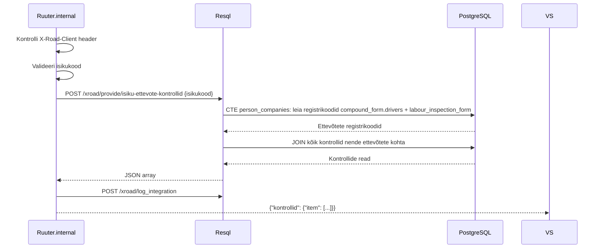

# IsikuEttevoteKontrollid

Tagastab kõik LJVIS-i kontrollid, mis on seotud ettevõtetega, kus antud isik on juhi rollis.

---

## 1. Eesmärk

Välissüsteem saab pärida, milliste ettevõtete kontrollid on seotud konkreetse isikuga — isik otsitakse koondvormide juhtide seast ja tööinspektsiooni aktide karistatud isikute seast. Kõik nende ettevõtete kontrollid tagastatakse.

> Teenus kasutab ainult LJVIS-i lokaalset andmebaasi. Äriregistri välispäringut ei tehta.

---

## 2. X-tee identiteet

| Väli | Väärtus |
|------|---------|
| Teenuse kood | `IsikuEttevoteKontrollid` |
| Endpoint | `POST /ljvis/xroad/provide/isiku-ettevote-kontrollid` |
| Versioon | v1 |
| DSL fail | `DSL/Ruuter.internal/ljvis/POST/xroad/provide/isiku-ettevote-kontrollid.yml` |
| SQL fail | `DSL/Resql/ljvis/POST/xroad/provide/isiku-ettevote-kontrollid.sql` |

---

## 3. Request

### 3.1 Päised

| Päis | Kohustuslik | Kirjeldus |
|------|-------------|-----------|
| `X-Road-Client` | Jah | Tarbija turvaserveri identiteet |
| `Content-Type` | Jah | `application/json` |

### 3.2 Keha väljad

| Väli | Tüüp | Kohustuslik | Kirjeldus |
|------|------|-------------|-----------|
| `isikukood` | string | Jah | Eesti isikukood |

### 3.3 Näide

```json
{
  "isikukood": "39001010001"
}
```

---

## 4. Response

### 4.1 Väljad

| Väli | Tüüp | Kirjeldus |
|------|------|-----------|
| `kontrollid.item[]` | array | Kontrollide loend (võib olla tühi) |
| `kontrollid.item[].ettevote_reg_nr` | string | Ettevõtte registrikood |
| `kontrollid.item[].kuupaev` | string | Kontrolli kuupäev |
| `kontrollid.item[].kontrolli_nimetus` | string | Kontrolli tüüp |
| `kontrollid.item[].asutus` | string | Kontrolliv asutus |
| `kontrollid.item[].nimetus` | string | Vormi number |
| `kontrollid.item[].soiduki_reg_nr` | string \| null | Sõiduki registreerimisnumber |
| `kontrollid.item[].juhi_nimi` | string \| null | Juhi eesnimi |
| `kontrollid.item[].juhi_perekonnanimi` | string \| null | Juhi perekonnanimi |
| `kontrollid.item[].rikkumise_liik` | string \| null | Otsus / rikkumise liik |
| `kontrollid.item[].rikkumised` | string \| null | Rikkumiste kirjeldus |
| `kontrollid.item[].rikkumised_lopetatud` | string \| null | Lõpetatud menetluse alus |

### 4.2 Näide

```json
{
  "kontrollid": {
    "item": [
      {
        "ettevote_reg_nr": "12345678",
        "kuupaev": "2026-06-15",
        "kontrolli_nimetus": "KOONDVORM",
        "asutus": "OÜ Kiirkaubaveos",
        "nimetus": "kv-2026-00042",
        "soiduki_reg_nr": "123ABC",
        "juhi_nimi": null,
        "juhi_perekonnanimi": null,
        "rikkumise_liik": "ok",
        "rikkumised": null,
        "rikkumised_lopetatud": null
      }
    ]
  }
}
```

---

## 5. Andmevoog



**Samm-sammuline:**
1. Kontrolli `X-Road-Client` header.
2. Valideeri `isikukood`.
3. CTE `person_companies`:
   - `compound_form.drivers @> '[{"personal_code_ee":"<kood>"}]'` → `DISTINCT company_reg_code`
   - `labour_inspection_form.punished_person_id_code = :isikukood` → `DISTINCT company_reg_code`
4. JOIN kõik `compound_form` read, kus `company_reg_code IN (person_companies)`.
5. JOIN kõik `labour_inspection_form` read, kus `company_reg_code IN (person_companies)`.
6. Sorteeri `ettevote_reg_nr, kuupaev DESC`.
7. Logi (isikukood maskituna).
8. Tagasta tulemus — tühi array on edukas vastus.

---

## 6. Valideerimine

| Väli | Reegel | Viga |
|------|--------|------|
| `X-Road-Client` | Ei tohi puududa | 400 `MISSING_HEADER` |
| `isikukood` | Kohustuslik | 400 `MISSING_PARAMETER` |
| `isikukood` | `/^[1-6][0-9]{10}$/` | 400 `INVALID_PARAMETER` |

---

## 7. Turvalisus ja isikuandmed

- Sama kui IsikuKontroll — isikukood maskitakse logi kirjes.
- Vastuses tagastatavad ettevõtte andmed ja kontrollinfo on piiratud X-tee allowlistiga.

---

## 8. Testimisjuhud

| # | Sisend | Oodatav tulemus |
|---|--------|-----------------|
| T1 | Isik on juht ühes ettevõttes, ettevõttel kontrollid olemas | Kõik selle ettevõtte kontrollid vastuses |
| T2 | Isik on juht mitmes ettevõttes | Kõigi ettevõtete kontrollid vastuses |
| T3 | Isik ei ole ühegi ettevõttega seotud | HTTP 200, `item: []` |
| T4 | Isik on seotud ettevõttega, kuid ettevõttel pole kontrollitud koondvorme | Ainult tööinspektsiooni vormid (kui olemas) |
| T5 | `isikukood` puudub | HTTP 400 `MISSING_PARAMETER` |
| T6 | `isikukood` vale formaat | HTTP 400 `INVALID_PARAMETER` |
| T7 | `X-Road-Client` puudub | HTTP 400 `MISSING_HEADER` |
| T8 | Kustutatud staatuses vormid ei ilmu | Kustutatud vormid välistatud |

---

## 9. Implementatsiooni viited

- DSL: [`DSL/Ruuter.internal/ljvis/POST/xroad/provide/isiku-ettevote-kontrollid.yml`](../../DSL/Ruuter.internal/ljvis/POST/xroad/provide/isiku-ettevote-kontrollid.yml)
- SQL: [`DSL/Resql/ljvis/POST/xroad/provide/isiku-ettevote-kontrollid.sql`](../../DSL/Resql/ljvis/POST/xroad/provide/isiku-ettevote-kontrollid.sql)
