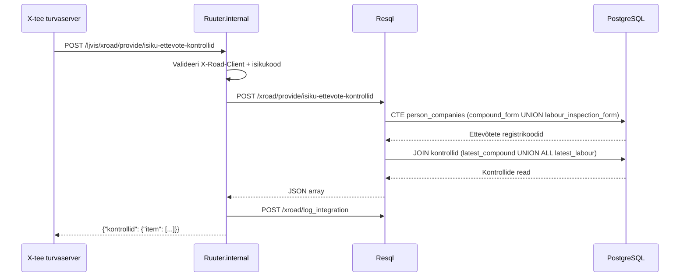

# IsikuEttevoteKontrollid

Tagastab kõik LJVIS-i kontrollid ettevõtete kohta, millega antud isik on juhi rollis seotud.

---

## 1. Eesmärk

Välissüsteem saab pärida, milliste ettevõtetega on isik LJVIS-is seotud (juht koondvormil
või karistatu tööinspektsiooniaktil) ja mis kontrollisündmused on nende ettevõtete kohta
olemas. Äriregistri välispäringut ei tehta — ainult lokaalne DB.

---

## 2. X-tee identiteet

| Väli | Väärtus |
|------|---------|
| Teenuse kood | `IsikuEttevoteKontrollid` |
| Endpoint | `POST /ljvis/xroad/provide/isiku-ettevote-kontrollid` |
| Versioon | v1 |
| DSL fail | `DSL/Ruuter.internal/ljvis/POST/xroad/provide/isiku-ettevote-kontrollid.yml` |
| SQL fail | `DSL/Resql/ljvis/POST/xroad/provide/isiku-ettevote-kontrollid.sql` |

---

## 3. Request

| Päis / Väli | Kohustuslik | Kirjeldus |
|-------------|-------------|-----------|
| `X-Road-Client` (header) | Jah | Tarbija turvaserveri identiteet |
| `isikukood` (body) | Jah | Eesti isikukood (11 numbrit, algab 1–6) |

---

## 4. Response

| Väli | Kirjeldus |
|------|-----------|
| `kontrollid.item[]` | Kontrollide loend |
| `.ettevote_reg_nr` | Ettevõtte registrikood |
| `.kuupaev` | Kontrolli kuupäev |
| `.kontrolli_nimetus` | `KOONDVORM` või `TOOINSPEKTION` |
| `.asutus` | Ettevõtte nimi |
| `.nimetus` | Vormi number |
| `.soiduki_reg_nr` | Sõiduki reg.nr (koondvormil) |
| `.juhi_nimi / .juhi_perekonnanimi` | Karistatu nimi (tööinspektsiooniaktil) |

---

## 5. Loogika

---

## 6. Valideerimine

| Väli | Reegel | Viga |
|------|--------|------|
| `X-Road-Client` | Ei tohi puududa | 400 `MISSING_HEADER` |
| `isikukood` | Kohustuslik | 400 `MISSING_PARAMETER` |
| `isikukood` | `/^[1-6][0-9]{10}$/` | 400 `INVALID_PARAMETER` |

---

## 7. Testimisjuhud

| # | Sisend | Oodatav tulemus |
|---|--------|-----------------|
| T1 | Kehtiv isikukood, seotud ettevõtted on olemas | HTTP 200, kontrollid tagastatakse |
| T2 | Kehtiv isikukood, seotud ettevõtteid pole | HTTP 200, `item: []` |
| T3 | Vale isikukood | HTTP 400 |
| T4 | `X-Road-Client` puudub | HTTP 400 |
| T5 | Kustutatud kontrollid | Ei ilmu vastuses |
