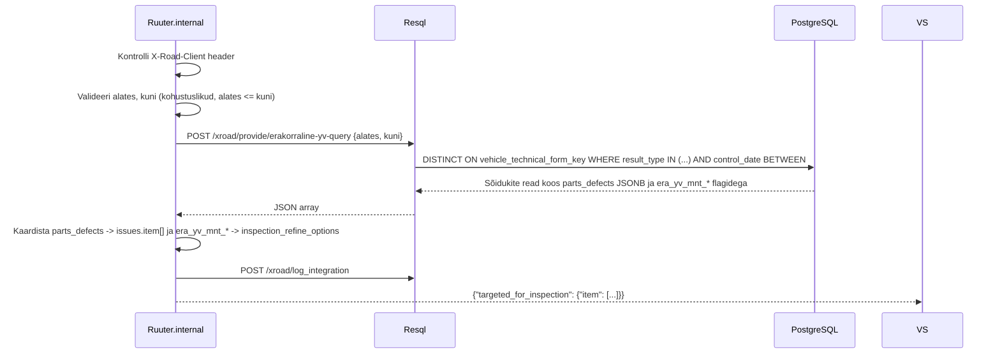

# ErakorralineYVquery

Tagastab ajavahemikul erakorralisele tehnoülevaatusele suunatud sõidukid.

---

## 1. Eesmärk

Transpordiamet saab pärida, millised sõidukid on LJVIS-i kontrollide põhjal suunatud erakorralisele tehnoülevaatusele (st kontrolli tulemus on `extraordinary_inspection` või `extraordinary_inspection_ta`). Vastus sisaldab sõiduki andmed, kontrolli info, avastatud puudused ja MNT-le saadetavad täpsustused.

---

## 2. X-tee identiteet

| Väli | Väärtus |
|------|---------|
| Teenuse kood | `ErakorralineYVquery` |
| Endpoint | `POST /ljvis/xroad/provide/erakorraline-yv-query` |
| Versioon | v1 |
| DSL fail | `DSL/Ruuter.internal/ljvis/POST/xroad/provide/erakorraline-yv-query.yml` |
| SQL fail | `DSL/Resql/ljvis/POST/xroad/provide/erakorraline-yv-query.sql` |

---

## 3. Request

### 3.1 Päised

| Päis | Kohustuslik | Kirjeldus |
|------|-------------|-----------|
| `X-Road-Client` | Jah | Tarbija turvaserveri identiteet |
| `Content-Type` | Jah | `application/json` |

### 3.2 Keha väljad

| Väli | Tüüp | Kohustuslik | Kirjeldus |
|------|------|-------------|-----------|
| `alates` | string (ISO date) | Jah | Vahemiku algus (`YYYY-MM-DD`) |
| `kuni` | string (ISO date) | Jah | Vahemiku lõpp (`YYYY-MM-DD`) |

Mõlemad väljad on kohustuslikud — piiramatu päring ei ole lubatud.

### 3.3 Näide

```json
{
  "alates": "2026-01-01",
  "kuni": "2026-06-30"
}
```

---

## 4. Response

### 4.1 Väljad

| Väli | Tüüp | Kirjeldus |
|------|------|-----------|
| `targeted_for_inspection.item[]` | array | Sõidukite loend |
| `.licence_plate_no` | string | Sõiduki registreerimisnumber |
| `.trailer_no` | string \| null | Haagise registreerimisnumber |
| `.inspection_id` | string | LJVIS-i vormivõti (`vehicle_technical_form_key`) |
| `.inspection_no` | string | Koondvormi number (nt `kv-2026-00042`) |
| `.inspection_date` | string | Kontrolli kuupäev |
| `.inspection_type` | string | `extraordinary_inspection` \| `extraordinary_inspection_ta` |
| `.inspection_unit` | string | Kontrolliv asutus |
| `.inspection_notes` | string \| null | Lisamärkused |
| `.inspector` | string \| null | Kontrollija nimi |
| `.issues.item[]` | array | Avastatud puudused (parts_defects) |
| `.issues.item[].code` | string | Komponendi kood |
| `.issues.item[].value` | string | Rikkumise kirjeldus |
| `.notes.item[]` | array | Täiendavalt kontrollitavad osad |
| `.inspection_refine_options.item[]` | array | MNT-le saadetavad täpsustused (era_yv_mnt_* flagidest) |

### 4.2 Inspection refine options koodid

| Flag | Kood | Tähendus |
|------|------|----------|
| `era_yv_mnt_regnr = true` | `REGNR` | Registreerimisnumber |
| `era_yv_mnt_vintin = true` | `VINTIN` | VIN/TIN-kood |
| `era_yv_mnt_axles = true` | `AXLES` | Telgede arv |
| `era_yv_mnt_places = true` | `PLACES` | Istekohtade arv koos juhiga |
| `era_yv_mnt_rebuilt = true` | `REBUILT` | Omavoliliselt ümberehitatud |

### 4.3 Näide

```json
{
  "targeted_for_inspection": {
    "item": [
      {
        "licence_plate_no": "123ABC",
        "trailer_no": null,
        "inspection_id": "42",
        "inspection_no": "kv-2026-00042",
        "inspection_date": "2026-06-15",
        "inspection_type": "extraordinary_inspection_ta",
        "inspection_unit": "Põhja prefektuur",
        "inspection_notes": "Roolimehanism kulunud",
        "inspector": null,
        "issues": {
          "item": [
            { "code": "CAA_1", "value": "Roolimine" }
          ]
        },
        "notes": { "item": [] },
        "inspection_refine_options": {
          "item": ["REGNR", "VINTIN"]
        }
      }
    ]
  }
}
```

---

## 5. Andmevoog



**Samm-sammuline:**
1. Kontrolli `X-Road-Client` header.
2. Valideeri `alates` ja `kuni` — mõlemad kohustuslikud, `alates <= kuni`.
3. SQL: DISTINCT ON `vehicle_technical_form_key` ORDER BY `created_at DESC` kus:
   - `result_type IN ('extraordinary_inspection', 'extraordinary_inspection_ta')`
   - JOIN `compound_form` (viimane snapshot) `control_date BETWEEN :alates AND :kuni`
   - `vehicle_country_code IS NULL OR vehicle_country_code = 'EE'`
   - `status != 'deleted'`
4. Kaardista `parts_defects` JSONB → `issues.item[]`.
5. Kaardista `era_yv_mnt_*` boolean-id → `inspection_refine_options.item[]`.
6. Logi.
7. Tagasta — tühi array on edukas vastus.

---

## 6. Valideerimine

| Väli | Reegel | Viga |
|------|--------|------|
| `X-Road-Client` | Ei tohi puududa | 400 `MISSING_HEADER` |
| `alates` | Kohustuslik | 400 `MISSING_PARAMETER` |
| `kuni` | Kohustuslik | 400 `MISSING_PARAMETER` |
| `alates` | Parsitav kuupäev | 400 `INVALID_PARAMETER` |
| `kuni` | Parsitav kuupäev | 400 `INVALID_PARAMETER` |
| `alates <= kuni` | Järjekord | 400 `INVALID_PARAMETER` |

---

## 7. Turvalisus

- Välisriigi sõidukid (`vehicle_country_code != 'EE'`) välistatakse.
- Sõiduki andmete väljastamine ainult lubatud X-tee klientidele (konfigureeritav allowlist).

---

## 8. Testimisjuhud

| # | Sisend | Oodatav tulemus |
|---|--------|-----------------|
| T1 | Vahemik kus on erakorralisi ülevaatusi | HTTP 200, tulemused kirjes |
| T2 | Vahemik kus pole ühtegi | HTTP 200, `item: []` |
| T3 | `alates` puudub | HTTP 400 `MISSING_PARAMETER` |
| T4 | `kuni` puudub | HTTP 400 `MISSING_PARAMETER` |
| T5 | `alates > kuni` | HTTP 400 `INVALID_PARAMETER` |
| T6 | Vale kuupäevaformaat | HTTP 400 `INVALID_PARAMETER` |
| T7 | `X-Road-Client` puudub | HTTP 400 `MISSING_HEADER` |
| T8 | Vorm on `deleted` staatuses | Ei ilmu vastuses |
| T9 | `era_yv_mnt_regnr = true` | `inspection_refine_options` sisaldab `REGNR` |
| T10 | `extraordinary_inspection_ta` tüüpi kontroll | Ilmub vastuses |

---

## 9. Implementatsiooni viited

- DSL: [`DSL/Ruuter.internal/ljvis/POST/xroad/provide/erakorraline-yv-query.yml`](../../DSL/Ruuter.internal/ljvis/POST/xroad/provide/erakorraline-yv-query.yml)
- SQL: [`DSL/Resql/ljvis/POST/xroad/provide/erakorraline-yv-query.sql`](../../DSL/Resql/ljvis/POST/xroad/provide/erakorraline-yv-query.sql)
