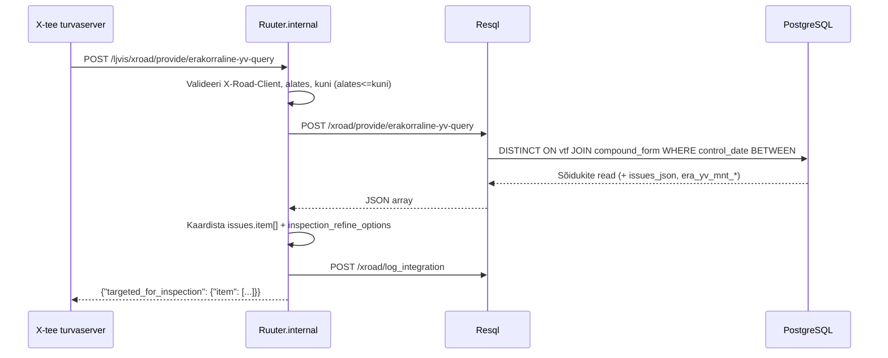

# ErakorralineYVquery

Tagastab ajavahemikul erakorralisele tehnoülevaatusele suunatud sõidukid.

---

## 1. Eesmärk

Transpordiamet saab pärida, millised sõidukid on LJVIS-i andmetel antud
ajavahemikul erakorralisele tehnoülevaatusele suunatud.
Päring on read-only, tühi loend on edukas vastus.

---

## 2. X-tee identiteet

| Väli | Väärtus |
|------|---------|
| Teenuse kood | `ErakorralineYVquery` |
| Endpoint | `POST /ljvis/xroad/provide/erakorraline-yv-query` |
| Versioon | v1 |
| DSL fail | `DSL/Ruuter.internal/ljvis/POST/xroad/provide/erakorraline-yv-query.yml` |
| SQL fail | `DSL/Resql/ljvis/POST/xroad/provide/erakorraline-yv-query.sql` |

---

## 3. Request

| Väli | Tüüp | Kohustuslik | Kirjeldus |
|------|------|-------------|-----------|
| `X-Road-Client` (header) | string | Jah | Tarbija identiteet |
| `alates` | string (ISO date) | Jah | Perioodi algus (kaasav) |
| `kuni` | string (ISO date) | Jah | Perioodi lõpp (kaasav) |

Näide:
```json
{ "alates": "2026-01-01", "kuni": "2026-06-30" }
```

---

## 4. Response

| Väli | Kirjeldus |
|------|-----------|
| `targeted_for_inspection.item[]` | Sõidukite loend |
| `.licence_plate_no` | Registreerimisnumber |
| `.inspection_id` | Vormi võti (ErakorralineYVconfirm viiteID) |
| `.inspection_type` | `extraordinary_inspection` / `extraordinary_inspection_ta` |
| `.issues.item[]` | Tuvastatud rikked (code + value) |
| `.inspection_refine_options.item[]` | MNT täiendusvalikud (REGNR, VINTIN jne) |

---

## 5. Andmevoog



---

## 6. Valideerimine

| Väli | Reegel | Viga |
|------|--------|------|
| `X-Road-Client` | Kohustuslik | 400 MISSING_HEADER |
| `alates` | Kohustuslik | 400 MISSING_PARAMETER |
| `kuni` | Kohustuslik | 400 MISSING_PARAMETER |
| `alates <= kuni` | Järjestus | 400 INVALID_PARAMETER |

---

## 7. Testimisjuhud

| # | Sisend | Oodatav tulemus |
|---|--------|-----------------|
| T1 | Kehtiv periood, sõidukid olemas | HTTP 200, loend |
| T2 | Kehtiv periood, sõidukeid pole | HTTP 200, `item: []` |
| T3 | `alates > kuni` | HTTP 400 INVALID_PARAMETER |
| T4 | `alates` puudub | HTTP 400 MISSING_PARAMETER |
| T5 | `X-Road-Client` puudub | HTTP 400 MISSING_HEADER |
| T6 | Välisriigi sõidukid perioodil | Ei ilmu vastuses |
