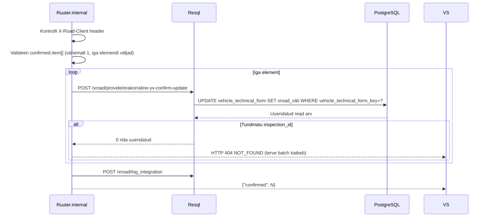

# ErakorralineYVconfirm

Võtab vastu välissüsteemi kinnituse erakorralise tehnoülevaatuse tulemuste kohta ja salvestab need LJVIS-i kontrollvormi X-tee väljadesse.

---

## 1. Eesmärk

Transpordiamet teatab LJVIS-ile erakorralise tehnoülevaatuse tulemuse (`extraordinary_inspection_date`, `enforcement_decision`, `proceeding_closure_basis`). Andmed salvestatakse `vehicle_technical_form` viimase snapshot'i X-tee blokkidesse ilma uue snapshot'i loomiseta (versiooni number ei muutu).

---

## 2. X-tee identiteet

| Väli | Väärtus |
|------|---------|
| Teenuse kood | `ErakorralineYVconfirm` |
| Endpoint | `POST /ljvis/xroad/provide/erakorraline-yv-confirm` |
| Versioon | v1 |
| DSL fail | `DSL/Ruuter.internal/ljvis/POST/xroad/provide/erakorraline-yv-confirm.yml` |
| SQL fail | `DSL/Resql/ljvis/POST/xroad/provide/erakorraline-yv-confirm-update.sql` |

---

## 3. Request

### 3.1 Päised

| Päis | Kohustuslik | Kirjeldus |
|------|-------------|-----------|
| `X-Road-Client` | Jah | Tarbija turvaserveri identiteet |
| `Content-Type` | Jah | `application/json` |

### 3.2 Keha väljad

| Väli | Tüüp | Kohustuslik | Kirjeldus |
|------|------|-------------|-----------|
| `confirmed.item[]` | array | Jah | Kinnituste loend (vähemalt 1 element) |
| `.inspection_id` | string | Jah | `vehicle_technical_form_key` väärtus |
| `.code` | string | Jah | Kinnituse tüüp (vt koodid allpool) |
| `.value` | string | Jah | Kinnituse väärtus |

### 3.3 Kinnituse koodid

| `code` | Salvestatav väli | Näide `value` |
|--------|-----------------|---------------|
| `INSPECTION_DATE` | `extraordinary_inspection_date` | `2026-07-01` |
| `ENFORCEMENT_DECISION` | `enforcement_decision` | `Otsus jõustus` |
| `CLOSURE_BASIS` | `proceeding_closure_basis` | `VtMS § 29 lg 1` |

### 3.4 Näide

```json
{
  "confirmed": {
    "item": [
      {
        "inspection_id": "42",
        "code": "INSPECTION_DATE",
        "value": "2026-07-01"
      },
      {
        "inspection_id": "42",
        "code": "ENFORCEMENT_DECISION",
        "value": "Otsus jõustus 01.07.2026"
      }
    ]
  }
}
```

---

## 4. Response

### 4.1 Väljad

| Väli | Tüüp | Kirjeldus |
|------|------|-----------|
| `confirmed` | integer | Edukalt töödeldud elementide arv |

### 4.2 Näide

```json
{
  "confirmed": 2
}
```

---

## 5. Andmevoog



**Samm-sammuline:**
1. Kontrolli `X-Road-Client` header.
2. Valideeri `confirmed.item[]` — ei tohi olla tühi, iga elemendi `inspection_id`, `code` ja `value` kohustuslikud.
3. Iga elemendi kohta:
   - Leia `vehicle_technical_form` viimane snapshot `vehicle_technical_form_key = inspection_id`
   - Uuenda vastavat X-tee välja in-place (ei loo uut snapshot'i)
   - Kui 0 rida uuendati → tagasta 404 `NOT_FOUND`, terve batch ebaõnnestub
4. **Atomaarne**: ühe elemendi ebaõnnestumisel terve päring ebaõnnestub (ühtegi muudatust ei salvestata)
5. **Idempotentne**: sama `inspection_id + code + value` kombinatsiooniga korduspäring annab sama tulemuse
6. Logi.
7. Tagasta `{"confirmed": N}`.

---

## 6. Valideerimine

| Väli | Reegel | Viga |
|------|--------|------|
| `X-Road-Client` | Ei tohi puududa | 400 `MISSING_HEADER` |
| `confirmed.item` | Ei tohi olla tühi | 400 `MISSING_PARAMETER` |
| `.inspection_id` | Kohustuslik, mittenegatiivne täisarv | 400 `INVALID_PARAMETER` |
| `.code` | Kohustuslik, lubatud koodide loendis | 400 `INVALID_PARAMETER` |
| `.value` | Kohustuslik, mittenegatiivne tekstistring | 400 `INVALID_PARAMETER` |
| Tundmatu `inspection_id` | DB ei leia vastavat rida | 404 `NOT_FOUND` |

---

## 7. Turvalisus

- Ainult `confirmed` staatuses vormid peaksid saama X-tee välju — SQL kontrollib `status = 'confirmed'` tingimust. Teistsuguse staatusega vormi kohta tagastatakse `NOT_FOUND`.
- Andmeid ei loeta ega tagastata — teenus on kirjutav, vastuses ainult loendur.

---

## 8. Testimisjuhud

| # | Sisend | Oodatav tulemus |
|---|--------|-----------------|
| T1 | 1 kehtiv kinnituse element | HTTP 200, `confirmed: 1` |
| T2 | 3 kehtivat elementi | HTTP 200, `confirmed: 3` |
| T3 | Tundmatu `inspection_id` | HTTP 404 `NOT_FOUND`, muudatusi ei salvestata |
| T4 | `confirmed.item` on tühi array | HTTP 400 `MISSING_PARAMETER` |
| T5 | `.code` on lubamatu väärtus | HTTP 400 `INVALID_PARAMETER` |
| T6 | `.value` puudub | HTTP 400 `INVALID_PARAMETER` |
| T7 | `X-Road-Client` puudub | HTTP 400 `MISSING_HEADER` |
| T8 | Korduspäring sama kombinatsiooniga | HTTP 200, `confirmed: N` (idempotentne) |
| T9 | Üks kehtiv, üks tundmatu | HTTP 404, mitte mingit muudatust |

---

## 9. Implementatsiooni viited

- DSL: [`DSL/Ruuter.internal/ljvis/POST/xroad/provide/erakorraline-yv-confirm.yml`](../../DSL/Ruuter.internal/ljvis/POST/xroad/provide/erakorraline-yv-confirm.yml)
- SQL: [`DSL/Resql/ljvis/POST/xroad/provide/erakorraline-yv-confirm-update.sql`](../../DSL/Resql/ljvis/POST/xroad/provide/erakorraline-yv-confirm-update.sql)
- Sarnane SQL: [`DSL/Resql/ljvis/POST/control-forms/vehicle-technical/update-xroad-fields.sql`](../../DSL/Resql/ljvis/POST/control-forms/vehicle-technical/update-xroad-fields.sql)
