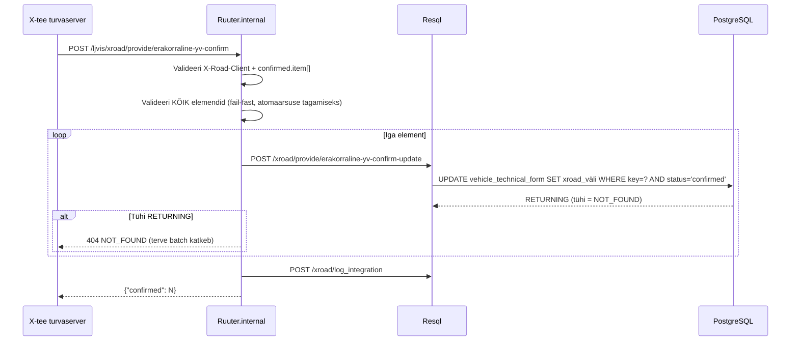

# ErakorralineYVconfirm

Võtab vastu kinnituse erakorralise tehnoülevaatuse tulemuste kohta ja salvestab need LJVIS-i `vehicle_technical_form` X-tee väljadesse.

---

## 1. Eesmärk

Transpordiamet teatab LJVIS-ile erakorralise tehnoülevaatuse tulemuse. Andmed salvestatakse viimase snapshot'i X-tee blokkidesse in-place — uut snapshot'i ei looda.

---

## 2. X-tee identiteet

| Väli | Väärtus |
|------|---------|
| Teenuse kood | `ErakorralineYVconfirm` |
| Endpoint | `POST /ljvis/xroad/provide/erakorraline-yv-confirm` |
| Versioon | v1 |
| DSL fail | `DSL/Ruuter.internal/ljvis/POST/xroad/provide/erakorraline-yv-confirm.yml` |
| SQL fail | `DSL/Resql/ljvis/POST/xroad/provide/erakorraline-yv-confirm-update.sql` |

---

## 3. Request

```json
{
  "confirmed": {
    "item": [
      { "inspection_id": "42", "code": "INSPECTION_DATE", "value": "2026-07-01" },
      { "inspection_id": "42", "code": "ENFORCEMENT_DECISION", "value": "Otsus jõustus" }
    ]
  }
}
```

### Kinnituse koodid

| `code` | Salvestatav DB veerg |
|--------|---------------------|
| `INSPECTION_DATE` | `extraordinary_inspection_date` |
| `ENFORCEMENT_DECISION` | `enforcement_decision` |
| `CLOSURE_BASIS` | `proceeding_closure_basis` |

---

## 4. Response

```json
{ "confirmed": 2 }
```

---

## 5. Andmevoog



---

## 6. Olulised nõuded

| Nõue | Kirjeldus |
|------|-----------|
| **Atomaarne** | Ühe elemendi ebaõnnestumisel batch katkeb — eelnevad muudatused jäävad (ei ole DB-taseme transaktsiooni) |
| **Idempotentne** | Sama `inspection_id + code + value` kordamine annab sama tulemuse |
| **Ainult confirmed** | SQL kontrollib `status = 'confirmed'` — teise staatusega vorm → 404 |
| **In-place** | Uut snapshot'i ei looda, versiooni number ei muutu |

---

## 7. Valideerimine

| Väli | Reegel | Viga |
|------|--------|------|
| `X-Road-Client` | Kohustuslik | 400 MISSING_HEADER |
| `confirmed.item` | Mitte-tühi massiiv | 400 MISSING_PARAMETER |
| `.inspection_id` | Kohustuslik | 400 INVALID_PARAMETER |
| `.code` | INSPECTION_DATE / ENFORCEMENT_DECISION / CLOSURE_BASIS | 400 INVALID_PARAMETER |
| `.value` | Kohustuslik | 400 INVALID_PARAMETER |
| Tundmatu ID | DB ei leia rida | 404 NOT_FOUND |

---

## 8. Testimisjuhud

| # | Sisend | Oodatav tulemus |
|---|--------|-----------------|
| T1 | 1 kehtiv element | HTTP 200, `confirmed: 1` |
| T2 | 3 kehtivat elementi | HTTP 200, `confirmed: 3` |
| T3 | Tundmatu `inspection_id` | HTTP 404, muudatusi ei salvestata |
| T4 | `item: []` | HTTP 400 MISSING_PARAMETER |
| T5 | Lubamatu `code` | HTTP 400 INVALID_PARAMETER |
| T6 | Korduspäring | HTTP 200 (idempotentne) |
| T7 | Üks kehtiv + üks tundmatu | HTTP 404, kumbagi ei salvestata |
