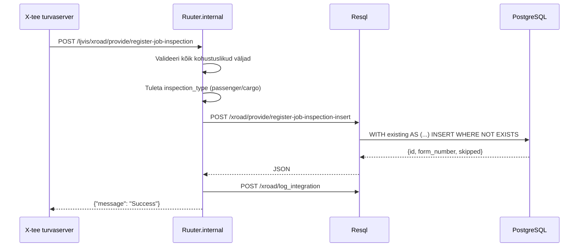

# RegisterJobInspection (v1)

Võtab vastu Tööinspektsiooni töökontrolli andmed (vana WSDL) ja salvestab need `forms.labour_inspection_form` tabelisse.

---

## 1. Eesmärk

Tööinspektsioon saab saata LJVIS-ile tehtud töökontrolli andmeid.
V1 leping vastab vanale WSDL-i `RegisterJobInspectionRequestType` struktuurile, mis on teisendatud REST-JSON-iks.

---

## 2. X-tee identiteet

| Väli | Väärtus |
|------|---------|
| Teenuse kood | `RegisterJobInspection` |
| Endpoint | `POST /ljvis/xroad/provide/register-job-inspection` |
| Versioon | v1 |
| DSL fail | `DSL/Ruuter.internal/ljvis/POST/xroad/provide/register-job-inspection.yml` |
| SQL fail | `DSL/Resql/ljvis/POST/xroad/provide/register-job-inspection-insert.sql` |

---

## 3. Request (WSDL -> JSON)

| WSDL väli | JSON väli | Tüüp | Kohustuslik | DB veerg |
|-----------|-----------|------|-------------|---------|
| `kontrollija` | `kontrollija` | string | Jah | `inspector_name` |
| `kontrolli_id` | `kontrolli_id` | integer | Jah | `external_inspection_id` |
| `kontrolli_kp` | `kontrolli_kp` | string (ISO date) | Jah | `inspection_date` |
| `tooandja_nimi` | `tooandja_nimi` | string | Jah | `company_name` |
| `tooandja_reg_kood` | `tooandja_reg_kood` | string | Jah | `company_reg_code` |
| `soidukite_arv` | `soidukite_arv` | integer | Ei | `vehicle_count` |
| `koostatatud_ettekirjutus` | `koostatatud_ettekirjutus` | boolean | Jah | `prescription_composed` |
| `kontrollimised` | `kontrollimised` | object | Jah | `controls_matrix` (JSONB) |
| `rikkumised` | `rikkumised` | object | Jah | `violations` (JSONB) |
| `vaarteomenetlus` | `vaarteomenetlus` | string | Ei | `proceeding_reference_number` |

---

## 4. Loogika

---

## 5. Idempotentsus

`external_inspection_id = kontrolli_id` — `WHERE NOT EXISTS` tagab, et sama ID-ga kirje ei tekita duplikaati. Korduspäring tagastab `{"message": "Success"}` ilma uue rea loomiseta.

---

## 6. Valideerimine

| Väli | Reegel | Viga |
|------|--------|------|
| `X-Road-Client` | Kohustuslik | 400 MISSING_HEADER |
| `kontrollija` | Kohustuslik | 400 MISSING_PARAMETER |
| `kontrolli_id` | Kohustuslik | 400 MISSING_PARAMETER |
| `kontrolli_kp` | Parsitav kuupäev | 400 INVALID_PARAMETER |
| `kontrollimised` | Kohustuslik objekt | 400 MISSING_PARAMETER |
| `rikkumised` | Kohustuslik objekt | 400 MISSING_PARAMETER |

---

## 7. Testimisjuhud

| # | Sisend | Oodatav tulemus |
|---|--------|-----------------|
| T1 | Kõik kohustuslikud väljad | HTTP 200, `{"message": "Success"}` |
| T2 | Korduspäring sama `kontrolli_id` | HTTP 200, duplikaati ei looda |
| T3 | `kontrollija` puudub | HTTP 400 |
| T4 | Vale `kontrolli_kp` formaat | HTTP 400 |
| T5 | `X-Road-Client` puudub | HTTP 400 |
