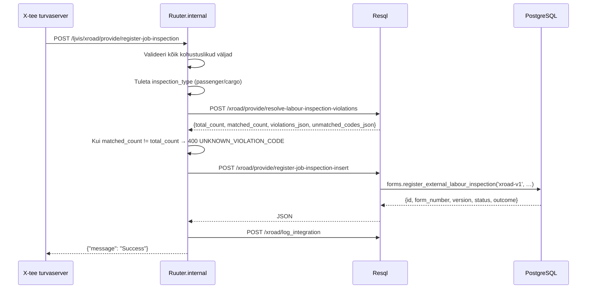

# RegisterJobInspection (v1)

Võtab vastu Tööinspektsiooni töökontrolli andmed (vana WSDL) ja salvestab need `forms.labour_inspection_form` tabelisse.

---

## 1. Eesmärk

Tööinspektsioon saab saata LJVIS-ile tehtud töökontrolli andmeid.
V1 leping vastab vanale WSDL-i `RegisterJobInspectionRequestType` struktuurile, mis on teisendatud REST-JSON-iks.

---

## 2. X-tee identiteet

| Väli | Väärtus |
|------|---------|
| Teenuse kood | `RegisterJobInspection` |
| Endpoint | `POST /ljvis/xroad/provide/register-job-inspection` |
| Versioon | v1 |
| DSL fail | `DSL/Ruuter.internal/ljvis/POST/xroad/provide/register-job-inspection.yml` |
| SQL fail | `DSL/Resql/ljvis/POST/xroad/provide/register-job-inspection-insert.sql` |

---

## 3. Request (WSDL -> JSON)

| WSDL väli | JSON väli | Tüüp | Kohustuslik | DB veerg |
|-----------|-----------|------|-------------|---------|
| `kontrollija` | `kontrollija` | string | Jah | `inspector_name` |
| `kontrolli_id` | `kontrolli_id` | integer | Jah | `external_inspection_id` |
| `kontrolli_kp` | `kontrolli_kp` | string (ISO date) | Jah | `inspection_date` |
| `tooandja_nimi` | `tooandja_nimi` | string | Jah | `company_name` |
| `tooandja_reg_kood` | `tooandja_reg_kood` | string | Jah | `company_reg_code` |
| `soidukite_arv` | `soidukite_arv` | integer | Ei | `vehicle_count` |
| `koostatatud_ettekirjutus` | `koostatatud_ettekirjutus` | boolean | Jah | `prescription_composed` |
| `kontrollimised` | `kontrollimised` | object | Jah | `controls_matrix` (JSONB) |
| `rikkumised` | `rikkumised` | object | Jah | `violations` (JSONB, vastendatud — vt allpool) |
| `vaarteomenetlus` | `vaarteomenetlus` | string | Ei | `proceeding_reference_number` |

### 3.1. `rikkumised` struktuur

```json
{
  "rikkumised_loend": [
    { "kood": "E5", "kogus": 2 },
    { "kood": "B1" }
  ]
}
```

| Väli | Tüüp | Kohustuslik | Kirjeldus |
|------|------|-------------|-----------|
| `rikkumised_loend[].kood` | string | Jah | Tööinspektsiooni täht+number rikkumiskood (nt `"E5"`, `"B1"`) — vastab `LABOUR_INSPECTION_VIOLATION` klassifikaatori `TI_<kood>` kirjele. |
| `rikkumised_loend[].kogus` | integer | Ei (vaikimisi 1) | Rikkumise esinemiste arv. |

LJVIS vastendab iga koodi `LABOUR_INSPECTION_VIOLATION` klassifikaatori kirjega (Resql `resolve-labour-inspection-violations`) ja salvestab `violations` veergu kuju `[{level1ValueKey, level2ValueKey, level3ValueKey?, quantity}]`, mida kontrollvormi UI oskab kuvada. Tundmatu kood lükatakse tagasi (vt punkt 6).

---

## 4. Loogika


```mermaid
sequenceDiagram
    participant VS as X-tee turvaserver
    participant RI as Ruuter.internal
    participant RS as Resql
    participant DB as PostgreSQL

    VS->>RI: POST /ljvis/xroad/provide/register-job-inspection
    RI->>RI: Valideeri kõik kohustuslikud väljad
    RI->>RI: Tuleta inspection_type (passenger/cargo)
    RI->>RS: POST /xroad/provide/resolve-labour-inspection-violations
    RS-->>RI: {total_count, matched_count, violations_json, unmatched_codes_json}
    RI->>RI: Kui matched_count != total_count → 400 UNKNOWN_VIOLATION_CODE
    RI->>RS: POST /xroad/provide/register-job-inspection-insert
    RS->>DB: forms.register_external_labour_inspection('xroad-v1', …)
    DB-->>RS: {id, form_number, version, status, outcome}
    RS-->>RI: JSON
    RI->>RS: POST /xroad/log_integration
    RI-->>VS: {"message": "Success"}
```

---

## 5. Idempotentsus

`external_inspection_id = kontrolli_id`; tegelik idempotentsuse võti on `forms.labour_inspection_external_ref` (`xroad-v1`, `kontrolli_id`). Kirjutamine käib atomaarselt funktsiooniga `forms.register_external_labour_inspection`.

Kordussaatmise reeglid (identiteet: leping + saatja `kontrolli_id`, tabel `forms.labour_inspection_external_ref`):

| Olukord | Tulemus |
|---|---|
| Esimene päring | Uus akt, staatus `confirmed`, versioon 1 |
| Täpne kordus (sama sisu kui viimati rakendatud) | HTTP 200 `Success`, uut rida ei lisata |
| Muudetud sisu, akt on `confirmed` / `published` / `deleted` | HTTP 409 `CONFLICT`, midagi ei salvestata (SOAP-is `Client` Fault) |
| Muudetud sisu, akt on arhiveerimisel töö-baasist eemaldatud | HTTP 409 `CONFLICT` (arhiveeritud), uut akti ei looda; täpne kordus `Success` |
| Samaaegsed päringud sama ID-ga | Luuakse üks akt; muudetud samaaegsed päringud rakendatakse järjest, ükski ei kao |
| Samal ajal kinnitatakse/kustutatakse akt UI-s | Ajalugu ei hargne (`revision`): kui UI jõudis enne, HTTP 409; kui X-tee jõudis enne, salvestub X-tee muudatus ja UI palub vormi uuesti laadida (`form_modified`) |

LJVIS1 (RavenDB) uuendas sama ID-ga dokumenti igas staatuses. LJVIS2-s on muutmine lubatud ainult kinnitamata aktil; lukustatud akti muutmine vajab äriotsust.

---

## 6. Valideerimine

| Väli | Reegel | Viga |
|------|--------|------|
| `X-Road-Client` | Kohustuslik | 400 MISSING_HEADER |
| `kontrollija` | Kohustuslik | 400 MISSING_PARAMETER |
| `kontrolli_id` | Kohustuslik | 400 MISSING_PARAMETER |
| `kontrolli_kp` | Parsitav kuupäev | 400 INVALID_PARAMETER |
| `kontrollimised` | Kohustuslik objekt | 400 MISSING_PARAMETER |
| `rikkumised` | Kohustuslik objekt | 400 MISSING_PARAMETER |
| `rikkumised_loend[].kood` | Peab vastama olemasolevale `LABOUR_INSPECTION_VIOLATION` koodile | 400 UNKNOWN_VIOLATION_CODE |

---

## 7. Testimisjuhud

| # | Sisend | Oodatav tulemus |
|---|--------|-----------------|
| T1 | Kõik kohustuslikud väljad | HTTP 200, `{"message": "Success"}` |
| T2 | Korduspäring sama `kontrolli_id` | HTTP 200, duplikaati ei looda |
| T2b | Muudetud korduspäring, akt `confirmed` | HTTP 409 `CONFLICT`, midagi ei salvestata |
| T2c | Samaaegsed sama `kontrolli_id` päringud | Üks akt |
| T3 | `kontrollija` puudub | HTTP 400 |
| T4 | Vale `kontrolli_kp` formaat | HTTP 400 |
| T5 | `X-Road-Client` puudub | HTTP 400 |
| T6 | `rikkumised_loend` sisaldab tundmatut koodi (nt `"Z99"`) | HTTP 400 `UNKNOWN_VIOLATION_CODE` |
| T7 | `rikkumised_loend` sisaldab tuntud koode (nt `"E5"`, `"B1"`) | HTTP 200, vorm tekib `violations` väljaga korrektselt vastendatuna |
