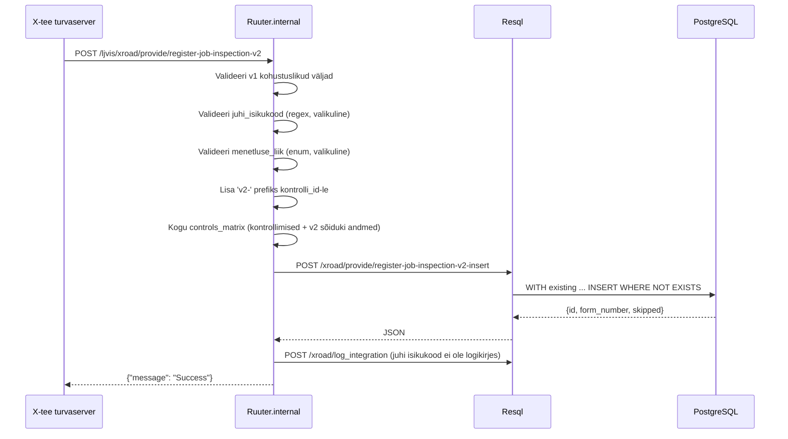

# RegisterJobInspection_v2

Uuem versioon töökontrolli andmete vastuvõtmisest X-tee kaudu — rikkam struktuur sõiduki, juhi ja menetluse andmetega.

---

## 1. Eesmärk

V2 laiendab v1 lepingut sõiduki identifikaatorite (reg.nr, VIN), juhi isikukoodi ja menetluse lisaväljadega. Salvestatakse samasse `forms.labour_inspection_form` tabelisse — idempotentsuse võti on `v2-` + `kontrolli_id`.

---

## 2. X-tee identiteet

| Väli | Väärtus |
|------|---------|
| Teenuse kood | `RegisterJobInspection_v2` |
| Endpoint | `POST /ljvis/xroad/provide/register-job-inspection-v2` |
| Versioon | v2 |
| DSL fail | `DSL/Ruuter.internal/ljvis/POST/xroad/provide/register-job-inspection-v2.yml` |
| SQL fail | `DSL/Resql/ljvis/POST/xroad/provide/register-job-inspection-v2-insert.sql` |

---

## 3. V2 lisandused v1-le

| Väli | Tüüp | DB mapping | Valideerimine |
|------|------|-----------|---------------|
| `soiduki_reg_nr` | string | `controls_matrix.v2_soiduki_reg_nr` | valikuline |
| `soiduki_vin` | string | `controls_matrix.v2_soiduki_vin` | valikuline |
| `juhi_isikukood` | string | `punished_person_id_code` | valikuline, aga regex kui esitatud |
| `juhi_eesnimi` | string | `punished_person_first_name` | valikuline |
| `juhi_perekonnanimi` | string | `punished_person_last_name` | valikuline |
| `menetluse_liik` | enum | `controls_matrix.v2_menetluse_liik` | lyhimenetlus/kiirmenetlus/uldmenetlus |
| `menetluse_number` | string | `proceeding_reference_number` | valikuline |

---

## 4. V1 vs V2 erinevused

| Aspekt | V1 | V2 |
|--------|----|----|
| Sõiduki andmed | puuduvad | soiduki_reg_nr, soiduki_vin |
| Juhi isikukood | puudub | juhi_isikukood (valideeritav regex) |
| Menetluse liik | puudub | menetluse_liik (enum) |
| Idempotentsuse võti | `kontrolli_id` | `v2-kontrolli_id` |
| DB tabel | `labour_inspection_form` | `labour_inspection_form` (sama) |

---

## 5. Loogika

---

## 6. Valideerimine

| Väli | Reegel | Viga |
|------|--------|------|
| `X-Road-Client` | Kohustuslik | 400 MISSING_HEADER |
| (v1 kohustuslikud) | samad mis v1-s | 400 |
| `juhi_isikukood` | Kui esitatud: `/^[1-6][0-9]{10}$/` | 400 INVALID_PARAMETER |
| `menetluse_liik` | Kui esitatud: enum | 400 INVALID_PARAMETER |

---

## 7. Testimisjuhud

| # | Sisend | Oodatav tulemus |
|---|--------|-----------------|
| T1 | Kõik v2 väljad | HTTP 200 |
| T2 | Ainult v1 kohustuslikud (v2 puuduvad) | HTTP 200 |
| T3 | Korduspäring sama kontrolli_id | HTTP 200, duplikaati ei looda |
| T4 | Vale juhi_isikukood formaat | HTTP 400 |
| T5 | Lubamatu menetluse_liik | HTTP 400 |
| T6 | V1 ja v2 sama kontrolli_id | Mõlemad HTTP 200 (prefiks eristab) |
| T7 | juhi_isikukood logis | Ei tohi olla selge tekstina |
