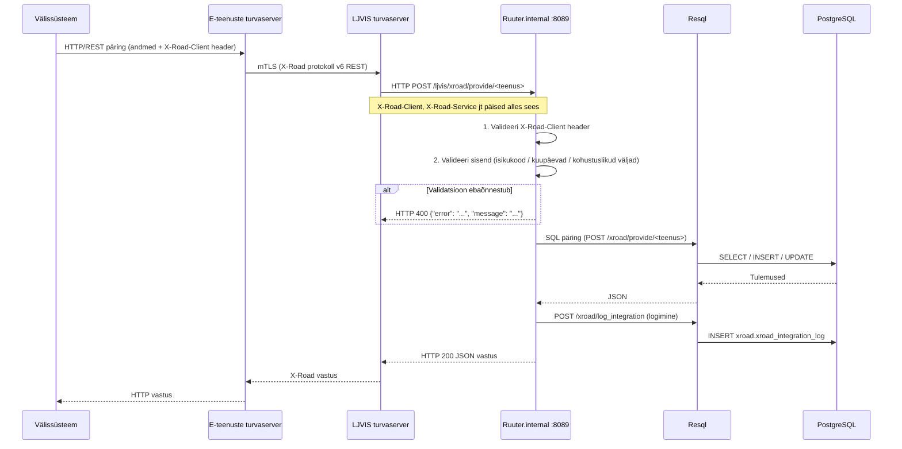

# LJVIS2 X-tee pakutavad teenused (sisenevad)

> Sisenevad X-tee teenused — need, mida LJVIS ise teistele süsteemidele pakub.  
> Väljaminevate X-tee teenuste (XTR, RR, AR) kohta vt [`docs/xtee_implementatsioon.md`](../xtee_implementatsioon.md).

---

## Ülevaade

LJVIS pakub 6 REST-teenust X-tee kaudu. Kõik teenused on kättesaadavad ainult X-tee turvaserveri kaudu ja lähevad läbi `ruuter-internal` komponendi (port 8089), mis **ei ole** kasutajaliidese nginx-ist proxitud.

| # | Teenus | Endpoint | Liik | Andmeallikas |
|---|--------|----------|------|--------------|
| 1 | [IsikuKontroll](./01-isiku-kontroll.md) | `POST /ljvis/xroad/provide/isiku-kontroll` | lugemine | `compound_form`, `labour_inspection_form` |
| 2 | [IsikuEttevoteKontrollid](./02-isiku-ettevote-kontrollid.md) | `POST /ljvis/xroad/provide/isiku-ettevote-kontrollid` | lugemine | lokaalne DB ettevõtete järgi |
| 3 | [ErakorralineYVquery](./03-erakorraline-yv-query.md) | `POST /ljvis/xroad/provide/erakorraline-yv-query` | lugemine | `vehicle_technical_form` |
| 4 | [ErakorralineYVconfirm](./04-erakorraline-yv-confirm.md) | `POST /ljvis/xroad/provide/erakorraline-yv-confirm` | kirjutamine | `vehicle_technical_form` (xroad väljad) |
| 5 | [RegisterJobInspection v1](./05-register-job-inspection.md) | `POST /ljvis/xroad/provide/register-job-inspection` | kirjutamine | `labour_inspection_form` |
| 6 | [RegisterJobInspection_v2](./06-register-job-inspection-v2.md) | `POST /ljvis/xroad/provide/register-job-inspection-v2` | kirjutamine | `labour_inspection_form` |

---

## Arhitektuur ja vooskeem

---

## Ühised reeglid

### Autentimine ja turvalisus

- `ruuter-internal` on eraldatud `ruuter`-ist (avalik port 8086) ja nginx ei proxyi seda.
- X-tee turvaserver kutsub `ruuter-internal` otse sisevõrgus.
- **Iga teenus** kontrollib `X-Road-Client` headeri olemasolu — tühi header tagastab 400.
- IP-allowlist konfigureeritakse `ruuter-internal.yaml` `allowed_ips` välja — seadista turvaserveri tegelik IP.
- Isikukoodi validatsioon: `/^[1-6][0-9]{10}$/` (sama mis `validate/estonian-personal-code.yml`).

### Veavastused

| Olukord | HTTP | Keha |
|---------|------|------|
| `X-Road-Client` puudub | 400 | `{"error": "MISSING_HEADER", "message": "X-Road-Client header is required"}` |
| Kohustuslik väli puudub | 400 | `{"error": "MISSING_PARAMETER", "message": "..."}` |
| Isikukoodi vale formaat | 400 | `{"error": "INVALID_PARAMETER", "message": "isikukood must be 11 digits starting 1-6"}` |
| Vale kuupäevavahemik | 400 | `{"error": "INVALID_PARAMETER", "message": "alates must not be after kuni"}` |
| Tundmatu ressursi ID | 404 | `{"error": "NOT_FOUND", "message": "..."}` |
| DB viga | 500 | `{"error": "SERVER_ERROR", "message": "Internal error"}` — stack trace ei tagastata |

### Logimine

Iga päring logitakse `xroad.xroad_integration_log` tabelisse:
- `service_code`: teenuse tunnus (nt `xroad.provide.isiku-kontroll`)
- `request_xml`: anonümiseeritud päringuinfo (isikukood maskituna)
- `response_xml`: vastuse kokkuvõte
- `duration_ms`: töötlusaeg
- `success`: kas päring õnnestus
- `error_message`: veateade ebaõnnestumise korral

### Tühi tulemus

Tühi loend on **edukas vastus** (HTTP 200), mitte 404.

---

## Implementatsiooni viited

| Komponent | Asukoht |
|-----------|---------|
| Ruuter.internal YAML-id | `DSL/Ruuter.internal/ljvis/POST/xroad/provide/` |
| Resql SQL-id | `DSL/Resql/ljvis/POST/xroad/provide/` |
| Integratsioonilogimine | `DSL/Resql/ljvis/POST/xroad/log_integration.sql` |
| Arhitektuur | `DSL/ARCHITECTURE.md` |
| Väljaminevad X-tee teenused | `docs/xtee_implementatsioon.md` |
