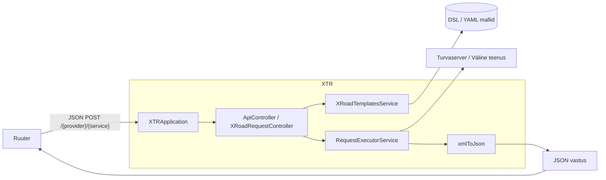
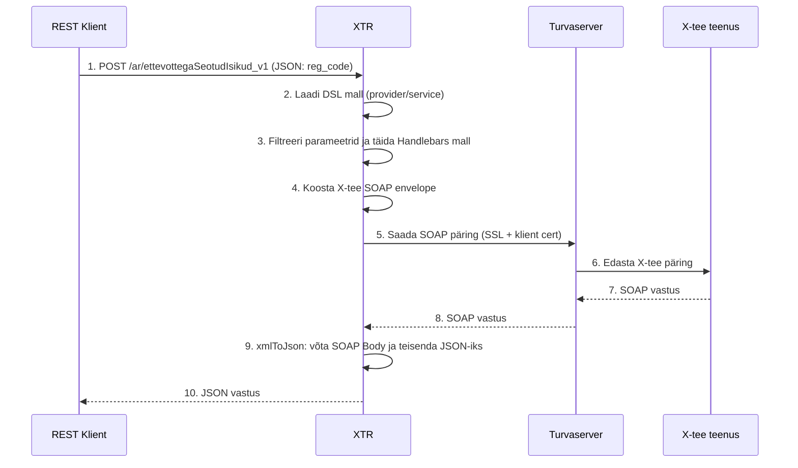
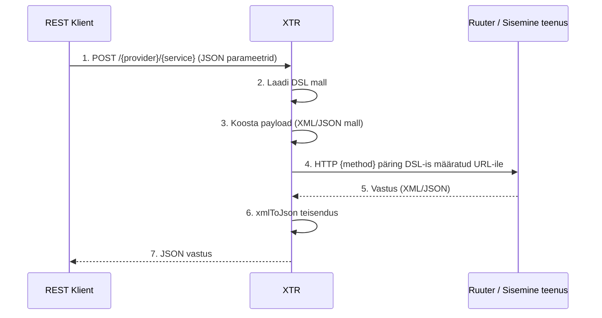
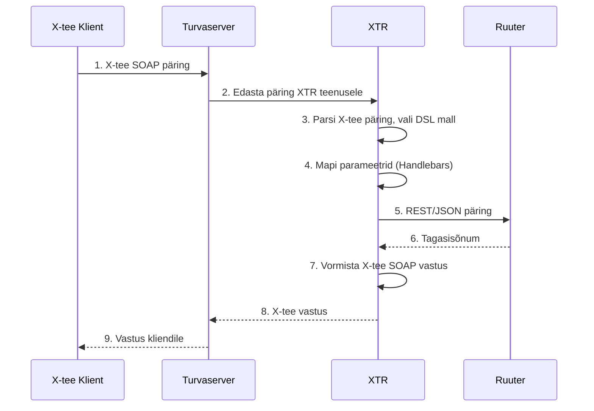

# X-tee implementatsioon

## Ülevaade

X-tee on Eesti riigi infosüsteemi kiht, mille kaudu liikmed (asutused) saavad omavahel turvaliselt teenuseid pakkuda ja tarbida.

**XTR (X-tee Translator)** on teenus, mis pakub X-tee **SOAP**-teenustele REST-liidest. XTR võtab vastu JSON-päringud, laeb vastava DSL-malli, täidab mallis olevad parameetrid, saadab päringu edasi X-tee turvaserverisse ja tagastab vastuse JSON-ina.

## Kasutusreeglid LJVIS-i jaoks

| Suund | Protokoll | Komponent |
|-------|-----------|-----------|
| LJVIS tarbib välist teenust | SOAP | XTR (REST → SOAP) |
| LJVIS tarbib välist teenust | REST | otse turvaserver ↔ Ruuter |
| LJVIS pakub teenust | REST | otse turvaserver ↔ Ruuter |
| LJVIS pakub teenust | SOAP | eraldi SOAP adapter (XTR v3 seda ei toeta) |

**Milles XTR-i ei vajata:**
- **Sisemiste teenuste** puhul (nt Ruuter) pole X-tee liidest vaja, neid otse REST-ga välja kutsuda on otstarbekam.
- **X-tee REST teenuste** puhul (nii tarbimine kui pakkumine) ei ole vaja XTR-i, sest X-tee liige ja LJVIS suudavad REST päringuid vahetada otse turvaserveri kaudu.
- **X-tee SOAP teenuse pakkumise** puhul ei sobi XTR, sest XTR ei kuula X-tee/SOAP sissepääsu. Selleks tuleks luua eraldi SOAP adapter.

**Milles XTR-i vajatakse:**
- **X-tee SOAP teenuse tarbimise** korral, et teisendada REST → SOAP ja vastupidi. Eesmärk on muinasaegse SOAP asemel kasutada lihtsamaid REST päringuid.

Hetkel töötab XTR ühes suunas: **REST klient (Ruuter) → XTR → (turvaserver/teenus)**.

---

## Arhitektuur



---

## Päringu vool

### 1. REST klient → X-tee turvaserver

Kõige levinum vool, kus XTR saadab päringu X-tee turvaserverisse ja tagastab vastuse JSON-ina.



### 2. REST klient → Sisemine teenus / Ruuter

Kui DSL-is on määratud `service` URL, suunab XTR päringu otse sellele teenusele. Seda saab kasutada näiteks mõne teise Ruuteri või muu sisemise teenuse poole suunamiseks.



### 3. X-tee klient → XTR → Ruuter (kontseptuaalne)

See on võimalik tulevikuvool, kus XTR oleks X-tee teenusepakkuja ja suunaks päringu sisemisse Ruuterisse. **Praegune XTR seda ei toeta**, sest tal puudub X-tee/SOAP sissepääsuendpunkt.



---

## Peamised komponendid

| Komponent | Asukoht | Ülesanne |
|-----------|---------|----------|
| `XTRApplication` | `ee.buerokratt.xtr` | Spring Boot rakenduse käivitamine |
| `ApiController` | `controllers/ApiController.java` | Tõenäoliselt OpenAPI / docs |
| `XRoadRequestController` | `controllers/XRoadRequestController.java` | REST endpoint, võtab vastu JSON päringud |
| `XRoadTemplatesService` | `services/XRoadTemplatesService.java` | Laeb DSL-id kettalt või URL-ilt |
| `XRoadTemplate` | `domain/XRoadTemplate.java` | DSL mall koos `params`, `service`, `method`, `envelope` |
| `HandlebarsHelper` | `services/HandlebarsHelper.java` | Täidab malli parameetritega |
| `RequestExecutorService` | `services/RequestExecutorService.java` | Saadab HTTP päringu sihtteenusesse |
| `SOAPQueryGenerator` | `services/SOAPQueryGenerator.java` | WSDL-põhine SOAP envelope genereerija (WIP) |

---

## DSL malli formaat

DSL-id asuvad kaustas, mille määrab `application.dslPath` (vaikimisi `DSL/`).

```yaml
params:
  - reg_code
service:               # Kui tühi, suunatakse turvaserverisse
method: POST

envelope: |
  <soapenv:Envelope ...>
    <soapenv:Body>
      <ar:ettevottegaSeotudIsikud_v1>
        <ar:reg_code>{{ reg_code }}</ar:reg_code>
      </ar:ettevottegaSeotudIsikud_v1>
    </soapenv:Body>
  </soapenv:Envelope>
```

- `params` — nimekiri lubatud parameetritest, mida võetakse JSON päringust arvesse.
- `service` — välise teenuse URL. Kui tühi, kasutatakse `application.security-server` väärtust.
- `method` — HTTP meetod (nt `POST`, `GET`).
- `envelope` — Handlebars mall, milles `{{ param }}` asendatakse päringu parameetritega.

---

## Konfiguratsioon

Põhikonfiguratsioon asub `src/main/resources/application.yml`:

```yaml
spring:
  application:
    name: XTR

application:
  dslPath: DSL

  ssl:
    certification:
    key:
    keystore-password: 123456

  client-data:
    member-class: GOV
    member-code: 70006317
    subsystem-code: byrokratt

  security-server: https://out.test.x-tee.ee:443/
  xroad-instance: ee-test
```

---

## Vastuse teisendus

`RequestExecutorService.xmlToJson()` võtab vastu XML vastuse, loeb selle `XmlMapper`-ga ja tagastab ainult SOAP `<Body>` elemendi JSON-ina:

```java
XmlMapper mapper = new XmlMapper();
JsonNode node = mapper.readTree(xmlPayload);

ObjectMapper jsonMapper = new ObjectMapper();
return jsonMapper.writeValueAsString(node.get("Body"));
```

---

## Piirangud ja laiendamise võimalused

- **Ainult üks suund**: praegune XTR v3 võtab vastu REST päringuid ja väljastab JSON-i. Ta ei kuula X-tee SOAP päringuid.
- **Handlebars**: mallid kasutavad hetkel Handlebarsi süntaksit.
- **SOAPQueryGenerator**: WSDL-põhine generaator on veel töötluses (`WORK IN PROGRESS`).
- **Võimalik laiendus**: X-tee sissepääsu endpunkti lisamiseks tuleks luua uus SOAP kontroller, mis dekrüpteerib X-tee päringu, leiab vastava DSL-i ja suunab selle edasi Ruuterisse või muusse sisemisse teenusesse.
